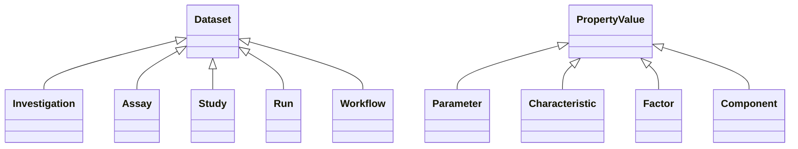

## Types and inheritance

- Dataset:
    - Investigation
    - Assay
    - Study
    - Run
    - Workflow
- Path
- Process
- Protocol
- PropertyValue
    - Parameter
    - Characteristic
    - Factor
    - Component
- Person
- Material:
    - Source
    - Sample
    - Material
- File

## Types and operations

- Path: Collection of processes conntected
    - 

## Query use cases

- Dataset: Give me all samples which result from specific growth temperature?
    - Caveat: Temperature might a property using in various processes across the pathway, so we need to specify the process where the property is used.
    - Technical formulation: Give me all samples where propertyValue in process with given protocolType equals to specific value.
    - Requirements: 
        - Either explorative analysis to find the relevant process 
        - In the case of a standardized tool, predefined requirements about ARC. These need to be checked via validation package, and can be used to guide the design of the tool.
    - CommandChain:
        - Find all processes with protocolType term "cell growth"
        - Filter these processes against propertyValue = specific temperature
        - Find all samples which are output of these processes