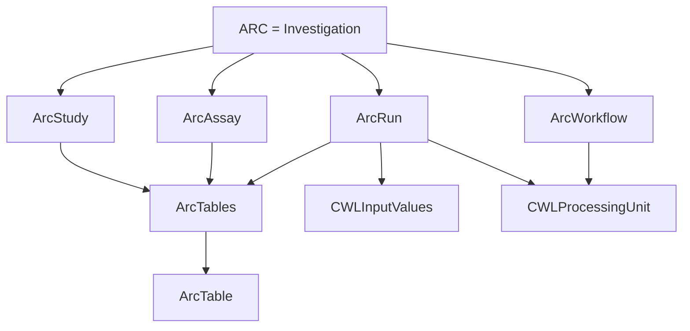
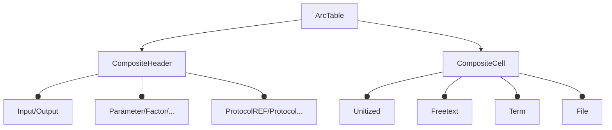
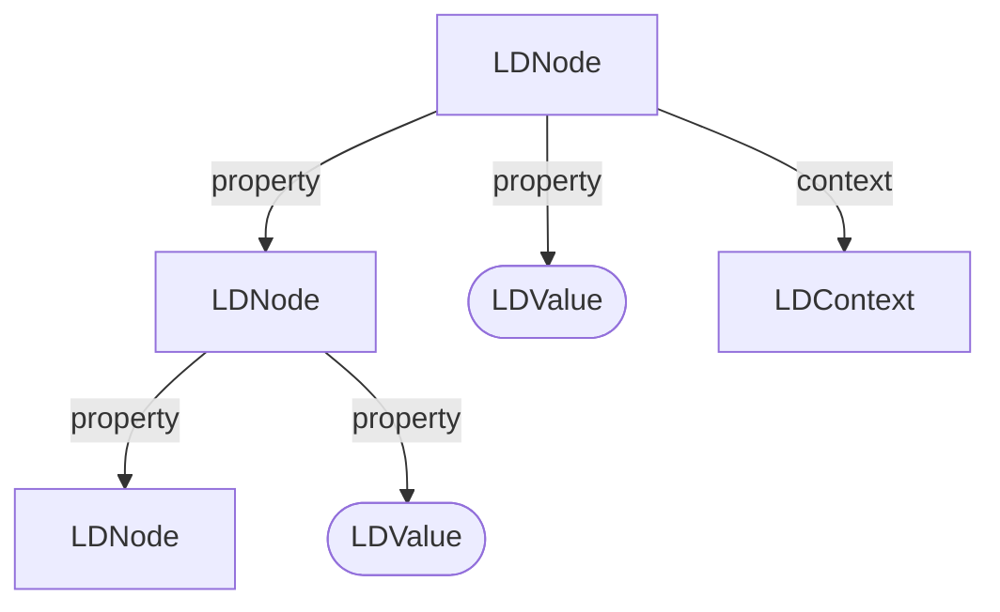
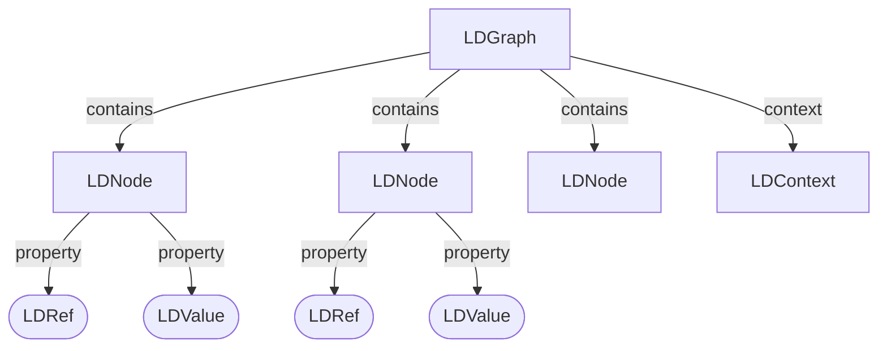
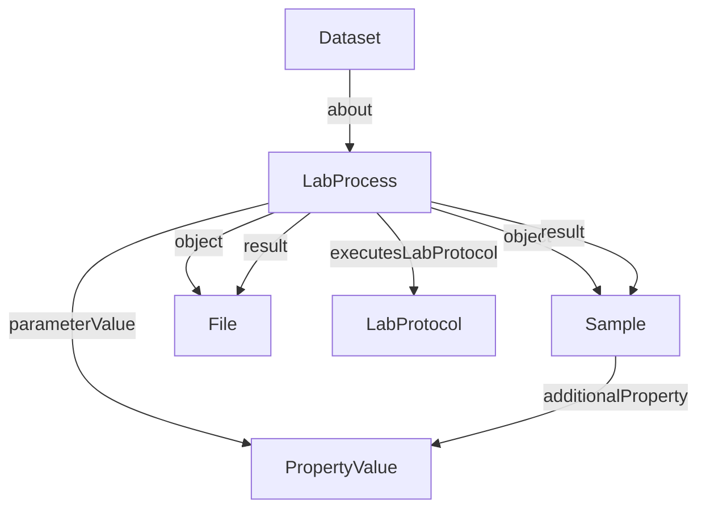
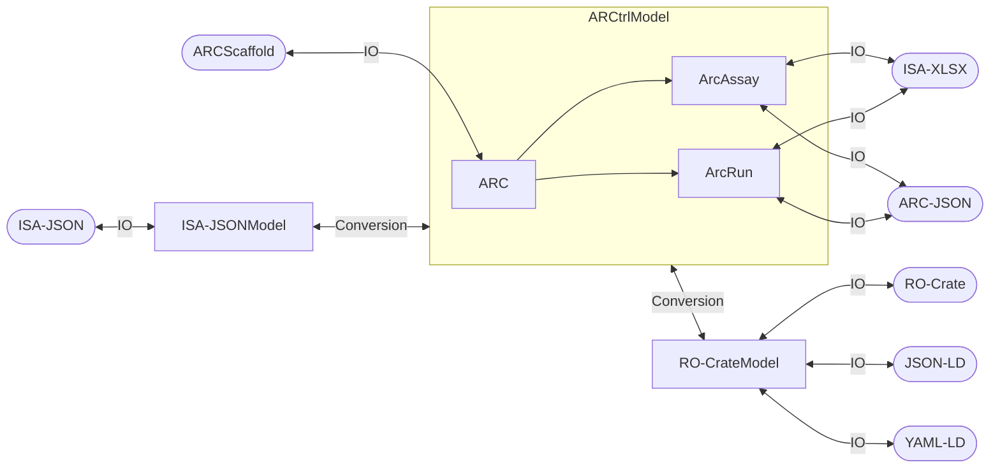

# ARC-Data-Model

Repo to collect planning and design of the upcoming changes regarding core ARC representation, data model and querying.

## Current status

### ARCtrl: Core Representation

https://github.com/nfdi4plants/ARCtrl/tree/main/src/Core

This is the current main datamodel in the ARC ecosystem. It uses a tabular representation for the experimental annotations, which is based on the ISA-Tab format. The main entities are:

#### Top level object hierarchy

#### ArcTable

### ARCtrl: ISA-JSON Representation

https://github.com/nfdi4plants/ARCtrl/tree/main/src/Core/Process

- Closely follows the ISA-JSON format
- Mostly Immutable Record types

### ARCtrl: RO-Crate Representation

#### Generic layer of basic JSON-LD objects:

https://github.com/nfdi4plants/ARCtrl/tree/main/src/ROCrate

- LDGraph (graph containing collection of flattened nodes)
- LDNode (main object representing any complex object)
- LDContext (context for the JSON-LD graph, containing mapping of terms to IRIs)
- LDRef (reference to another node in the graph, containing the @id of the referenced node)
- LDValue (simple value, such as string, number, boolean, or array of simple values)

##### Hierarchical 

##### Flattened

#### Static classes for Schema-Types and RO-Crate profile:

### Querymodel: Core Extensions

https://github.com/nfdi4plants/ARCtrl.Querymodel/tree/main/src/ARCtrl.QueryModel

### Querymodel: RO-Crate Extensions

https://github.com/nfdi4plants/ARCtrl.Querymodel/tree/main/src/ARCtrl.QueryModel/ProcessCore

### Mappings and IO

