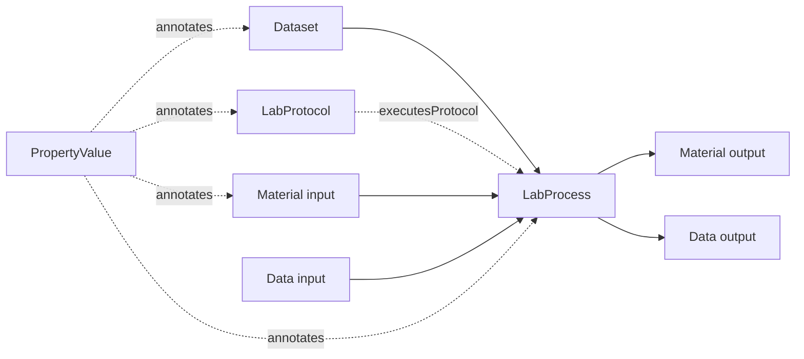

# ProcessCore User Guide

ProcessCore is the in-memory F# library for building, reading, querying, and editing ARC process graphs.

The central idea is small:

- A `Dataset` groups process graphs and nested datasets.
- A `LabProcess` connects `Material` and `Data` input/output nodes.
- A `LabProtocol` describes what the process executes.
- A `PropertyValue` annotates datasets, process parameters, input/output nodes, and protocol components.

## Recommended Path

1. [Creating A Dataset](creating-datasets.fsx) builds a graph from F# objects.
2. [Reading And Writing YAML](yaml-parsing.fsx) loads profile-shaped examples and writes inline or indexed YAML.
3. [Querying Process Graphs](querying.fsx) traverses upstream, downstream, and connected context.
4. [Fragment Selector Providers](fragment-selector-providers.fsx) makes file fragments first-class in traversal.
5. [Tabular Views](tables.fsx) edits process graphs through ISA-like table projections.

## Concept Pages

- [Property Values And Annotation Slots](property-values.md) explains where annotations live and how `AdditionalType` is used.
- [Graph Identity, Back-Edges, And Scope](graph-invariants.md) explains shared nodes, nested datasets, and scoped traversal.

For normative field definitions, use the [core specification](../../spec/core/overview.md). These project pages focus on using the F# library.

## What To Use When

| Task | Start With |
|------|------------|
| Build a process graph in code | `Dataset`, `LabProcess`, `Material`, `Data` |
| Load ARC/profile-shaped YAML | `ProcessCore.Yaml.Dataset.fromYamlString false` |
| Validate stricter core-shaped YAML | `ProcessCore.Yaml.Dataset.fromYamlString true` |
| Ask provenance questions | `AllProcesses`, `UpstreamNodes`, `DownstreamPropertyValues`, `PathsThrough` |
| Work with file fragments | `Data.Selector`, `Data.SelectorFormat`, `RegisterFragmentSelectorProvider` |
| Edit as rows and columns | `dataset.Tables` from `ProcessCore.Table` |
