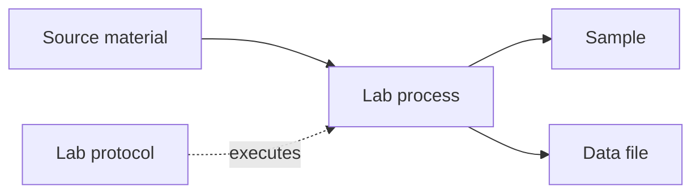

# Your Project Name

Welcome to the documentation for **Your Project Name**.

## Getting Started

Add your documentation here. You can use Markdown, F# scripts (`.fsx`) or Jupyter notebooks (`.ipynb`).

Run `dotnet fsdocs watch` to preview the site locally.

## Mermaid Sample

