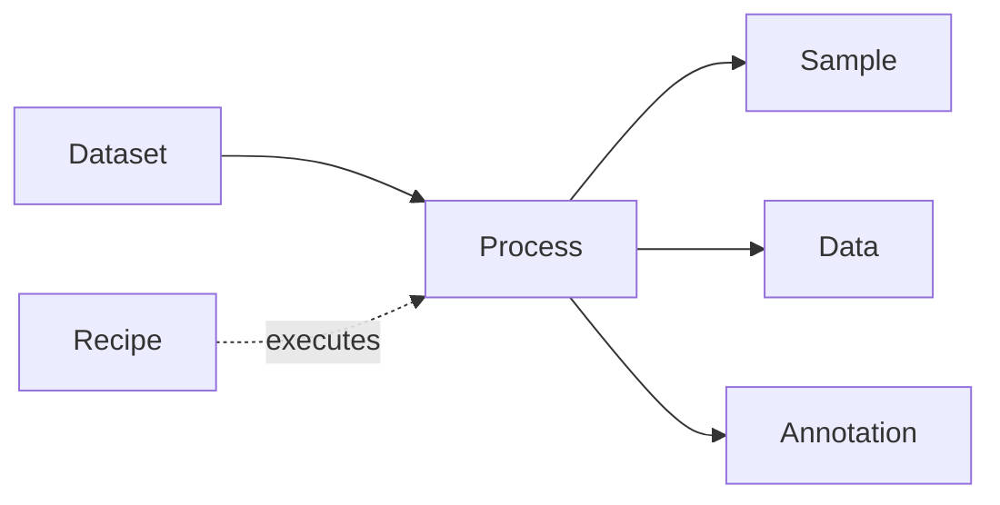

# ARC Data Model

Specification and implementation workspace for the ARC process data model. The project defines a small ProcessCore vocabulary, derived schema representations, examples, and F# libraries for working with the SQL profile across .NET, JavaScript, and Python runtimes.

## Start Here

- [Project overview](project/overview.md)
- [Normative specification](spec/index.md)
- [Specification guide](project/specification.md)
- [Implementation guide](project/implementation.md)
- [Core Implementation guide](project/core_implementation/index.md)
- [Examples and schemas](project/examples-and-schemas.md)
- [Reference material](project/references.md)
- [Prior art notes](project/prior-art.md)

## ProcessCore Sketch

