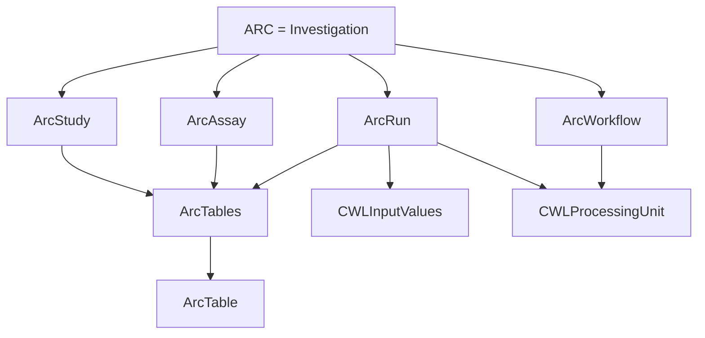
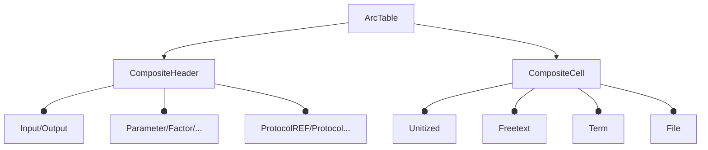
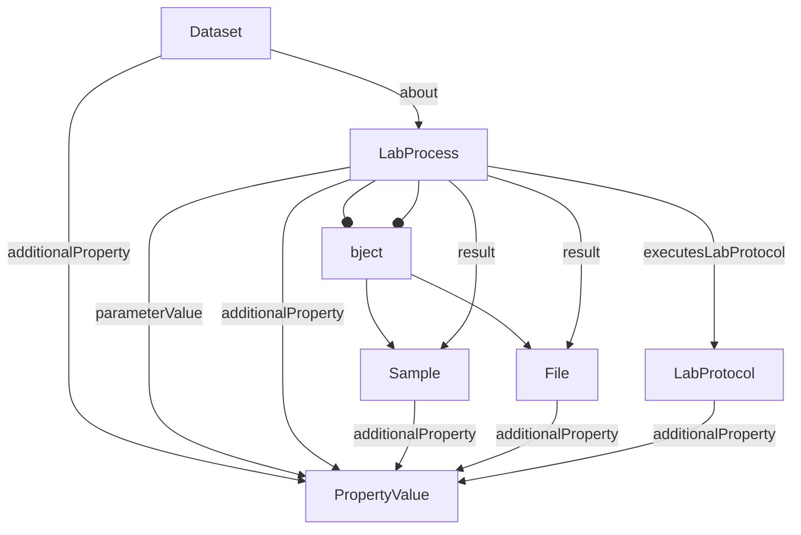
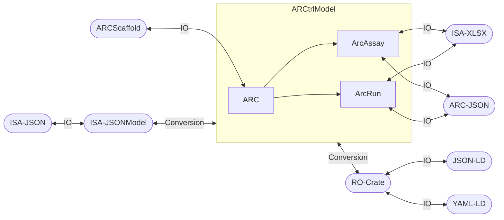

# Prior Art

The ARC Data Model builds on existing ARCtrl representations and query-model work. This page keeps that background separate from the current repository overview.

## ARCtrl Core Representation

Source: <https://github.com/nfdi4plants/ARCtrl/tree/main/src/Core>

The current ARC ecosystem has historically used a tabular representation for experimental annotations, based on ISA-Tab. The main shape is:

## ArcTable

## ARCtrl ISA-JSON Representation

Source: <https://github.com/nfdi4plants/ARCtrl/tree/main/src/Core/Process>

- Closely follows ISA-JSON.
- Mostly uses immutable record types.

## ARCtrl RO-Crate Representation

Source: <https://github.com/nfdi4plants/ARCtrl/tree/main/src/ROCrate>

The generic linked-data layer uses flattened JSON-LD-style objects:

- `LDGraph`
- `LDNode`
- `LDContext`
- `LDRef`
- `LDValue`

## Query Model

Sources:

- <https://github.com/nfdi4plants/ARCtrl.Querymodel/tree/main/src/ARCtrl.QueryModel>
- <https://github.com/nfdi4plants/ARCtrl.Querymodel/tree/main/src/ARCtrl.QueryModel/ProcessCore>

The current repo keeps preserved query-model reference material under `references/ProcessCore/` and implements current graph/path helpers in `src/ProcessCore/`.

## Mappings And IO

