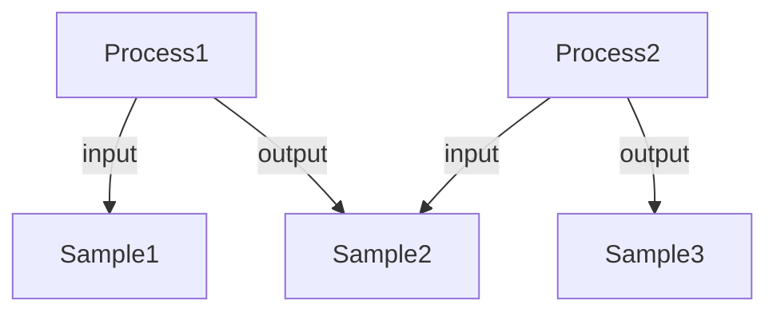
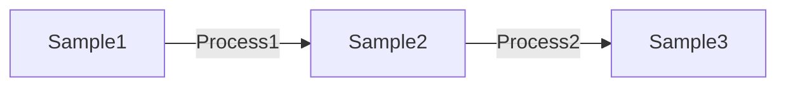

# Querying

## Process list is an emerging graph:

- Process objects contain inputs and outputs. These relationships form a directed graph, where nodes represent these input and output entities and edges represent the processes connecting them.
- This graph structure allows us to traverse the relationships between entities, enabling complex queries that can follow the pathways of data transformation and sample processing.

#### Object model

#### Graph

## Types and operations

In addition to the core entities defined in the core specification and their properties, the implementation exposes an additional type: **Path**

This type contains a collection of processes connected through their shared nodes (input and output entities). Query operations live on the owning model types in `src/ProcessCore/Graph.fs`: node-centered traversal on `IONode`/`Sample`/`Data`, and dataset-scoped convenience queries on `Dataset`.

I.e. if we ask for a path of a specific sample, we want to get all paths (i.e. distinct sequences of processes) that lead through this sample (including it being the start or end of the path).

## Query use cases

- Dataset: Give me all samples which result from specific growth temperature?
    - Caveat: Temperature might a property using in various processes across the pathway, so we need to specify the process where the property is used.
    - Technical formulation: Give me all samples where in a path leading up to this sample, a annotation in process with given protocolType equals a specific value.
    - Requirements:
        - Either explorative analysis to find the relevant process
        - In the case of a standardized tool, predefined requirements about ARC. These need to be checked via validation package, and can be used to guide the design of the tool.
    - CommandChain:
        - Find all processes with protocolType term "cell growth"
        - Filter these processes against annotation = specific temperature
        - Find all samples which are output of a path containing on of these processes
- Sample: Give me all parameters that are connected to this sample through the process graph?
    - Technical formulation: Give me all parameters part of processes part of a path containing this sample.
    - CommandChain:
        - Find all processes where this sample is an input or output
        - For each of these processes, find all parameters connected to them (e.g. protocol parameters, process parameters)
        - Recursively repeat this for all connected processes until no new processes are found, collecting all parameters along the way.
- Sample: Give me all samples that are connected to this sample through the process graph?
    - Technical formulation: Give me all samples that are input to a process in a path leading up to this sample or output from a process in a path leading down from this sample.
    - CommandChain:
        - Find all processes where this sample is an input or output
        - For each of these processes, find all samples that are input or output of these processes
        - Recursively repeat this for all connected processes until no new processes are found, collecting all samples along the way.

## Technical considerations

### Performance is key

- We need to consider how to efficiently query across potentially large datasets and complex relationships between entities.
- This might involve indexing certain fields, optimizing the structure of the data for common query patterns, or using a graph database that can handle complex relationships more efficiently.
- Especially traversing the process graph requires efficient retrieval of how input and output entities are connected, which can be computationally intensive if not optimized properly. (e.g. each input and output entity should know which process it's the input or output of, to avoid having to search through all processes to find these relationships).

### Queries should be flexible and composable:

- Users should be able to build complex queries by combining simpler ones, allowing for a wide range of use cases and enabling users to explore the data in various ways.
- e.g. get entities in specific dataset then search their connections in all datasets, or vice versa, i.e. get all entities then get all entities they are connected to in specific dataset.
