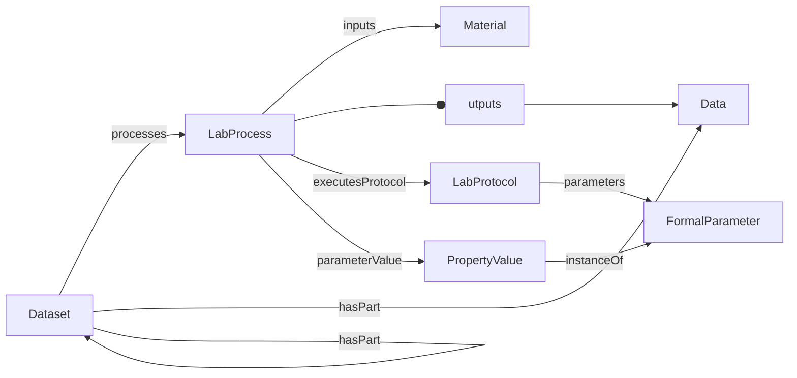

# Specification Guide

The normative specification lives in [docs/spec](../spec/index.md). ProcessCore is the small shared model. Decorations specialize or extend it for ISA, Workflow Run, and Datamap use cases without changing the core requirements.

## ProcessCore

Core entities:

| Entity | Source |
|--------|--------|
| Dataset | [Dataset](../spec/core/Dataset.md) |
| LabProcess | [LabProcess](../spec/core/LabProcess.md) |
| LabProtocol | [LabProtocol](../spec/core/LabProtocol.md) |
| Material | [Material](../spec/core/Material.md) |
| Data | [Data](../spec/core/Data.md) |
| PropertyValue | [PropertyValue](../spec/core/PropertyValue.md) |
| FormalParameter | [FormalParameter](../spec/core/FormalParameter.md) |
| DefinedTerm | [DefinedTerm](../spec/core/DefinedTerm.md) |

## Decorations

Decorations add domain-specific meaning through `additionalType`, specialized properties, and decoration-specific entities.

| Decoration | Purpose | Source |
|------------|---------|--------|
| ISA | Investigation, Study, Assay, Source, Sample, and ISA property value roles | [ISA](../spec/decorations/isa/overview.md) |
| Workflow Run | Workflow and Run datasets, workflow protocols, and workflow invocations | [Workflow Run](../spec/decorations/workflow-run/overview.md) |
| Datamap | Datamap datasets and DataContext annotations for file fragments | [Datamap](../spec/decorations/datamap/overview.md) |

## Naming Notes

The current core vocabulary uses `LabProcess` and `LabProtocol`, not the older placeholder names `Process` and `Protocol`.

For process I/O, the current core and YAML schema names are:

- `inputs`
- `outputs`
- `executesProtocol`
- `parameterValue`
- `additionalProperty`

Some legacy/profile-shaped examples and upstream references use RO-Crate or Bioschemas names such as `object`, `result`, and `executesLabProtocol`. See [Examples and schemas](examples-and-schemas.md) for how those files are treated.

## Querying

The query use cases are described in [Querying](../spec/querying/use-cases.md). The implementation exposes `Path` as a returned value object, while traversal and query operations are attached to the model types in `src/ProcessCore/Graph.fs`.
