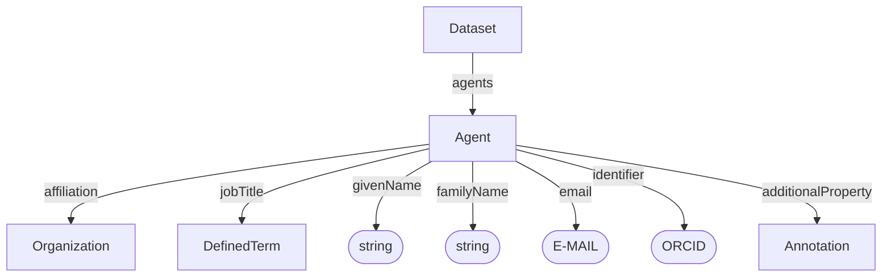

# Agent

Individual contributor, agent, author, or contact associated with a dataset or citation.

**Schema.org type**: `schema.org/Agent`

## Properties

| Property | Type | Required | Description |
|----------|------|----------|-------------|
| `id` | Text | COULD | Unique identifier |
| `type` | Text | MUST | `Agent` |
| `givenName` | Text | MUST | Given name |
| `familyName` | Text | SHOULD | Family name |
| `email` | Text | SHOULD | Email address |
| `affiliation` | [Organization](Organization.md) | SHOULD | Affiliated organization |
| `identifier` | Text | SHOULD | ORCID or other identifier |
| `additionalProperty` | [Annotation](../process_core/Annotation.md) | COULD | Extensible agent metadata not covered by the base properties |
| `jobTitle` | [DefinedTerm](../process_core/DefinedTerm.md) | COULD | Job title |

## Relationships

