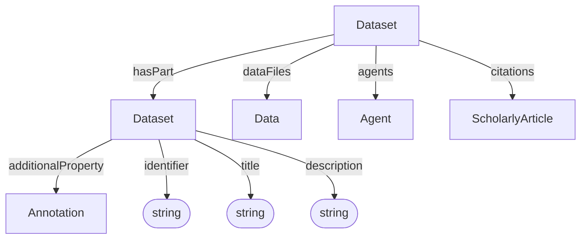

# Dataset

Container and context for data, and administrative metadata. 

**Schema.org type**: `schema.org/Dataset`

Decorations specialize Dataset via `additionalType`:
- ISA: Investigation, Study, Assay
- Workflow Run: ARC Workflow, ARC Run
- Datamap

## Properties

| Property | Type | Required | Description |
|----------|------|----------|-------------|
| `id` | Text | MUST | Unique identifier for the dataset |
| `type` | Text | MUST | `Dataset` |
| `additionalType` | Text | COULD | Discriminator for decoration type |
| `identifier` | Text | MUST | Identifying descriptor |
| `title` | Text | SHOULD | Human-readable dataset title |
| `description` | Text | SHOULD | Short description or abstract |
| `license` | Text | COULD | License identifier, URL, or label |
| `datePublished` | Text | COULD | Publication date |
| `dateCreated` | Text | COULD | Creation date |
| `dateModified` | Text | COULD | Modification date |
| `hasPart` | [Dataset](Dataset.md) | SHOULD | Sub-datasets |
| `dataFiles` | [Data](../process_core/Data.md) | COULD | Data files that belong to this dataset |
| `agents` | [Agent](../administrative/Agent.md) | COULD | Dataset agents |
| `citations` | [ScholarlyArticle](../administrative/ScholarlyArticle.md) | COULD | Publications cited by or associated with the dataset |
| `additionalProperty` | [Annotation](../process_core/Annotation.md) | COULD | Extensible metadata |

## Relationships

