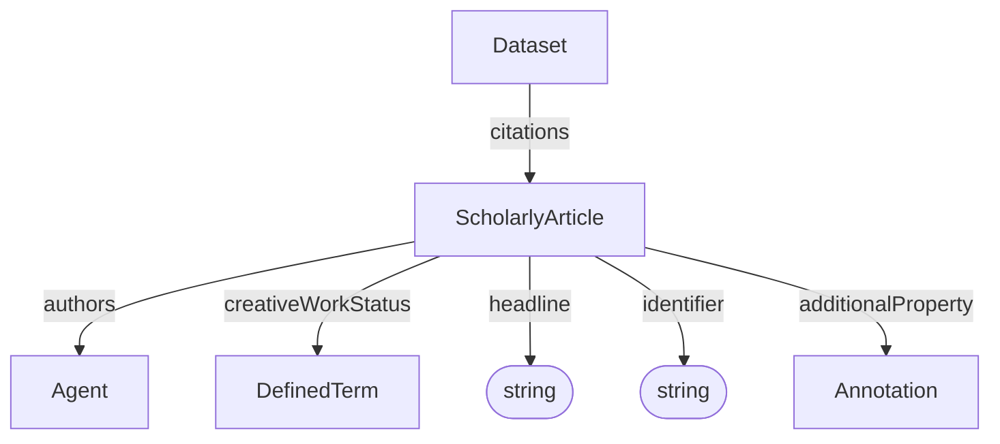

# ScholarlyArticle

A scholarly publication associated with a Dataset. This can be used to link to publications describing the experiment, method, or results.

**Schema.org type**: `schema.org/ScholarlyArticle`

## Properties

| Property | Type | Required | Description |
|----------|------|----------|-------------|
| `id` | Text | COULD | Unique identifier |
| `type` | Text | MUST | `ScholarlyArticle` |
| `headline` | Text | MUST | Headline of the article |
| `identifier` | Text | SHOULD | Identifier for this article, such as a DOI or PubMedID |
| `authors` | [Agent](Agent.md) | SHOULD | Authors of the article |
| `creativeWorkStatus` | [DefinedTerm](../process_core/DefinedTerm.md) | COULD | The status of the publication in terms of its stage in a lifecycle. |
| `additionalProperty` | [Annotation](../process_core/Annotation.md) | COULD | Extensible article metadata not covered by the base properties. |

## Relationships

