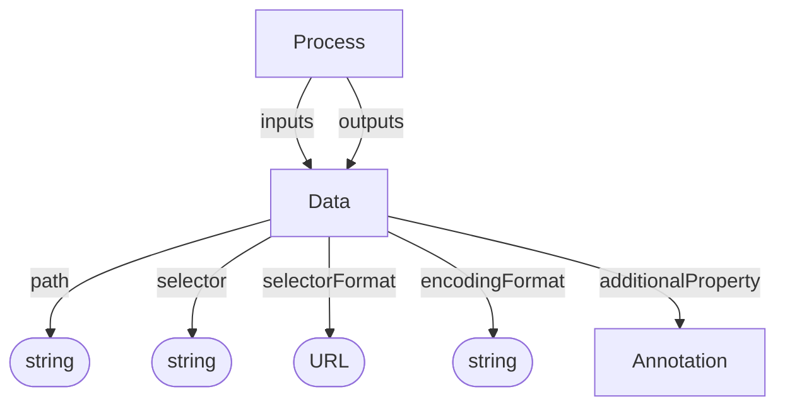

# Data

Data files produced or consumed by processes. A Data object may represent either a whole file or, when its identifier includes a selector, a specific fragment within a file.

**Schema.org type**: `schema.org/MediaObject` or `File`

## Properties

| Property | Type | Required | Description |
|----------|------|----------|-------------|
| `id` | Text | COULD | Path pointing to the file |
| `type` | Text | MUST | `Data` |
| `additionalType` | Text | COULD | Decoration discriminator, e.g. `Raw Data` |
| `path` | Text | MUST | Path to the target data object when using the flat form |
| `selector` | Text | COULD | Fragment selector that narrows the target to a subset of the data object |
| `selectorFormat` | URL | COULD | Formal description of the selector syntax, e.g. RFC 7111 |
| `encodingFormat` | Text | COULD | MIME type of the target data object or fragment |
| `additionalProperty` | [Annotation](Annotation.md) | COULD | Extensible file-, fragment-, or content-level metadata |

## Relationships

