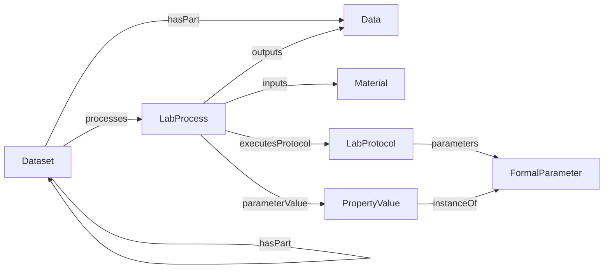

# ProcessCore

ProcessCore is the foundational ARC process model. It abstracts experimental and computational workflows as process graphs that connect material and data inputs to material and data outputs.

## Core Types

| Type | Description |
|------|-------------|
| [Dataset](Dataset.md) | Container and context for processes, nested datasets, data files, and metadata |
| [LabProcess](LabProcess.md) | Transformation node connecting inputs to outputs |
| [LabProtocol](LabProtocol.md) | Planned procedure that a process executes |
| [Material](Material.md) | Biological, chemical, or digital material used as input or output |
| [Data](Data.md) | Data file or selected file fragment |
| [PropertyValue](PropertyValue.md) | Extensible key-value-unit triple |
| [FormalParameter](FormalParameter.md) | Prospective parameter slot for protocols |
| [DefinedTerm](DefinedTerm.md) | Ontology annotation or controlled vocabulary term |

## Process Graph

For a relational view of these types, see [schemas/sql/design.md](../../../schemas/sql/design.md).
