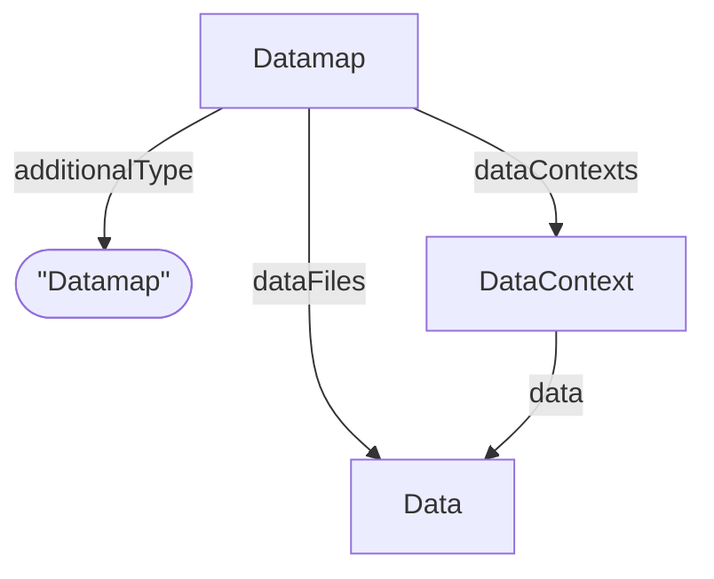

# Datamap

Datamap profile content on [Dataset](../process_core/Dataset.md). Represents a dataset that groups data files and fragment-level data contexts.

**Schema.org type**: `schema.org/Dataset`

**`additionalType`**: `Datamap`

Reference: [Datamap RO-Crate Profile](../../../references/arc_datamap_ro_crate.md)

## Additional Properties (beyond Dataset)

| Property | Type | Required | Description |
|----------|------|----------|-------------|
| `additionalType` | string | MUST | `Datamap` |
| `dataContexts` | [DataContext](DataContext.md) | SHOULD | List of DataContexts for annotation of data objects |
| `dataFiles` | [Data](./Data.md) | SHOULD | Data files that are part of the dataset |

## Relationships

