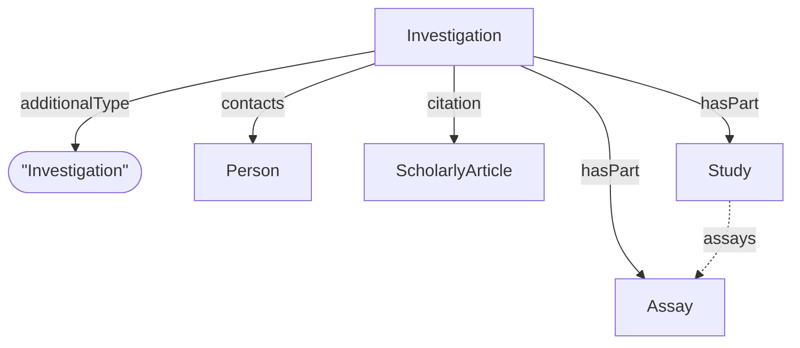

# Investigation

ISA specialization of [Dataset](../../core/Dataset.md). Represents the root container of an ISA-structured experiment, grouping studies and assays.

**`additionalType`**: `Investigation`

Reference: [ISA RO-Crate Profile — Investigation](../../../../references/isa_ro_crate.md)

## Additional Properties (beyond Dataset)

| Property | Type | Required | Description |
|----------|------|----------|-------------|
| `license` | Text | MUST | Usage license |
| `datePublished` | Date | MUST | Publication or creation date |
| `dateCreated` | Date | SHOULD | Creation date |
| `hasPart` | [Study](Study.md), [Assay](Assay.md) | SHOULD | Contained studies and assays |
| `contacts` | [Person](Person.md) | COULD | Investigation contacts and contributors |
| `citation` | ScholarlyArticle | COULD | Associated publications |

## Relationships

