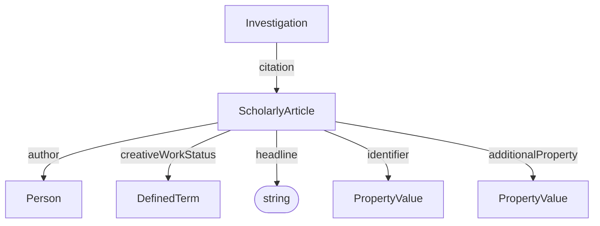

# ScholarlyArticle

A scholarly publication associated with a Dataset, Study, or Assay. This can be used to link to publications describing the experiment or its results.

**Schema.org type**: `schema.org/ScholarlyArticle`

## Properties

| Property | Type | Required | Description |
|----------|------|----------|-------------|
| `id` | Text | COULD | Unique identifier |
| `type` | Text | MUST | `schema.org/ScholarlyArticle` |
| `headline` | Text | MUST | Headline of the article |
| `identifier` | Text, PropertyValue | MUST | One or many identifiers for this article like a DOI or PubMedID. Can be of type PropertyValue to indicate the kind of reference (See details in Section on PropertyValue). |
| `author` | [Person](Person.md) | SHOULD | Authors of the article |
| `creativeWorkStatus` | [DefinedTerm](../../core/DefinedTerm.md) | COULD | The status of the publication in terms of its stage in a lifecycle. |
| `additionalProperty` | [PropertyValue](../../core/PropertyValue.md) | COULD | Extensible article metadata not covered by the base properties. |

## Relationships

## Identifiers

The `identifier` property can be used to link to external identifiers for the article, such as a DOI or PubMedID. 

### DOI

