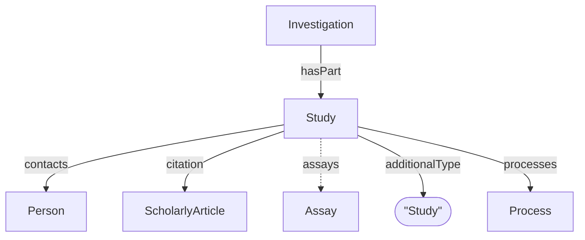

# Study

ISA specialization of [Dataset](../../core/Dataset.md). Represents a unit of research with associated experimental processes at the study level.

**`additionalType`**: `Study`

Reference: [ISA RO-Crate Profile — Study](../../../../references/isa_ro_crate.md)

## Additional Properties (beyond Dataset)

| Property | Type | Required | Description |
|----------|------|----------|-------------|
| `additionalType` | string | MUST | `Study` |
| `assays` | [Assay](Assay.md) | COULD | Contained assays or data files |
| `contacts` | [Person](Person.md) | COULD | Study contacts and contributors |
| `citation` | ScholarlyArticle | COULD | Associated publications |

## Relationships

