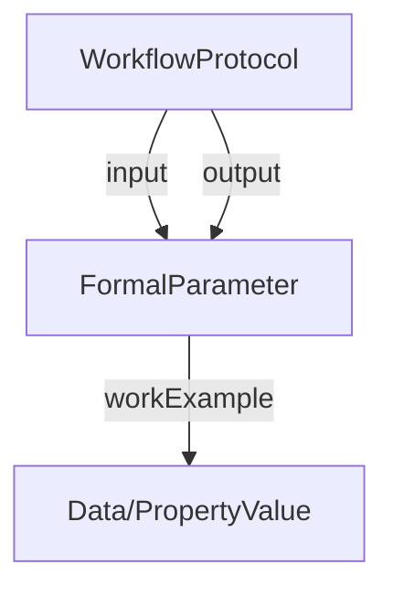

# FormalParameter

Specializations of [FormalParameter](../../core/FormalParameter.md) used in the Workflow Run decoration.

Workflow Run-specific entity (no direct ProcessCore equivalent). Describes the shape and type of workflow inputs/outputs, providing prospective provenance.

**Schema.org type**: `bioschemas.org/FormalParameter`

Reference: [ARC WR RO-Crate Profile — FormalParameter](../../../../references/arc_wr_ro_crate.md)

## Properties

| Property | Type | Required | Description |
|----------|------|----------|-------------|
| `@id` | Text | MUST | Unique identifier |
| `@type` | Text | MUST | `bioschemas.org/FormalParameter` |
| `additionalType` | Text | SHOULD | File, Dataset, Collection, PropertyValue, or DataType |
| `name` | Text | SHOULD | Parameter slot name (should match workflow parameter) |
| `encodingFormat` | Text, URL | SHOULD | MIME format |
| `description` | Text | COULD | Parameter purpose |
| `workExample` | IRI | COULD | Data entity realizing this parameter |
| `defaultValue` | Text, Thing | COULD | Default value for input |
| `valueRequired` | Boolean | COULD | Whether value must be specified |

## Relationships

