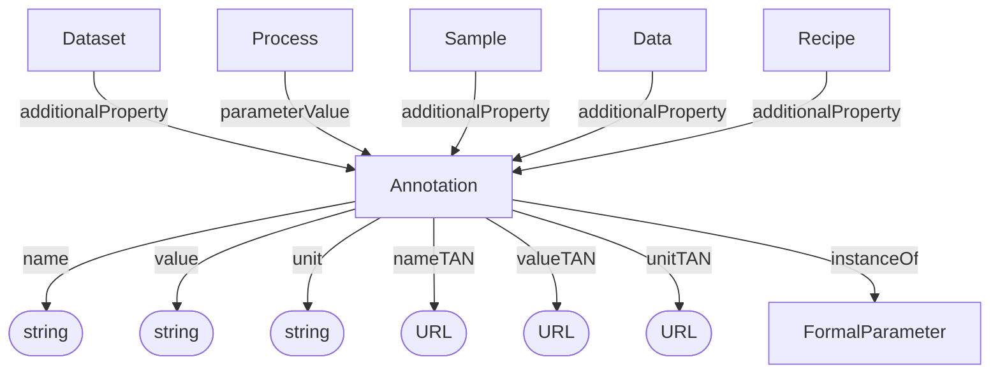

# Annotation

Extensible key-value-unit triple. Annotations are the primary extension mechanism of ARC Core. They can be attached through `additionalProperty` for cross-cutting metadata, or through dedicated relationships such as `parameterValue` when the host type already defines a more specific role.

**Schema.org type**: `schema.org/PropertyValue`

Decoration subtypes:
- ISA: ParameterValue, CharacteristicValue, FactorValue, Component
- Workflow Run: Workflow Input, Prefix, Position

## Properties

| Property | Type | Required | Description |
|----------|------|----------|-------------|
| `id` | Text | MUST | Unique identifier |
| `type` | Text | MUST | `Annotation` |
| `additionalType` | Text | SHOULD | Subtype discriminator |
| `name` | Text | MUST | Key name |
| `value` | Text, Number | SHOULD | The value |
| `unit` | Text | COULD | Unit ontology reference |
| `nameTAN` | URL | SHOULD | Key ontology reference |
| `valueTAN` | URL | COULD | Value term annotation |
| `unitTAN` | URL | COULD | Unit term annotation |
| `instanceOf` | [FormalParameter](FormalParameter.md) | COULD | Links a parameter value to its formal parameter definition |
## Relationships

