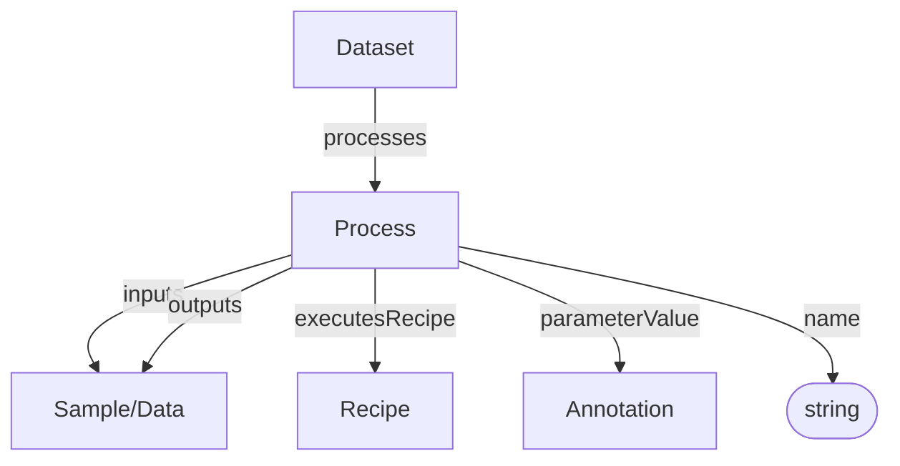
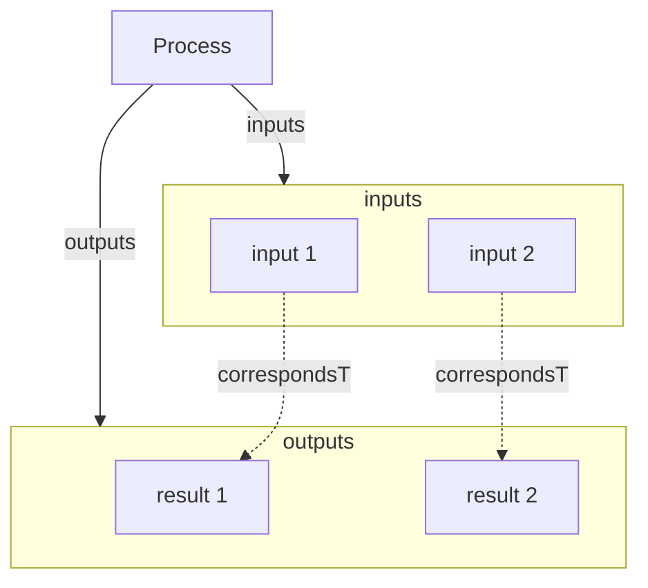

# Process

Core transformation node in the process graph. A Process connects inputs to outputs and references the Recipe that was executed.

**Schema.org type**: `bioschemas.org/LabProcess`

Decorations specialize Process:
- ISA: Process
- Workflow Run: Workflow Invocation (CreateAction + Process)

## Properties

| Property | Type | Required | Description |
|----------|------|----------|-------------|
| `id` | Text | COULD | Unique process identifier |
| `type` | Text | MUST | `Process` |
| `additionalType` | Text | COULD | Decoration discriminator, e.g. `Process` |
| `name` | Text | MUST | Name of the process |
| `inputs` | [Sample](Sample.md), [Data](Data.md) | SHOULD | Input(s) of the process |
| `outputs` | [Sample](Sample.md), [Data](Data.md) | SHOULD | Output(s) of the process |
| `executesRecipe` | [Recipe](Recipe.md) | SHOULD | Recipe that was executed |
| `parameterValue` | [Annotation](Annotation.md) | SHOULD | Parameter key-value pairs |

## Relationships

## Inputs and Outputs

The core mechanism of a process is one directed graph edge with an optional singular input and optional singular output. Fan-in, fan-out, and parallel lanes are represented by multiple processes, which makes each table row and each traversable edge unambiguous.

The YAML profile retains `inputs` and `outputs` arrays as a compact wire representation. Readers expand the Nth input/output pair into a singular process and pad an unequal shorter side with an absent endpoint. Writers group processes with equal non-I/O state back into these arrays.

