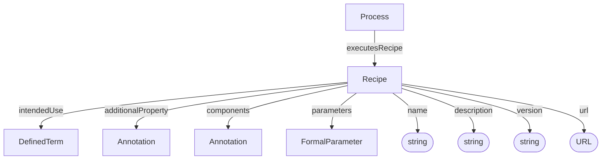

# Recipe

Description of a planned procedure. Recipes define what a Process executes, including intended use, equipment, reagents, and software.

**Schema.org type**: `bioschemas.org/LabProtocol`

Decorations specialize Recipe:
- ISA: Recipe
- Workflow Run: Workflow Protocol (SoftwareSourceCode + ComputationalWorkflow + Recipe)

## Properties

| Property | Type | Required | Description |
|----------|------|----------|-------------|
| `id` | Text | COULD | URL or identifier for the recipe |
| `type` | Text | MUST | `Recipe` |
| `additionalType` | Text | COULD | Decoration discriminator, e.g. `Recipe` |
| `name` | Text | SHOULD | Main title |
| `parameters` | [FormalParameter](FormalParameter.md) | COULD | Prospectively specifies parameters for which values should be given in the execution of the recipe. Maps to `input` in the Bioschemas type. |
| `description` | Text | SHOULD | Short description or abstract |
| `intendedUse` | [DefinedTerm](DefinedTerm.md), Text | SHOULD | Recipe type as ontology term |
| `additionalProperty` | [Annotation](Annotation.md) | COULD | Extensible recipe metadata |
| `components` | [Annotation](Annotation.md) | COULD | Equipment, software, reagents, materials, or other components used in the recipe |
| `version` | Text | COULD | Version identifier |
| `url` | URL | COULD | External recipe resource |

## Relationships

