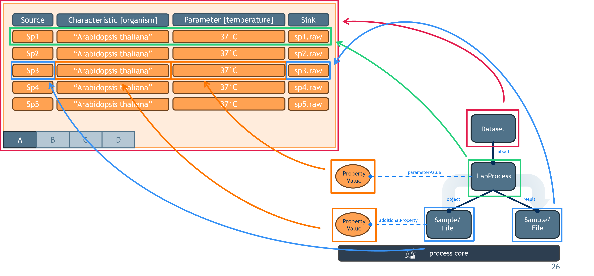

# Tabular ↔ Process Graph: Bidirectional Mapping

## The Two Representations

### Tabular Representation

A rectangular matrix of typed, named columns and rows. Each **column** has a header that declares both the *role* of the data (e.g. "this is a measured parameter", "this is a sample characteristic", "this is a protocol setting") and optionally the *ontology term* that identifies what is being described. Each **cell** in a column holds a typed value: either a plain string, an ontology term reference (name + accession URL), or a numeric value with a unit term. The entire matrix represents a single experimental step (one protocol applied to multiple samples), where each row is one execution of that step.

### Process Graph Representation

A directed graph of execution nodes. Each **process node** represents one row from the table — a single execution of a protocol applied to one set of inputs, producing one set of outputs. It carries: a reference to a protocol object, a list of annotated parameter values, a list of input entities, a list of output entities, an optional agent (performer), and optional comments. Each **protocol object** carries metadata (name, description, URL, version, type) and a list of component/equipment annotations. Each **input** and **output entity** is a named node that can carry its own annotations (characteristics on inputs, factor values on outputs).

---

## Structural Correspondence

### One Table = One Group of Process Nodes

The table name is the identity of the group. For a table with N rows, N process nodes are produced, all named after the table. A single-row table produces exactly one process. Decomposing a process graph back to a table is done by grouping nodes whose names share the same name — each group reconstructs exactly one table.

### One Column = One Slot Across All Process Nodes

A column in the table corresponds to a consistently-typed slot that appears once per process node. The column header defines the slot's type and ontology identity; the cell in each row defines the slot's value for that process node. The mapping of column role to graph slot is as follows:

| Column role | Where the value lives in each process node |
|---|---|
| Parameter | An annotation value on the process node itself, tagged as a "parameter value" |
| Component / Equipment | An annotation value on the *protocol* object referenced by the process, tagged as a "component" |
| Characteristic | An annotation value on the *input entity* of that row, tagged as a "characteristic" |
| Factor | An annotation value on the *output entity* of that row, tagged as a "factor value" |
| Input (sample/file name) | The name of the input entity node |
| Output (sample/file name) | The name of the output entity node |
| Protocol name (REF) | The name of the protocol object |
| Protocol type | A typed term reference on the protocol object (its intended use category) |
| Protocol description | A plain-text field on the protocol object |
| Protocol URL | A URL field on the protocol object |
| Protocol version | A plain-text field on the protocol object |
| Comment | A free-text annotation directly on the process node, serialized as `"key=value"` |
| Performer | The named agent/person attached to the process node |

### One Row = One Process Node

A single table row maps to a single process node. That process node bundles:

- one input entity (carrying all Characteristic annotations from that row)
- one output entity (carrying all Factor annotations from that row)
- all Parameter annotation values from that row
- a protocol object (instantiated per row from the protocol columns)
- all Component annotation values on that protocol object from that row
- all Comment values from that row
- an optional performer from that row

---

## Value Encoding

### Annotation Values (Parameters, Factors, Characteristics, Components)

Every annotation value is encoded as a structure with up to seven fields:

| Field | Description |
|---|---|
| Property name | The display name of the ontology term from the column header |
| Property identifier | The accession URL of the ontology term from the column header (optional) |
| Value | The cell's content as a plain string (optional, absent if cell is empty) |
| Value reference | If the cell contains an ontology term, the accession URL of that term (optional) |
| Unit text | The unit's display name, if the cell is a numeric-with-unit value (optional) |
| Unit identifier | The unit's accession URL, if the cell is a numeric-with-unit value (optional) |
| Type tag | A fixed string discriminating the annotation role (see below) |
| Column index | An integer recording the column's original position for round-trip ordering |

**Type tag values:**

| Column role | Type tag |
|---|---|
| Parameter | `"ParameterValue"` |
| Factor | `"FactorValue"` |
| Characteristic | `"CharacteristicValue"` |
| Component | `"Component"` |

**Reconstructing a cell from a property value:**

1. If a value reference (accession URL) is present → the cell is an ontology term reference
2. Else if unit information is present → the cell is a numeric value with unit
3. Else → the cell is a plain string or a bare ontology term name

**Reconstructing a column header from a property value:**

- The property name and optional property identifier together form the ontology term for the column header
- The type tag determines which column role (Parameter / Factor / Characteristic / Component) to assign

### Input and Output Entities

Input and output entities are typed nodes. The column header's IO type (Source, Sample, Material, Data file, or a free-text schema type) determines what kind of node is created:

| IO type | Node kind |
|---|---|
| Source | A material entity node sub-typed as "source" |
| Sample | A material entity node sub-typed as "sample" |
| Material | A material entity node sub-typed as "material" |
| Data file | A file entity node; structured file fields (format, selector format, etc.) are embedded on the node if present |
| Free-text type | A generic node whose schema type is set to the free-text string |

On decompose, the node type is inspected to reconstruct the IO type and cell value.

---

## Column Order Preservation

Because the process graph format does not guarantee column order, the original column position of every annotation value (Parameters, Factors, Characteristics, Components) is stored as an integer metadata field on each annotation value node during compose. The integer is the column's ordinal position **within the subset of annotation columns only** (not counting Input / Output / Protocol / Comment columns).

During decompose, all annotation values collected from a single process node are sorted by this stored integer before being assembled into a row. This ensures that the column order in the reconstructed table matches the original. Annotation values without a stored index are sorted last.

---

## Protocol Multiplicity

Every process node references its own copy of a protocol object. All rows of the same table produce protocol objects with the same node identity (derived from the protocol name), but each carries the field values from its own row's protocol columns. If protocol columns are constant across all rows, all protocol objects are identical. If they differ per row, each process node has a distinct protocol.

On decompose, the protocol object of each process node is read independently per row, so per-row variation in protocol metadata is faithfully reconstructed as per-row variation in the protocol columns.

---

## Handling Missing Inputs or Outputs

If a table has no Input column but has Characteristic columns, a synthetic input entity is created for each row (named after the table and row index) to carry those characteristic annotations. The same applies symmetrically to outputs and Factor columns. This ensures the compose direction is lossless for annotation values even when I/O columns are absent.

On decompose, if a process node has no input entity, no Input column is emitted (and Characteristic columns are also absent, since they had no entity to attach to).

---

## Multi-Input / Multi-Output Rows

If a process node has more than one input entity or more than one output entity, the decompose direction produces one **row per input/output pair** (a zip of inputs × outputs). The annotation columns (parameters, characteristics, factors, components, protocol metadata) are identical for all rows within that process node — only the I/O entity columns vary across the zip. If the input and output counts are unequal, the shorter side is padded with empty cells.

---

## Column Ordering Within a Reconstructed Row

When building a row from a process, columns are emitted in this fixed order:

1. Input entity (if present)
2. Protocol metadata columns (REF, Description, URL, Version, Type)
3. Characteristic annotation values (sorted by stored column index)
4. Component annotation values (sorted by stored column index)
5. Parameter annotation values (sorted by stored column index)
6. Factor annotation values (sorted by stored column index)
7. Comment columns
8. Output entity (if present)
