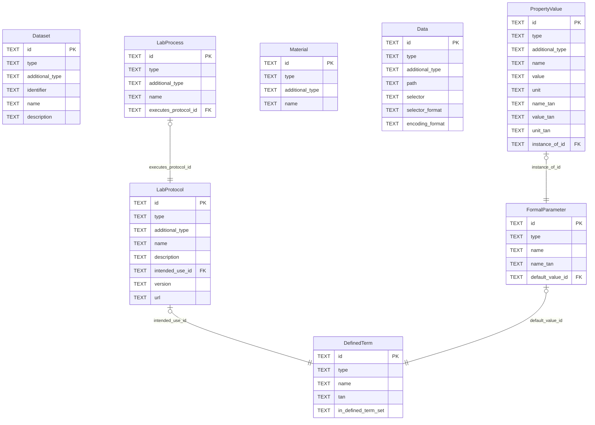
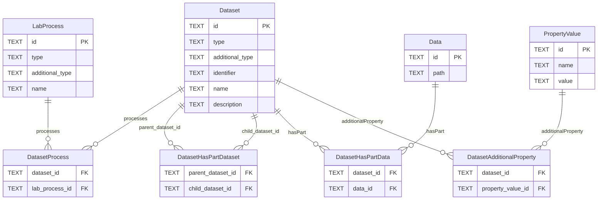
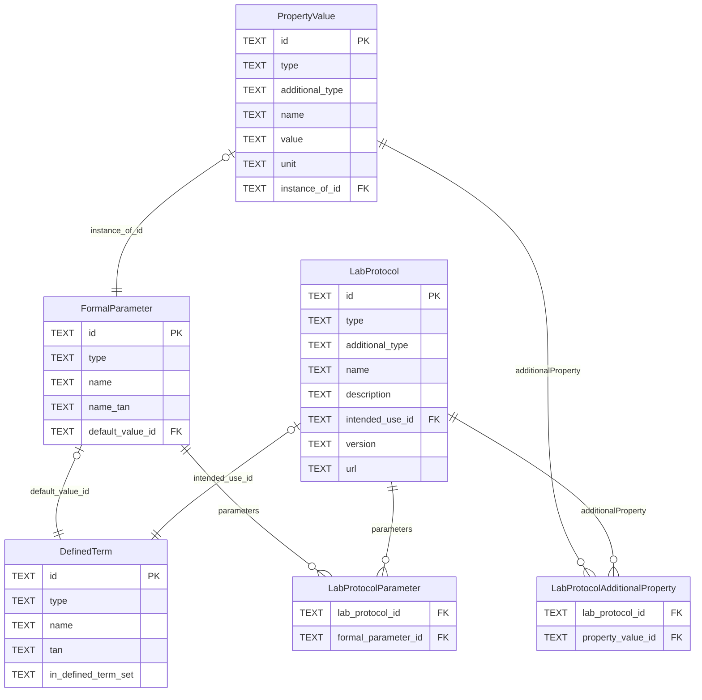
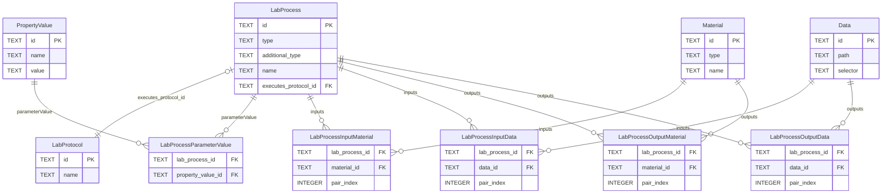
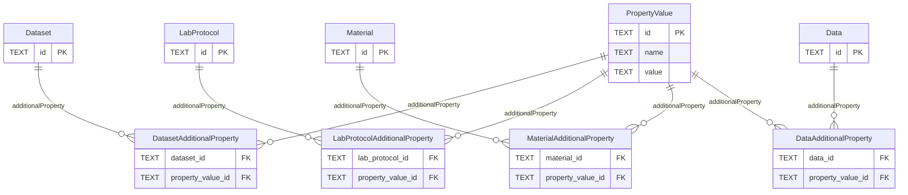

# Core SQLite Logical ERD

This draft translates the current core spec into a SQLite-friendly logical model.

How to read it:

- Single-valued references become foreign key columns on the owning table, for example `LabProcess.executesProtocol` becomes `LabProcess.executes_protocol_id`.
- Multi-valued references become join tables, because SQLite does not have native array columns.
- Polymorphic multi-valued references such as `inputs` and `outputs` are split into separate `...Material` and `...Data` join tables so foreign keys can still be enforced.
- `pair_index` on process input/output tables preserves the spec idea that the Nth input corresponds to the Nth output.
- This draft assumes every persisted row has a primary key, even where the markdown spec marks an identifier as optional. That matters especially for `LabProtocol`, `LabProcess`, and `Data`.
- `Person` is still omitted because it is referenced from the core docs but is not currently specified as a core type.

## Overview

This overview keeps only the core tables and single-valued foreign keys. The multi-valued properties are detailed in the focused diagrams below.

## Dataset Structure

This diagram expands the multi-valued dataset properties.

## Protocol And Parameters

This diagram expands `LabProtocol.parameters`, `LabProtocol.additionalProperty`, `PropertyValue.instanceOf`, and `FormalParameter.defaultValue`.

## Process Inputs, Outputs, And Parameter Values

This diagram expands `inputs`, `outputs`, and `parameterValue`.

## AdditionalProperty Attachments

This diagram collects the repeated `additionalProperty` join-table pattern.

