# Core SQL Schema - Design

A SQLite relational mapping of the [ProcessCore model](../../spec/core/README.md). Scope: core entities only. ISA, Workflow Run, and Datamap decorations can layer on top later through `additional_type` and decoration-owned tables.

The Markdown files in `spec/core/` remain authoritative. This document describes a relational representation that should round-trip the current core YAML schemas without silently dropping core semantics.

## Design Decisions

- **Primary keys** - every entity table uses `TEXT PRIMARY KEY`. Where the spec marks `id` as `MUST`, it is taken from the source. Where `id` is `COULD` (`LabProcess`, `LabProtocol`, `Data`), import code must generate or persist a stable local identifier when no source identifier is present.
- **`type` columns are omitted only when constant** - most entity tables encode a single core type through the table name. `data.type` is stored because `Data` can be either `File` or `schema:MediaObject`.
- **`additional_type` only where the model defines it** - kept on `dataset`, `lab_protocol`, `lab_process`, `material`, `data`, and `property_value`. It is intentionally absent from `defined_term` and `formal_parameter`.
- **Ordered lists are keyed by position** - ordered association tables use `(owner_id, position)` as the primary key, with `position INTEGER NOT NULL CHECK(position >= 0)`. This preserves order and does not forbid the same target appearing more than once unless a future requirement adds a uniqueness rule.
- **Mixed-target lists use one association table with strict FKs** - `Dataset.hasPart` and `LabProcess.inputs`/`outputs` can point to more than one target type. They are represented with nullable target FK columns plus an exact-one-target `CHECK`, rather than with polymorphic IDs or several split tables that must later be merged by `position`.
- **Entity references stay reusable unless the spec says otherwise** - `LabProtocol.parameters` is represented by `protocol_parameter`, not by a `protocol_id` column on `formal_parameter`. This avoids baking in single-owner semantics that the core schema does not require.
- **`PropertyValue` is a first-class entity** - it has its own PK, and associations to owners (`Dataset`, `Material`, `Data`, `LabProtocol`, `LabProcess`) live in ordered association tables. The schema permits a `PropertyValue` to be referenced from multiple owners; in practice each will typically have one owner.
- **Numeric values preserve their source kind** - `property_value.value` is stored as `TEXT`, with `value_type` recording whether the source value was text or numeric. Numeric range indexes or generated numeric columns can be added later if querying by numeric range becomes a requirement.
- **No path/closure tables** - process paths are derivable from `process_io` and can be added later as a view or materialized closure table.

## Schema Overview

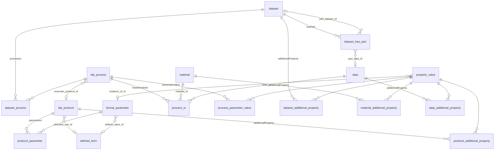
```mermaid
erDiagram
    dataset ||--o{ dataset_has_part : "hasPart"
    dataset_has_part }o--o| dataset : "part_dataset_id"
    dataset_has_part }o--o| data : "part_data_id"
    dataset ||--o{ dataset_process : "processes"
    lab_process ||--o{ dataset_process : ""
    lab_process }o--o| lab_protocol : "executes_protocol_id"
    lab_protocol ||--o{ protocol_parameter : "parameters"
    formal_parameter ||--o{ protocol_parameter : ""
    lab_protocol }o--o| defined_term : "intended_use_id"
    formal_parameter }o--o| defined_term : "default_value_id"
    property_value }o--o| formal_parameter : "instance_of_id"
    lab_process ||--o{ process_io : "inputs/outputs"
    material ||--o{ process_io : "material_id"
    data ||--o{ process_io : "data_id"
    lab_process ||--o{ process_parameter_value : "parameterValue"
    property_value ||--o{ process_parameter_value : ""
    dataset ||--o{ dataset_additional_property : "additionalProperty"
    property_value ||--o{ dataset_additional_property : ""
    lab_protocol ||--o{ protocol_additional_property : "additionalProperty"
    property_value ||--o{ protocol_additional_property : ""
    material ||--o{ material_additional_property : "additionalProperty"
    property_value ||--o{ material_additional_property : ""
    data ||--o{ data_additional_property : "additionalProperty"
    property_value ||--o{ data_additional_property : ""
```

## Creation Order

FK dependencies require this broad order:

1. `defined_term`
2. `lab_protocol`
3. `formal_parameter`
4. `dataset`
5. `material`
6. `data`
7. `lab_process`
8. `property_value`
9. Association tables

When importing nested documents, create or upsert referenced entities before inserting association rows.

---

## Entity Tables

### `defined_term`

Ontology term annotation. `inDefinedTermSet` may be a URL or an inline `DefinedTermSet` object in the YAML schema; this design stores the set identifier and, when present, the inline set name.

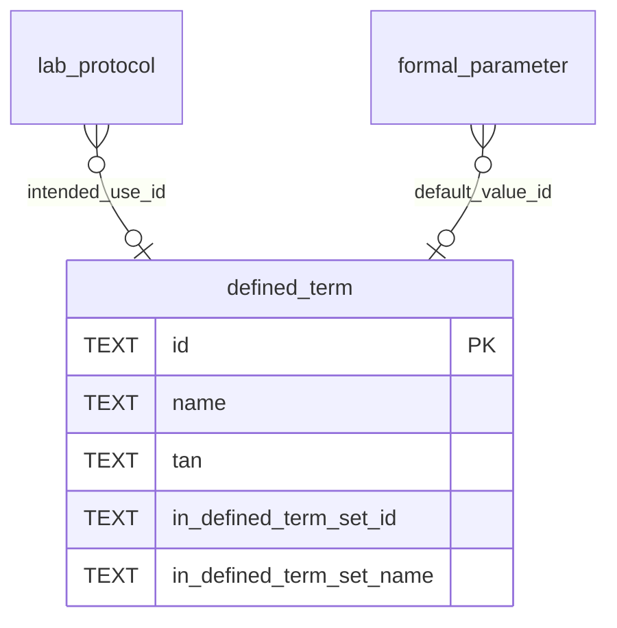
```mermaid
erDiagram
    defined_term {
        TEXT id PK
        TEXT name
        TEXT tan
        TEXT in_defined_term_set_id
        TEXT in_defined_term_set_name
    }
    lab_protocol }o--o| defined_term : "intended_use_id"
    formal_parameter }o--o| defined_term : "default_value_id"
```

| Column | Type | Constraint | Source |
|---|---|---|---|
| `id` | TEXT | PK | spec `id` (MUST) |
| `name` | TEXT | NOT NULL | spec `name` |
| `tan` | TEXT | nullable | spec `TAN` |
| `in_defined_term_set_id` | TEXT | nullable | spec `inDefinedTermSet` URL or object `id` |
| `in_defined_term_set_name` | TEXT | nullable | spec `inDefinedTermSet.name` when inline |

---

### `lab_protocol`

Planned procedure.

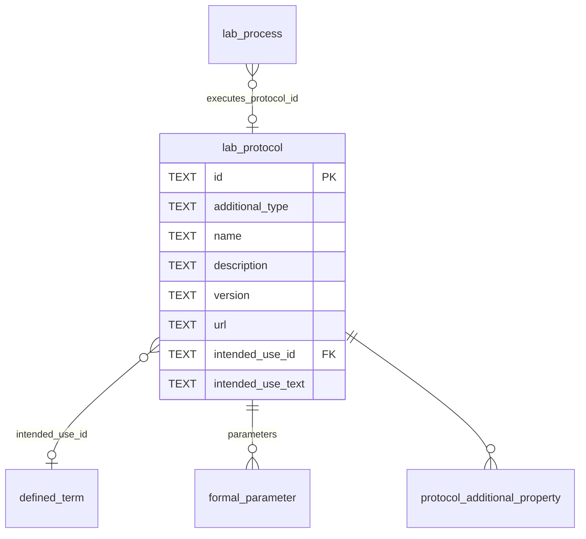
```mermaid
erDiagram
    lab_protocol {
        TEXT id PK
        TEXT additional_type
        TEXT name
        TEXT description
        TEXT version
        TEXT url
        TEXT intended_use_id FK
        TEXT intended_use_text
    }
    lab_protocol }o--o| defined_term : "intended_use_id"
    lab_protocol ||--o{ formal_parameter : "parameters"
    lab_protocol ||--o{ protocol_additional_property : ""
    lab_process }o--o| lab_protocol : "executes_protocol_id"
```

| Column | Type | Constraint | Source |
|---|---|---|---|
| `id` | TEXT | PK | spec `id` (COULD; app-generated if absent) |
| `additional_type` | TEXT | nullable | spec `additionalType` |
| `name` | TEXT | nullable | spec `name` |
| `description` | TEXT | nullable | spec `description` |
| `version` | TEXT | nullable | spec `version` |
| `url` | TEXT | nullable | spec `url` |
| `intended_use_id` | TEXT | FK -> `defined_term.id`, nullable | spec `intendedUse` as `DefinedTerm` or `@id` |
| `intended_use_text` | TEXT | nullable | spec `intendedUse` as free text |

DDL should include `CHECK (intended_use_id IS NULL OR intended_use_text IS NULL)`.

---

### `formal_parameter`

Named parameter slot for prospective provenance. Protocol membership and order are represented by `protocol_parameter`.

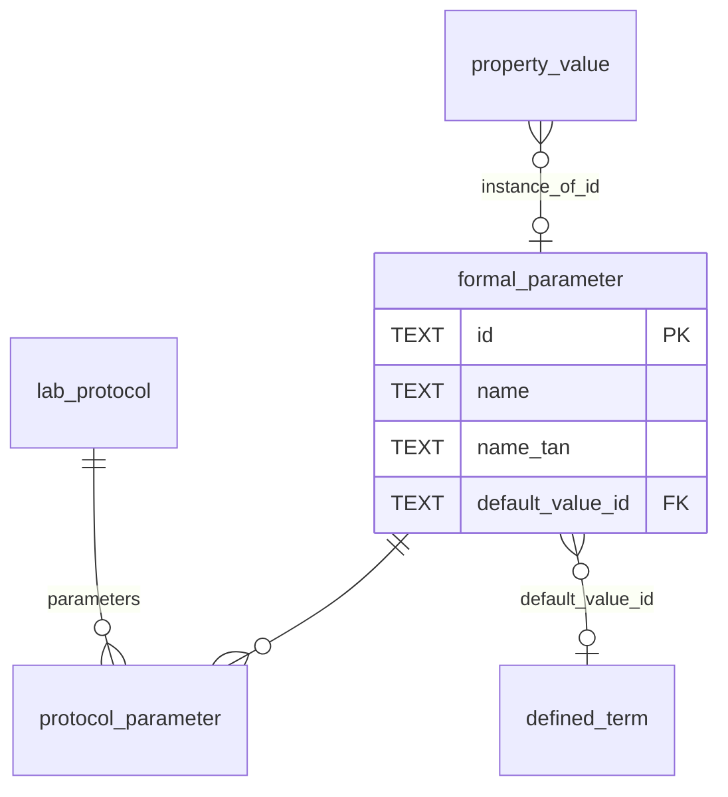
```mermaid
erDiagram
    formal_parameter {
        TEXT id PK
        TEXT name
        TEXT name_tan
        TEXT default_value_id FK
    }
    lab_protocol ||--o{ protocol_parameter : "parameters"
    formal_parameter ||--o{ protocol_parameter : ""
    formal_parameter }o--o| defined_term : "default_value_id"
    property_value }o--o| formal_parameter : "instance_of_id"
```

| Column | Type | Constraint | Source |
|---|---|---|---|
| `id` | TEXT | PK | spec `id` (MUST) |
| `name` | TEXT | nullable | spec `name` |
| `name_tan` | TEXT | nullable | spec `nameTAN` (URL) |
| `default_value_id` | TEXT | FK -> `defined_term.id`, nullable | spec `defaultValue` |

---

### `dataset`

Container for processes and metadata. Nesting and contained data files are represented by `dataset_has_part`, not by a `parent_id`, because `Dataset.hasPart` can contain both `Dataset` and `Data`.

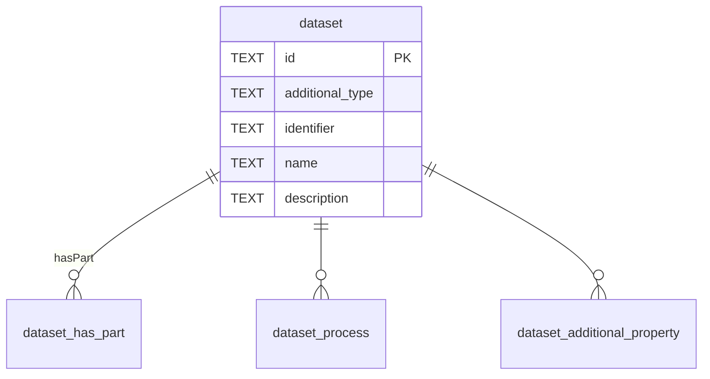
```mermaid
erDiagram
    dataset {
        TEXT id PK
        TEXT additional_type
        TEXT identifier
        TEXT name
        TEXT description
    }
    dataset ||--o{ dataset_has_part : "hasPart"
    dataset ||--o{ dataset_process : ""
    dataset ||--o{ dataset_additional_property : ""
```

| Column | Type | Constraint | Source |
|---|---|---|---|
| `id` | TEXT | PK | spec `id` (MUST) |
| `additional_type` | TEXT | nullable | spec `additionalType` |
| `identifier` | TEXT | NOT NULL | spec `identifier` (MUST) |
| `name` | TEXT | nullable | spec `name` |
| `description` | TEXT | nullable | spec `description` |

---

### `lab_process`

Transformation node.

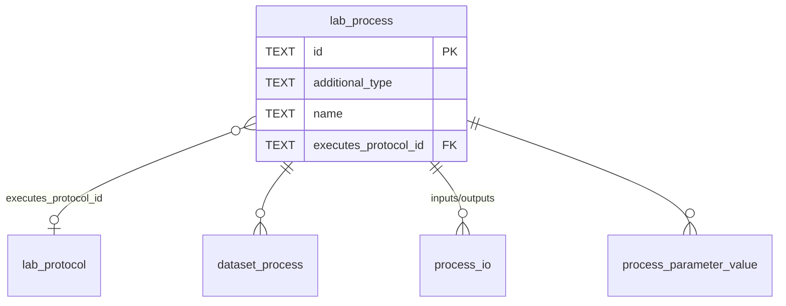
```mermaid
erDiagram
    lab_process {
        TEXT id PK
        TEXT additional_type
        TEXT name
        TEXT executes_protocol_id FK
    }
    lab_process }o--o| lab_protocol : "executes_protocol_id"
    lab_process ||--o{ dataset_process : ""
    lab_process ||--o{ process_io : "inputs/outputs"
    lab_process ||--o{ process_parameter_value : ""
```

| Column | Type | Constraint | Source |
|---|---|---|---|
| `id` | TEXT | PK | spec `id` (COULD; app-generated if absent) |
| `additional_type` | TEXT | nullable | spec `additionalType` |
| `name` | TEXT | NOT NULL | spec `name` (MUST) |
| `executes_protocol_id` | TEXT | FK -> `lab_protocol.id`, nullable | spec `executesProtocol` |

---

### `material`

Biological, chemical, or digital material.

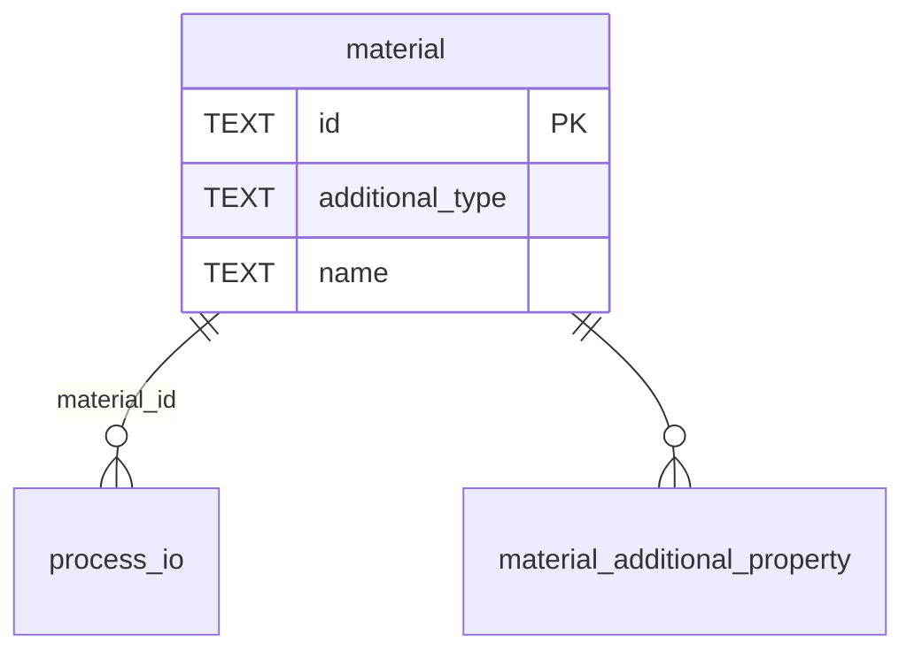
```mermaid
erDiagram
    material {
        TEXT id PK
        TEXT additional_type
        TEXT name
    }
    material ||--o{ process_io : "material_id"
    material ||--o{ material_additional_property : ""
```

| Column | Type | Constraint | Source |
|---|---|---|---|
| `id` | TEXT | PK | spec `id` (MUST) |
| `additional_type` | TEXT | nullable | spec `additionalType` |
| `name` | TEXT | NOT NULL | spec `name` (MUST) |

---

### `data`

File or fragment.

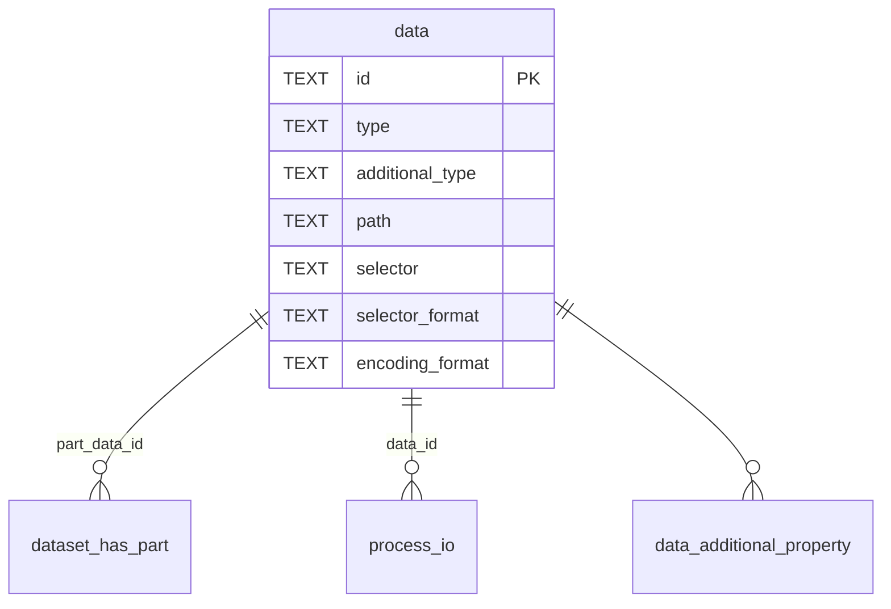
```mermaid
erDiagram
    data {
        TEXT id PK
        TEXT type
        TEXT additional_type
        TEXT path
        TEXT selector
        TEXT selector_format
        TEXT encoding_format
    }
    data ||--o{ dataset_has_part : "part_data_id"
    data ||--o{ process_io : "data_id"
    data ||--o{ data_additional_property : ""
```

| Column | Type | Constraint | Source |
|---|---|---|---|
| `id` | TEXT | PK | spec `id` (COULD; app-generated if absent) |
| `type` | TEXT | NOT NULL, `CHECK(type IN ('File', 'schema:MediaObject'))` | spec `type` |
| `additional_type` | TEXT | nullable | spec `additionalType` |
| `path` | TEXT | NOT NULL | spec `path` (MUST) |
| `selector` | TEXT | nullable | spec `selector` |
| `selector_format` | TEXT | nullable | spec `selectorFormat` (URL) |
| `encoding_format` | TEXT | nullable | spec `encodingFormat` |

If import data uses `schema.org/MediaObject`, normalize it to the YAML schema's `schema:MediaObject` form before insert, or widen the check constraint intentionally.

---

### `property_value`

Key-value-unit triple. Owned via association tables.

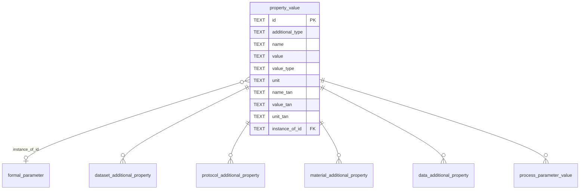
```mermaid
erDiagram
    property_value {
        TEXT id PK
        TEXT additional_type
        TEXT name
        TEXT value
        TEXT value_type
        TEXT unit
        TEXT name_tan
        TEXT value_tan
        TEXT unit_tan
        TEXT instance_of_id FK
    }
    property_value }o--o| formal_parameter : "instance_of_id"
    property_value ||--o{ dataset_additional_property : ""
    property_value ||--o{ protocol_additional_property : ""
    property_value ||--o{ material_additional_property : ""
    property_value ||--o{ data_additional_property : ""
    property_value ||--o{ process_parameter_value : ""
```

| Column | Type | Constraint | Source |
|---|---|---|---|
| `id` | TEXT | PK | spec `id` (MUST) |
| `additional_type` | TEXT | nullable | spec `additionalType` |
| `name` | TEXT | NOT NULL | spec `name` (MUST) |
| `value` | TEXT | nullable | spec `value` |
| `value_type` | TEXT | nullable, `CHECK(value_type IN ('text', 'number'))` | source kind of `value` |
| `unit` | TEXT | nullable | spec `unit` |
| `name_tan` | TEXT | nullable | spec `nameTAN` (URL) |
| `value_tan` | TEXT | nullable | spec `valueTAN` (URL) |
| `unit_tan` | TEXT | nullable | spec `unitTAN` (URL) |
| `instance_of_id` | TEXT | FK -> `formal_parameter.id`, nullable | spec `instanceOf` |

DDL should keep `value` and `value_type` aligned, for example `CHECK ((value IS NULL AND value_type IS NULL) OR (value IS NOT NULL AND value_type IS NOT NULL))`.

---

## Association Tables

Ordered association tables use `position INTEGER NOT NULL CHECK(position >= 0)`. For tables whose source property is an array, `position` is part of the primary key.

### `dataset_has_part` - `Dataset.hasPart` -> `Dataset` or `Data`

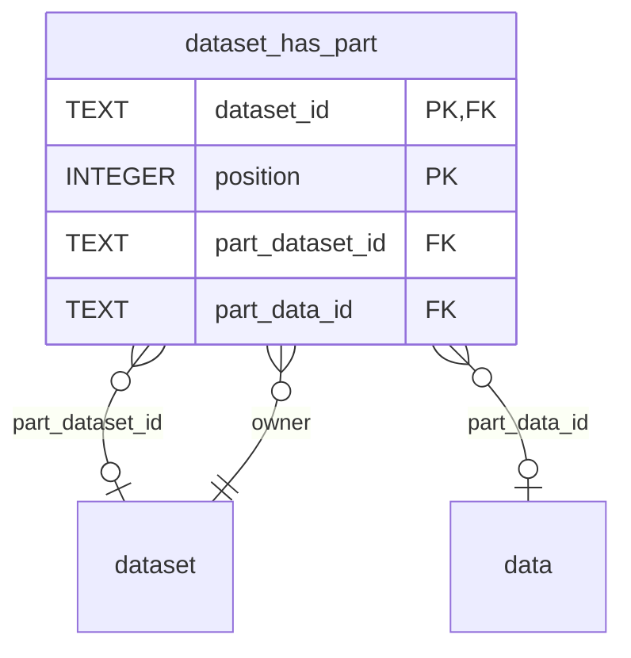
```mermaid
erDiagram
    dataset_has_part {
        TEXT dataset_id PK,FK
        INTEGER position PK
        TEXT part_dataset_id FK
        TEXT part_data_id FK
    }
    dataset ||--o{ dataset_has_part : "owner"
    dataset_has_part }o--o| dataset : "part_dataset_id"
    dataset_has_part }o--o| data : "part_data_id"
```

| Column | Type | Constraint | Source |
|---|---|---|---|
| `dataset_id` | TEXT | PK, FK -> `dataset.id` | owning dataset |
| `position` | INTEGER | PK, `CHECK(position >= 0)` | order in `Dataset.hasPart` |
| `part_dataset_id` | TEXT | FK -> `dataset.id`, nullable | `hasPart` dataset item |
| `part_data_id` | TEXT | FK -> `data.id`, nullable | `hasPart` data item |

DDL should include an exact-one-target check:

```sql
CHECK (
  (part_dataset_id IS NOT NULL AND part_data_id IS NULL)
  OR
  (part_dataset_id IS NULL AND part_data_id IS NOT NULL)
)
```

If the core spec later makes dataset nesting exclusive, add partial unique indexes on the part columns. The current schema does not assume that a `Dataset` or `Data` object can appear in only one parent's `hasPart` list.

### `dataset_process` - `Dataset.processes` -> `LabProcess`

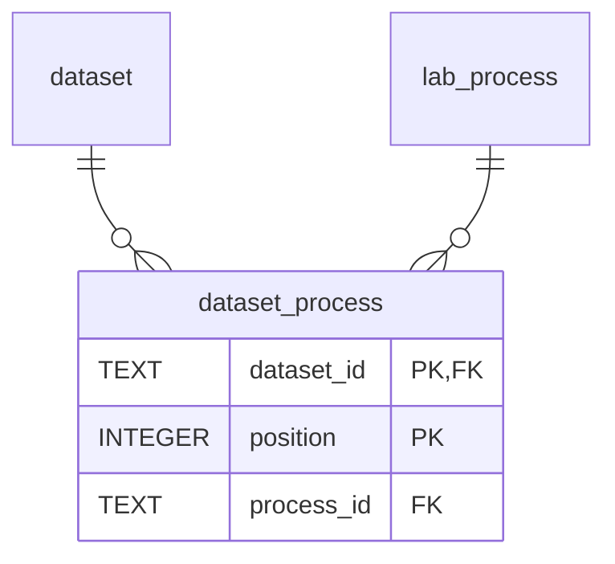
```mermaid
erDiagram
    dataset_process {
        TEXT dataset_id PK,FK
        INTEGER position PK
        TEXT process_id FK
    }
    dataset ||--o{ dataset_process : ""
    lab_process ||--o{ dataset_process : ""
```

| Column | Type | Constraint | Source |
|---|---|---|---|
| `dataset_id` | TEXT | PK, FK -> `dataset.id` | owning dataset |
| `position` | INTEGER | PK, `CHECK(position >= 0)` | order in `Dataset.processes` |
| `process_id` | TEXT | NOT NULL, FK -> `lab_process.id` | process item |

### `dataset_additional_property` - `Dataset.additionalProperty` -> `PropertyValue`

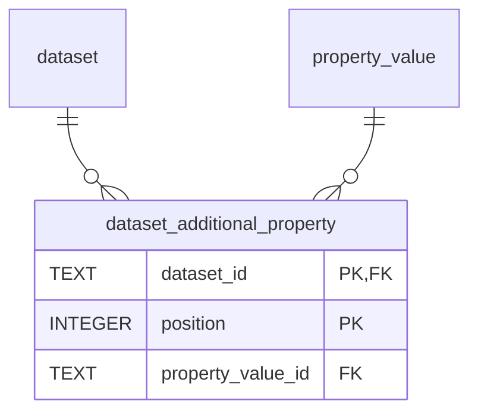
```mermaid
erDiagram
    dataset_additional_property {
        TEXT dataset_id PK,FK
        INTEGER position PK
        TEXT property_value_id FK
    }
    dataset ||--o{ dataset_additional_property : ""
    property_value ||--o{ dataset_additional_property : ""
```

| Column | Type | Constraint | Source |
|---|---|---|---|
| `dataset_id` | TEXT | PK, FK -> `dataset.id` | owning dataset |
| `position` | INTEGER | PK, `CHECK(position >= 0)` | order in `additionalProperty` |
| `property_value_id` | TEXT | NOT NULL, FK -> `property_value.id` | property value item |

### `protocol_parameter` - `LabProtocol.parameters` -> `FormalParameter`

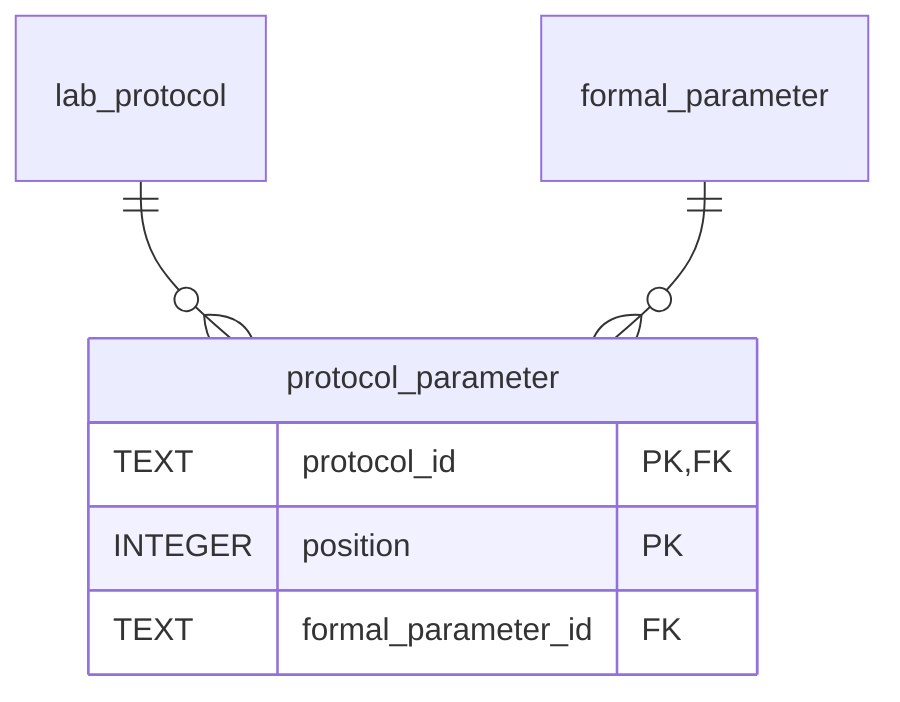
```mermaid
erDiagram
    protocol_parameter {
        TEXT protocol_id PK,FK
        INTEGER position PK
        TEXT formal_parameter_id FK
    }
    lab_protocol ||--o{ protocol_parameter : ""
    formal_parameter ||--o{ protocol_parameter : ""
```

| Column | Type | Constraint | Source |
|---|---|---|---|
| `protocol_id` | TEXT | PK, FK -> `lab_protocol.id` | owning protocol |
| `position` | INTEGER | PK, `CHECK(position >= 0)` | order in `LabProtocol.parameters` |
| `formal_parameter_id` | TEXT | NOT NULL, FK -> `formal_parameter.id` | formal parameter item |

### `process_io` - `LabProcess.inputs` / `LabProcess.outputs` -> `Material` or `Data`

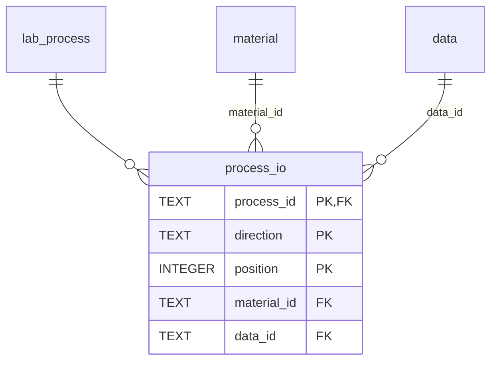
```mermaid
erDiagram
    process_io {
        TEXT process_id PK,FK
        TEXT direction PK
        INTEGER position PK
        TEXT material_id FK
        TEXT data_id FK
    }
    lab_process ||--o{ process_io : ""
    material ||--o{ process_io : "material_id"
    data ||--o{ process_io : "data_id"
```

| Column | Type | Constraint | Source |
|---|---|---|---|
| `process_id` | TEXT | PK, FK -> `lab_process.id` | owning process |
| `direction` | TEXT | PK, `CHECK(direction IN ('input', 'output'))` | `inputs` or `outputs` |
| `position` | INTEGER | PK, `CHECK(position >= 0)` | order in the selected list |
| `material_id` | TEXT | FK -> `material.id`, nullable | material input/output |
| `data_id` | TEXT | FK -> `data.id`, nullable | data input/output |

DDL should include an exact-one-target check:

```sql
CHECK (
  (material_id IS NOT NULL AND data_id IS NULL)
  OR
  (material_id IS NULL AND data_id IS NOT NULL)
)
```

The spec's "Nth input corresponds to Nth output" contract is represented by matching `position` values across `direction = 'input'` and `direction = 'output'`. The pairing is positional only: a process may be a pure source (outputs only), a pure sink (inputs only), or asymmetric, and the spec does not require the two lists to have equal length. Pair extraction is a self-join on `(process_id, position)` across directions, defined only at indices present in both.

### `process_parameter_value` - `LabProcess.parameterValue` -> `PropertyValue`

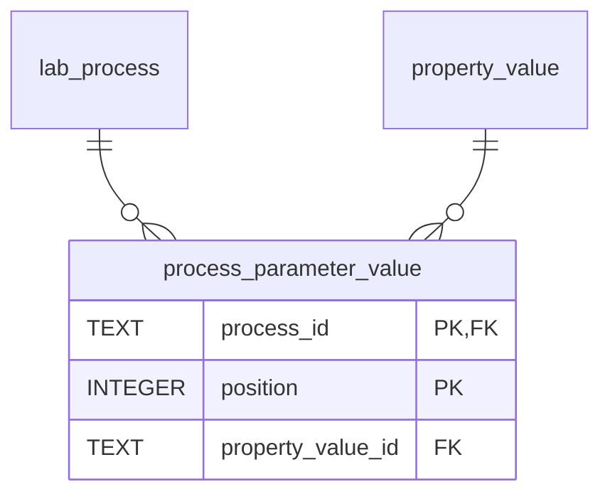
```mermaid
erDiagram
    process_parameter_value {
        TEXT process_id PK,FK
        INTEGER position PK
        TEXT property_value_id FK
    }
    lab_process ||--o{ process_parameter_value : ""
    property_value ||--o{ process_parameter_value : ""
```

| Column | Type | Constraint | Source |
|---|---|---|---|
| `process_id` | TEXT | PK, FK -> `lab_process.id` | owning process |
| `position` | INTEGER | PK, `CHECK(position >= 0)` | order in `parameterValue` |
| `property_value_id` | TEXT | NOT NULL, FK -> `property_value.id` | property value item |

### `protocol_additional_property` - `LabProtocol.additionalProperty` -> `PropertyValue`

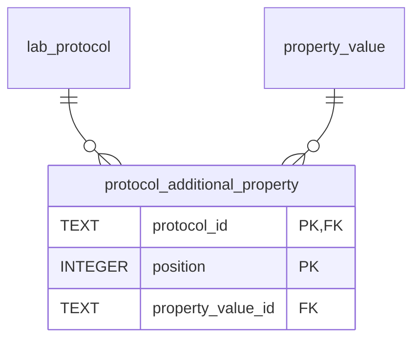
```mermaid
erDiagram
    protocol_additional_property {
        TEXT protocol_id PK,FK
        INTEGER position PK
        TEXT property_value_id FK
    }
    lab_protocol ||--o{ protocol_additional_property : ""
    property_value ||--o{ protocol_additional_property : ""
```

| Column | Type | Constraint | Source |
|---|---|---|---|
| `protocol_id` | TEXT | PK, FK -> `lab_protocol.id` | owning protocol |
| `position` | INTEGER | PK, `CHECK(position >= 0)` | order in `additionalProperty` |
| `property_value_id` | TEXT | NOT NULL, FK -> `property_value.id` | property value item |

### `material_additional_property` - `Material.additionalProperty` -> `PropertyValue`

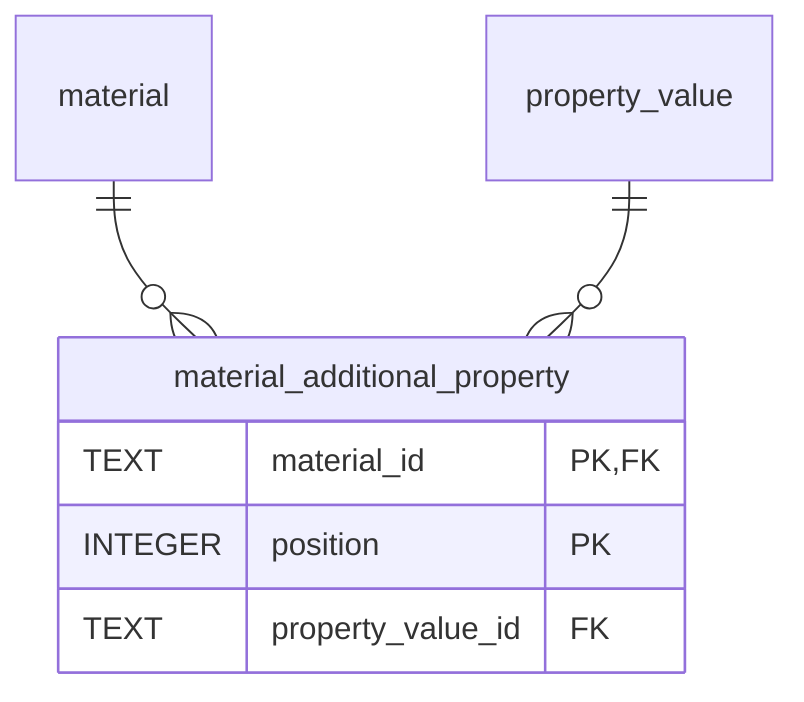
```mermaid
erDiagram
    material_additional_property {
        TEXT material_id PK,FK
        INTEGER position PK
        TEXT property_value_id FK
    }
    material ||--o{ material_additional_property : ""
    property_value ||--o{ material_additional_property : ""
```

| Column | Type | Constraint | Source |
|---|---|---|---|
| `material_id` | TEXT | PK, FK -> `material.id` | owning material |
| `position` | INTEGER | PK, `CHECK(position >= 0)` | order in `additionalProperty` |
| `property_value_id` | TEXT | NOT NULL, FK -> `property_value.id` | property value item |

### `data_additional_property` - `Data.additionalProperty` -> `PropertyValue`

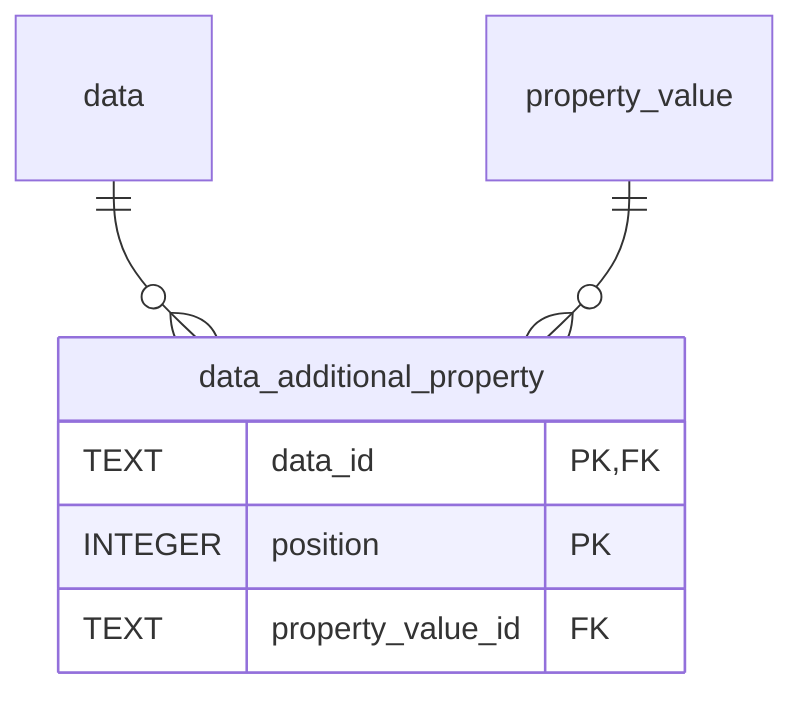
```mermaid
erDiagram
    data_additional_property {
        TEXT data_id PK,FK
        INTEGER position PK
        TEXT property_value_id FK
    }
    data ||--o{ data_additional_property : ""
    property_value ||--o{ data_additional_property : ""
```

| Column | Type | Constraint | Source |
|---|---|---|---|
| `data_id` | TEXT | PK, FK -> `data.id` | owning data object |
| `position` | INTEGER | PK, `CHECK(position >= 0)` | order in `additionalProperty` |
| `property_value_id` | TEXT | NOT NULL, FK -> `property_value.id` | property value item |

---

## Validation Rules

These rules should be enforced either in DDL, import/export code, or both:

- Enable SQLite FK enforcement with `PRAGMA foreign_keys = ON`.
- Enforce exact-one-target checks on `dataset_has_part` and `process_io`.
- Enforce non-negative, unique positions per owner/list.
- Enforce `intended_use_id` and `intended_use_text` mutual exclusion.
- Enforce `value` and `value_type` consistency on `property_value`.
- Preserve `process_io` positional pairing without requiring symmetry: input-only, output-only, and asymmetric processes are valid, and pair extraction should join only positions present in both directions.
- Validate acyclic dataset nesting if the application treats `Dataset.hasPart` as a tree.
- Normalize accepted aliases before insert, especially `schema.org/MediaObject` versus `schema:MediaObject`.

---

## Counts

8 entity tables + 9 association tables = **17 tables**.

## Out of Scope

- ISA, Workflow Run, and Datamap decoration-specific tables and constraints.
- Process path views or closure tables; these remain derivable from `process_io`.
- `Dataset.creator` -> `Person`; it appears in a spec diagram but not the property table or YAML schema.
- `FormalParameter.workExample`; it appears in a spec diagram but not the property table or YAML schema.
- Normalizing `DefinedTermSet` into its own table. The current design stores its ID and optional inline name on `defined_term`.
- Numeric range indexing for `PropertyValue.value`. Add a generated numeric column or parallel numeric column later if range queries become a real requirement.
