# Core SQL Import Profile

A SQLite import profile for the [ProcessCore model](../../docs/spec/core/overview.md). Scope: core entities only. ISA, Workflow Run, and Datamap decorations can layer on top later through `additional_type` and decoration-owned tables.

The Markdown files in `docs/spec/core/` remain authoritative. This SQL import profile round-trips YAML documents that conform to it. The profile narrows the open YAML surface where SQL needs a concrete contract: no orphan Annotations at commit time, exact-one-target foreign keys for mixed-target lists, deterministic generated IDs for fragment-level Data, and unresolved references as import errors except for `intendedUse` free text.

## Design Decisions

- **Primary keys** - every entity table uses `TEXT PRIMARY KEY`. Where the spec marks `id` as `MUST`, it is taken from the source. Where `id` is `COULD` (`Process`, `Recipe`, `Data`), import code must generate or persist a stable local identifier when no source identifier is present.
- **`type` is stored as source text** - every entity table has a `type TEXT` column. The profile does not currently canonicalize or constrain core type strings; naming questions such as `Process` versus `Process` are left to the core spec.
- **`additional_type` only where the model defines it** - kept on `dataset`, `recipe`, `process`, `sample`, `data`, and `annotation`. It is intentionally absent from `defined_term` and `formal_parameter`.
- **Ordered lists are keyed by position** - ordered association tables use `(owner_id, position)` as the primary key, with `position INTEGER NOT NULL CHECK(position >= 0)`. This preserves order and does not forbid the same target appearing more than once unless a future requirement adds a uniqueness rule.
- **Mixed-target lists use one association table with strict FKs** - `Dataset.hasPart` and `Process.inputs`/`outputs` can point to more than one target type. They are represented with nullable target FK columns plus an exact-one-target `CHECK`, rather than with polymorphic IDs or several split tables that must later be merged by `position`.
- **References resolve to FKs** - string references resolve against the target table by `id`; unknown IDs are import errors. For mixed-target lists (`hasPart`, `inputs`, `outputs`), the importer looks across all permitted target tables and errors on zero hits or cross-type ID collisions. Inline objects on mixed-target lists are validated against all permitted schemas and must match exactly one. Inline objects are inserted or upserted before recording the FK; if an inline `Process`, `Recipe`, or `Data` omits `id`, the importer generates a stable local identifier. `intendedUse` is the exception: a string is resolved to `defined_term.id` on hit and otherwise stored as free text.
- **Entity references stay reusable unless the spec says otherwise** - `Recipe.parameters` is represented by `protocol_parameter`, not by a `protocol_id` column on `formal_parameter`. This avoids baking in single-owner semantics that the core schema does not require.
- **`Annotation` is a first-class entity** - it has its own PK, and associations to owners (`Dataset`, `Sample`, `Data`, `Recipe`, `Process`) live in ordered association tables. The schema permits a `Annotation` to be referenced from multiple owners; in practice each will typically have one owner.
- **Per-owner `additional_property` tables** - the profile uses one association table per owner instead of a polymorphic `(owner_table, owner_id)` table. The duplication preserves FK enforcement on the owner side.
- **Property values are stored as strings** - `annotation.value` is nullable `TEXT`. The SQL profile does not preserve whether the YAML scalar was numeric or textual; semantic validation belongs in the SQL-to-model layer or a separate validator.
- **No path/closure tables** - process paths are derivable from `process_io` and can be added later as a view or sampleized closure table.

## Schema Overview

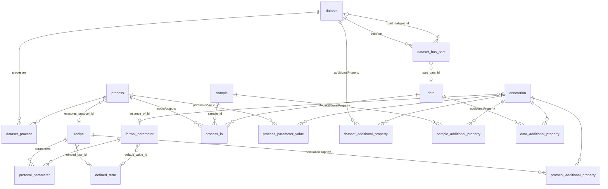

## Creation Order

FK dependencies require this broad order:

1. `defined_term`
2. `recipe`
3. `formal_parameter`
4. `dataset`
5. `sample`
6. `data`
7. `process`
8. `annotation`
9. Association tables

When importing nested documents, create or upsert referenced entities before inserting association rows.

---

## Entity Tables

### `defined_term`

Ontology term annotation. `inDefinedTermSet` may be a URL or an inline `DefinedTermSet` object in the YAML schema; this design stores the set identifier and, when present, the inline set name.

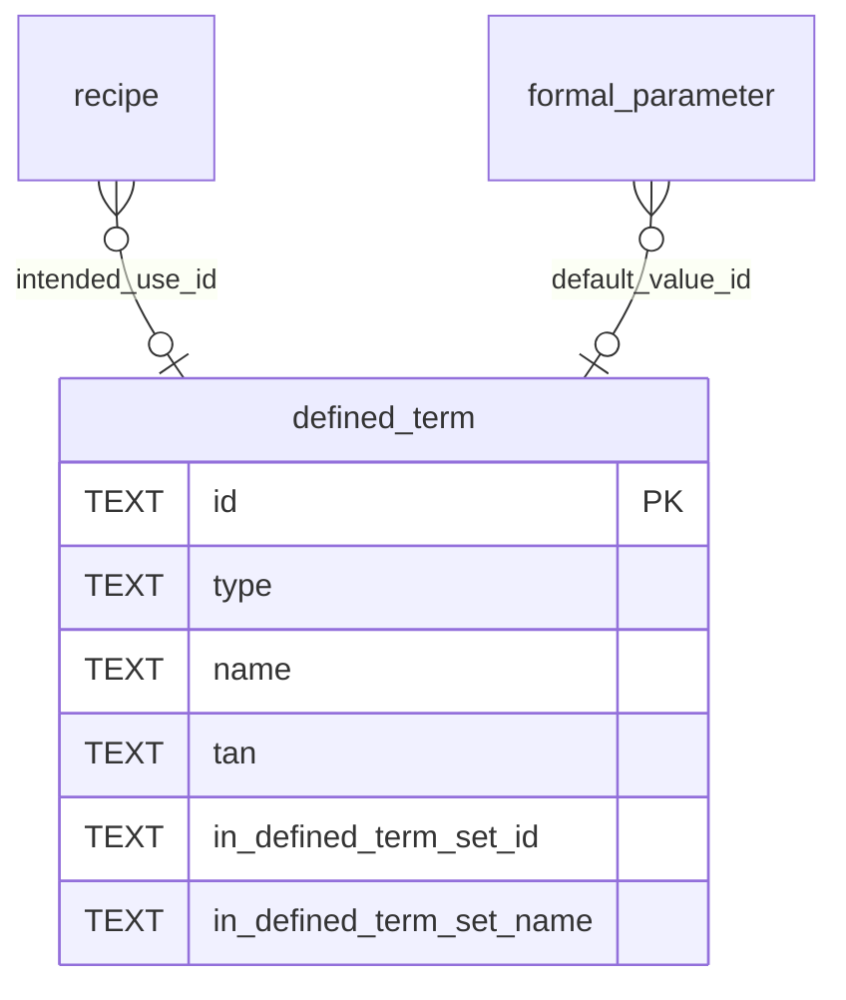

| Column | Type | Constraint | Source |
|---|---|---|---|
| `id` | TEXT | PK | spec `id` (MUST) |
| `type` | TEXT | NOT NULL | spec `type` |
| `name` | TEXT | NOT NULL | spec `name` |
| `tan` | TEXT | nullable | spec `TAN` |
| `in_defined_term_set_id` | TEXT | nullable | spec `inDefinedTermSet` URL or object `id` |
| `in_defined_term_set_name` | TEXT | nullable | spec `inDefinedTermSet.name` when inline |

---

### `recipe`

Planned procedure.

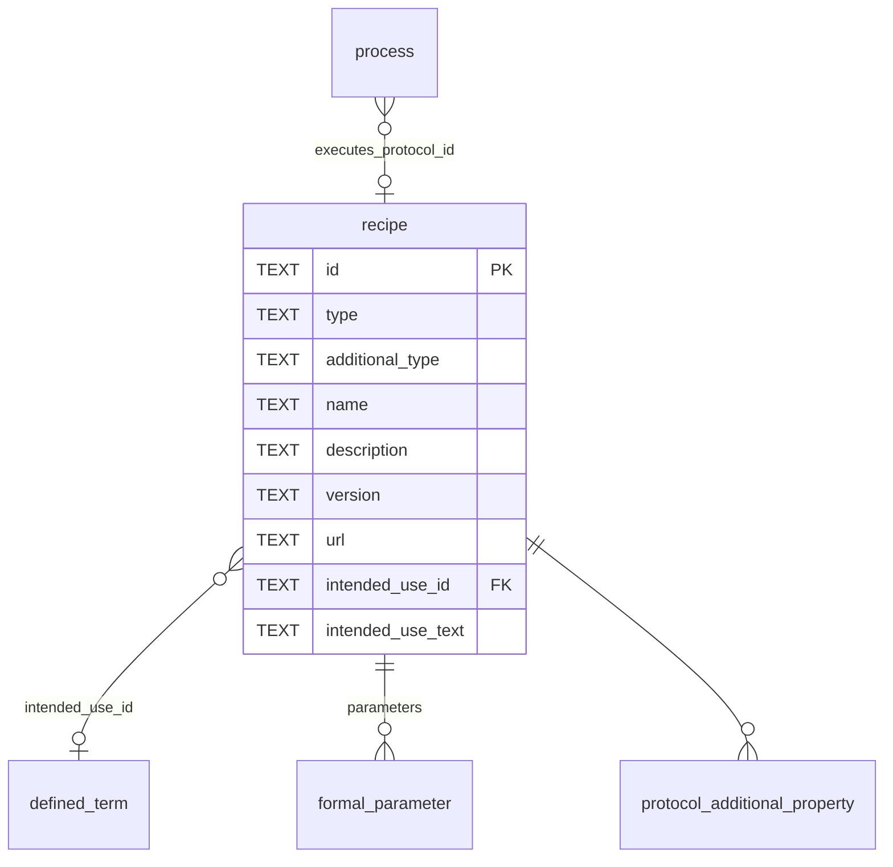

| Column | Type | Constraint | Source |
|---|---|---|---|
| `id` | TEXT | PK | spec `id` (COULD; app-generated if absent) |
| `type` | TEXT | NOT NULL | spec `type` |
| `additional_type` | TEXT | nullable | spec `additionalType` |
| `name` | TEXT | nullable | spec `name` |
| `description` | TEXT | nullable | spec `description` |
| `version` | TEXT | nullable | spec `version` |
| `url` | TEXT | nullable | spec `url` |
| `intended_use_id` | TEXT | FK -> `defined_term.id` ON DELETE RESTRICT, nullable | spec `intendedUse` as `DefinedTerm` or `@id` |
| `intended_use_text` | TEXT | nullable | spec `intendedUse` as free text |

DDL should include `CHECK (intended_use_id IS NULL OR intended_use_text IS NULL)`.

When the source `intendedUse` value is an inline `DefinedTerm`, upsert it into `defined_term` and set `intended_use_id`. When the source value is a string, look it up against `defined_term.id`: on hit, set `intended_use_id`; on miss, set `intended_use_text`.

---

### `formal_parameter`

Named parameter slot for prospective provenance. Protocol membership and order are represented by `protocol_parameter`.

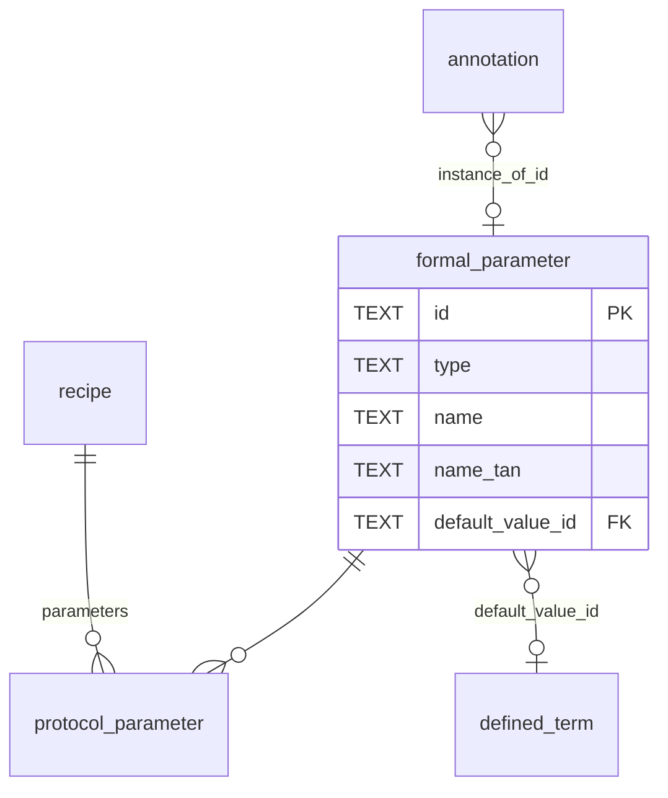

| Column | Type | Constraint | Source |
|---|---|---|---|
| `id` | TEXT | PK | spec `id` (MUST) |
| `type` | TEXT | NOT NULL | spec `type` |
| `name` | TEXT | nullable | spec `name` |
| `name_tan` | TEXT | nullable | spec `nameTAN` (URL) |
| `default_value_id` | TEXT | FK -> `defined_term.id` ON DELETE RESTRICT, nullable | spec `defaultValue` |

---

### `dataset`

Container for processes and metadata. Nesting and contained data files are represented by `dataset_has_part`, not by a `parent_id`, because `Dataset.hasPart` can contain both `Dataset` and `Data`.

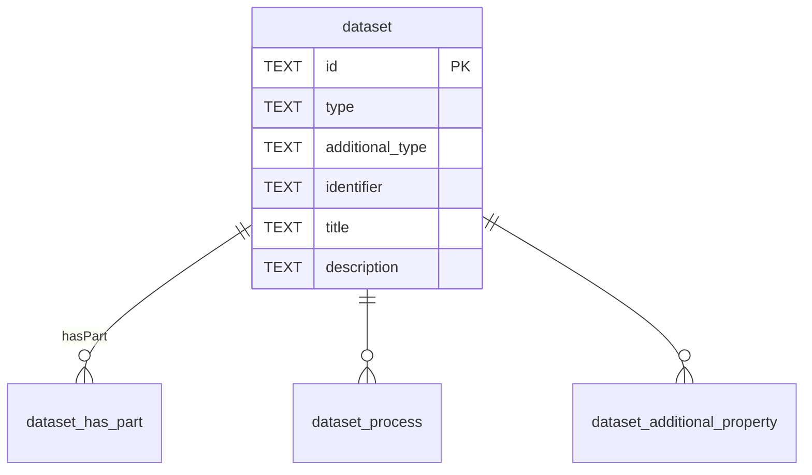

| Column | Type | Constraint | Source |
|---|---|---|---|
| `id` | TEXT | PK | spec `id` (MUST) |
| `type` | TEXT | NOT NULL | spec `type` |
| `additional_type` | TEXT | nullable | spec `additionalType` |
| `identifier` | TEXT | NOT NULL | spec `identifier` (MUST) |
| `title` | TEXT | nullable | spec `title` |
| `description` | TEXT | nullable | spec `description` |

---

### `process`

Transformation node.

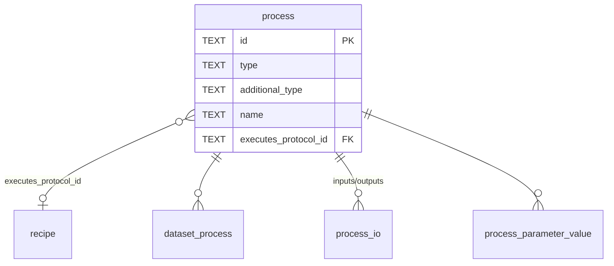

| Column | Type | Constraint | Source |
|---|---|---|---|
| `id` | TEXT | PK | spec `id` (COULD; app-generated if absent) |
| `type` | TEXT | NOT NULL | spec `type` |
| `additional_type` | TEXT | nullable | spec `additionalType` |
| `name` | TEXT | NOT NULL | spec `name` (MUST) |
| `executes_protocol_id` | TEXT | FK -> `recipe.id` ON DELETE RESTRICT, nullable | spec `executesProtocol` |

---

### `sample`

Biological, chemical, or digital sample.

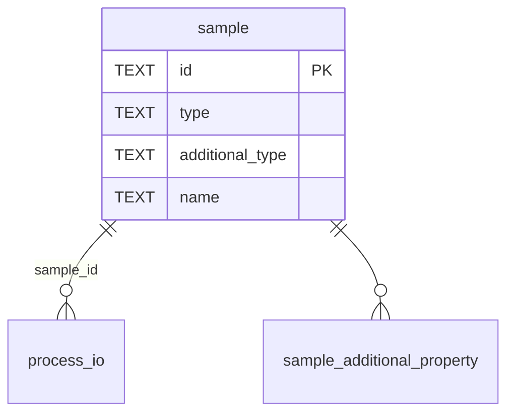

| Column | Type | Constraint | Source |
|---|---|---|---|
| `id` | TEXT | PK | spec `id` (MUST) |
| `type` | TEXT | NOT NULL | spec `type` |
| `additional_type` | TEXT | nullable | spec `additionalType` |
| `name` | TEXT | NOT NULL | spec `name` (MUST) |

---

### `data`

File or fragment.

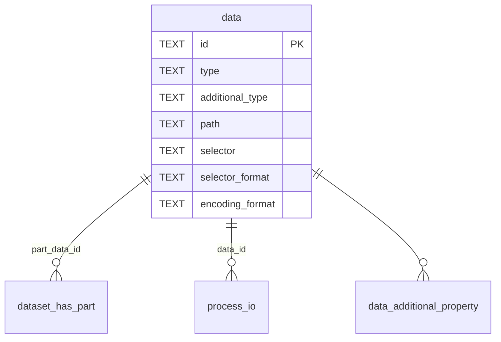

| Column | Type | Constraint | Source |
|---|---|---|---|
| `id` | TEXT | PK | spec `id` (COULD; app-generated if absent) |
| `type` | TEXT | NOT NULL | spec `type` |
| `additional_type` | TEXT | nullable | spec `additionalType` |
| `path` | TEXT | NOT NULL | spec `path` (MUST) |
| `selector` | TEXT | nullable | spec `selector` |
| `selector_format` | TEXT | nullable | spec `selectorFormat` (URL) |
| `encoding_format` | TEXT | nullable | spec `encodingFormat` |

When the source omits `id`, generate it deterministically from the fragment-identity triple `(path, selector, selectorFormat)`. If `selector` is absent, use `id := path` and ignore `selectorFormat`. If `selector` is present, use a single profile-wide canonicalization of `(path, selector, selectorFormat)`; `selectorFormat` must participate because the same selector string can identify different fragments under different selector languages. When the source provides `id`, store it verbatim alongside `path`, `selector`, and `selectorFormat`.

Uniqueness is best enforced importer-side by deterministic ID generation. If a database-level invariant is desired, use a generated fragment identity over a structured encoding or hash of `(path, selector, selectorFormat)`, then add a unique index on that generated column. Avoid naive unique indexes over nullable columns because SQLite treats `NULL`s as distinct.

---

### `annotation`

Key-value-unit triple. Owned via association tables.

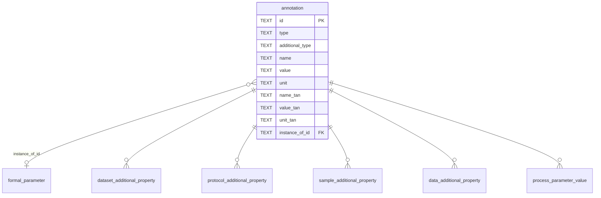

| Column | Type | Constraint | Source |
|---|---|---|---|
| `id` | TEXT | PK | spec `id` (MUST) |
| `type` | TEXT | NOT NULL | spec `type` |
| `additional_type` | TEXT | nullable | spec `additionalType` |
| `name` | TEXT | NOT NULL | spec `name` (MUST) |
| `value` | TEXT | nullable | spec `value` |
| `unit` | TEXT | nullable | spec `unit` |
| `name_tan` | TEXT | nullable | spec `nameTAN` (URL) |
| `value_tan` | TEXT | nullable | spec `valueTAN` (URL) |
| `unit_tan` | TEXT | nullable | spec `unitTAN` (URL) |
| `instance_of_id` | TEXT | FK -> `formal_parameter.id` ON DELETE RESTRICT, nullable | spec `instanceOf` |

SQL stores `value` as text regardless of the source scalar kind. YAML numeric `42` and textual `"42"` both become `value = '42'`; validators above SQL decide whether a value should parse as numeric based on ontology context.

---

## Association Tables

Ordered association tables use `position INTEGER NOT NULL CHECK(position >= 0)`. For tables whose source property is an array, `position` is part of the primary key.

### `dataset_has_part` - `Dataset.hasPart` -> `Dataset` or `Data`

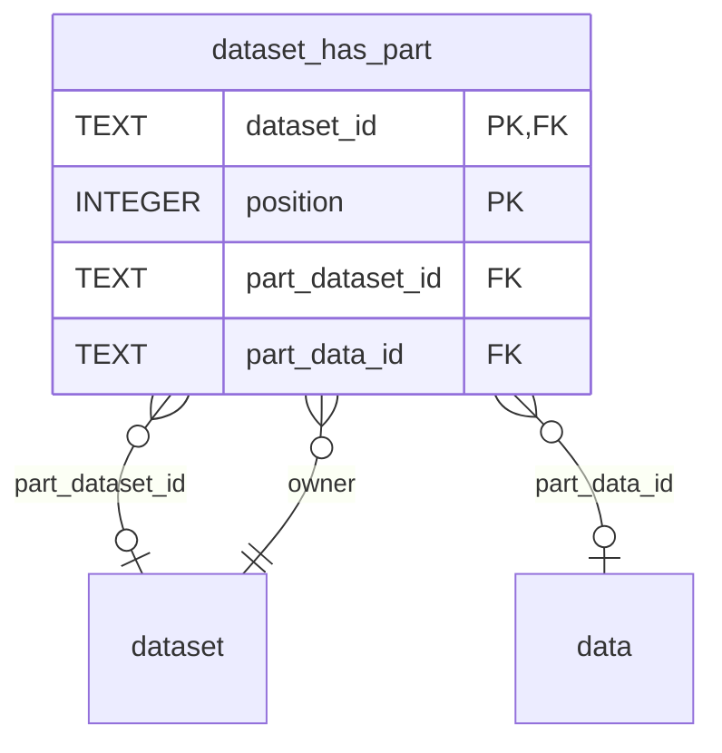

| Column | Type | Constraint | Source |
|---|---|---|---|
| `dataset_id` | TEXT | PK, FK -> `dataset.id` ON DELETE CASCADE | owning dataset |
| `position` | INTEGER | PK, `CHECK(position >= 0)` | order in `Dataset.hasPart` |
| `part_dataset_id` | TEXT | FK -> `dataset.id` ON DELETE RESTRICT, nullable | `hasPart` dataset item |
| `part_data_id` | TEXT | FK -> `data.id` ON DELETE RESTRICT, nullable | `hasPart` data item |

DDL should include an exact-one-target check:

```sql
CHECK (
  (part_dataset_id IS NOT NULL AND part_data_id IS NULL)
  OR
  (part_dataset_id IS NULL AND part_data_id IS NOT NULL)
)
```

If the core spec later makes dataset nesting exclusive, add partial unique indexes on the part columns. The current schema does not assume that a `Dataset` or `Data` object can appear in only one parent's `hasPart` list.

### `dataset_process` - `Dataset.processes` -> `Process`

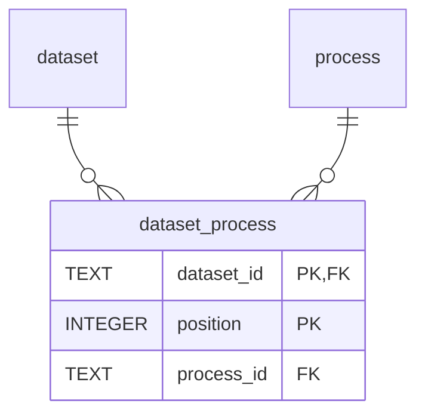

| Column | Type | Constraint | Source |
|---|---|---|---|
| `dataset_id` | TEXT | PK, FK -> `dataset.id` ON DELETE CASCADE | owning dataset |
| `position` | INTEGER | PK, `CHECK(position >= 0)` | order in `Dataset.processes` |
| `process_id` | TEXT | NOT NULL, FK -> `process.id` ON DELETE RESTRICT | process item |

### `dataset_additional_property` - `Dataset.additionalProperty` -> `Annotation`


| Column | Type | Constraint | Source |
|---|---|---|---|
| `dataset_id` | TEXT | PK, FK -> `dataset.id` ON DELETE CASCADE | owning dataset |
| `position` | INTEGER | PK, `CHECK(position >= 0)` | order in `additionalProperty` |
| `annotation_id` | TEXT | NOT NULL, FK -> `annotation.id` ON DELETE RESTRICT | property value item |

### `protocol_parameter` - `Recipe.parameters` -> `FormalParameter`

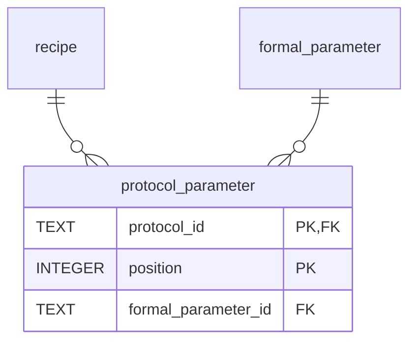

| Column | Type | Constraint | Source |
|---|---|---|---|
| `protocol_id` | TEXT | PK, FK -> `recipe.id` ON DELETE CASCADE | owning protocol |
| `position` | INTEGER | PK, `CHECK(position >= 0)` | order in `Recipe.parameters` |
| `formal_parameter_id` | TEXT | NOT NULL, FK -> `formal_parameter.id` ON DELETE RESTRICT | formal parameter item |

### `process_io` - `Process.inputs` / `Process.outputs` -> `Sample` or `Data`

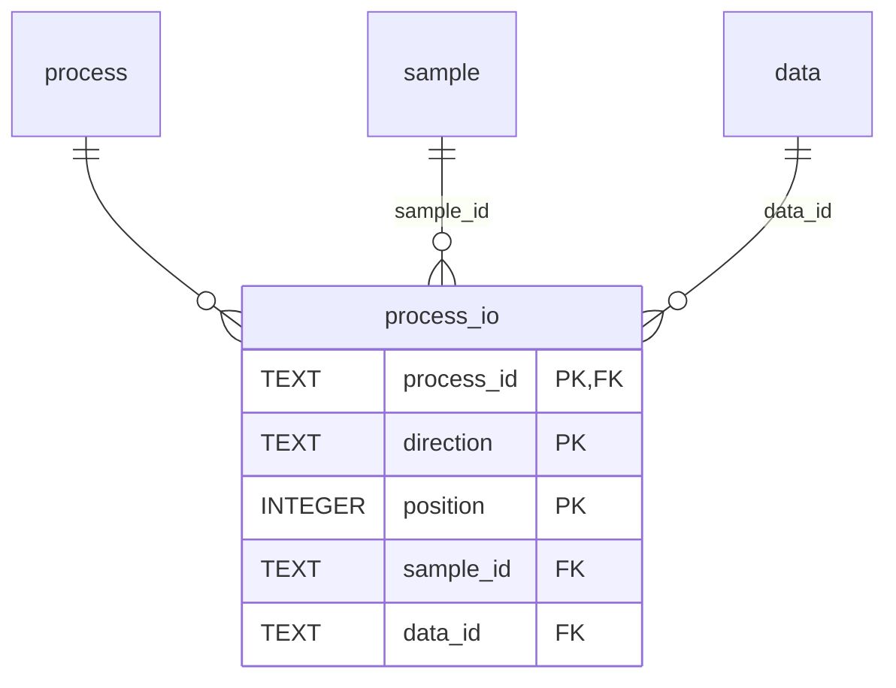

| Column | Type | Constraint | Source |
|---|---|---|---|
| `process_id` | TEXT | PK, FK -> `process.id` ON DELETE CASCADE | owning process |
| `direction` | TEXT | PK, `CHECK(direction IN ('input', 'output'))` | `inputs` or `outputs` |
| `position` | INTEGER | PK, `CHECK(position >= 0)` | order in the selected list |
| `sample_id` | TEXT | FK -> `sample.id` ON DELETE RESTRICT, nullable | sample input/output |
| `data_id` | TEXT | FK -> `data.id` ON DELETE RESTRICT, nullable | data input/output |

DDL should include an exact-one-target check:

```sql
CHECK (
  (sample_id IS NOT NULL AND data_id IS NULL)
  OR
  (sample_id IS NULL AND data_id IS NOT NULL)
)
```

The spec recommends equal-length input and output lists, with the Nth input corresponding to the Nth output. The profile permits asymmetric storage and does not currently enforce length equality. Pair extraction is a self-join on `(process_id, position)` across directions, defined only at indices present in both.

### `process_parameter_value` - `Process.parameterValue` -> `Annotation`

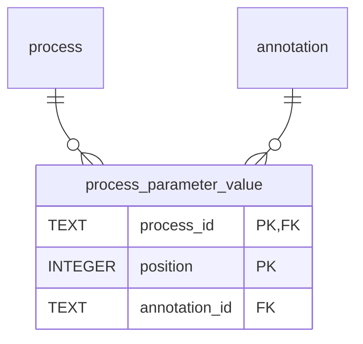

| Column | Type | Constraint | Source |
|---|---|---|---|
| `process_id` | TEXT | PK, FK -> `process.id` ON DELETE CASCADE | owning process |
| `position` | INTEGER | PK, `CHECK(position >= 0)` | order in `parameterValue` |
| `annotation_id` | TEXT | NOT NULL, FK -> `annotation.id` ON DELETE RESTRICT | property value item |

### `protocol_additional_property` - `Recipe.additionalProperty` -> `Annotation`


| Column | Type | Constraint | Source |
|---|---|---|---|
| `protocol_id` | TEXT | PK, FK -> `recipe.id` ON DELETE CASCADE | owning protocol |
| `position` | INTEGER | PK, `CHECK(position >= 0)` | order in `additionalProperty` |
| `annotation_id` | TEXT | NOT NULL, FK -> `annotation.id` ON DELETE RESTRICT | property value item |

### `sample_additional_property` - `Sample.additionalProperty` -> `Annotation`

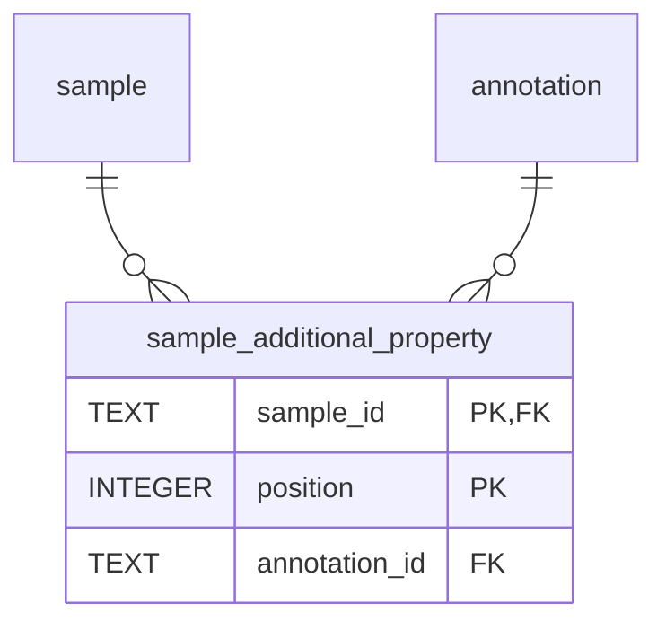

| Column | Type | Constraint | Source |
|---|---|---|---|
| `sample_id` | TEXT | PK, FK -> `sample.id` ON DELETE CASCADE | owning sample |
| `position` | INTEGER | PK, `CHECK(position >= 0)` | order in `additionalProperty` |
| `annotation_id` | TEXT | NOT NULL, FK -> `annotation.id` ON DELETE RESTRICT | property value item |

### `data_additional_property` - `Data.additionalProperty` -> `Annotation`

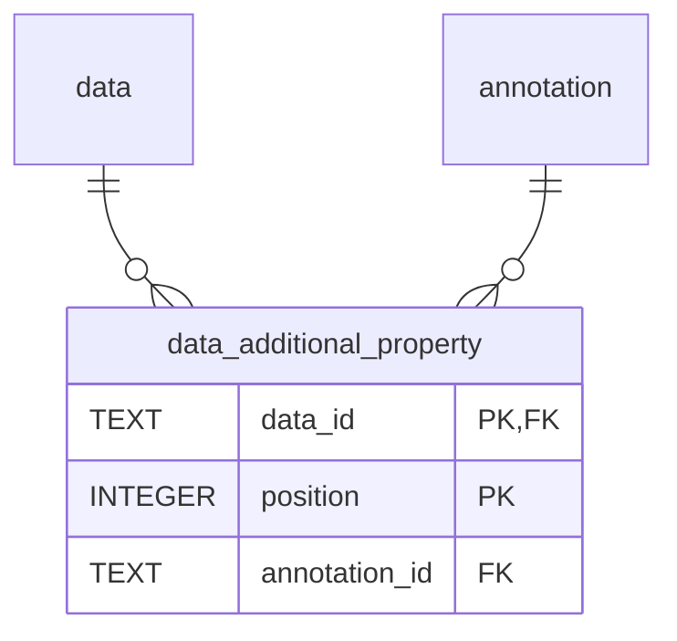

| Column | Type | Constraint | Source |
|---|---|---|---|
| `data_id` | TEXT | PK, FK -> `data.id` ON DELETE CASCADE | owning data object |
| `position` | INTEGER | PK, `CHECK(position >= 0)` | order in `additionalProperty` |
| `annotation_id` | TEXT | NOT NULL, FK -> `annotation.id` ON DELETE RESTRICT | property value item |

---

## Validation Rules

These rules should be enforced either in DDL, import/export code, or both:

- Enable SQLite FK enforcement with `PRAGMA foreign_keys = ON`.
- Enforce exact-one-target checks on `dataset_has_part` and `process_io`.
- Enforce non-negative, unique positions per owner/list.
- Enforce `intended_use_id` and `intended_use_text` mutual exclusion.
- Enforce closed-document ownership for `annotation`: at commit time, every row must be referenced by at least one of `dataset_additional_property`, `protocol_additional_property`, `sample_additional_property`, `data_additional_property`, or `process_parameter_value`. `annotation.instance_of_id` does not count as ownership.
- Preserve `process_io` positional pairing while allowing asymmetry: the spec recommends equal-length input/output lists, but the profile does not currently enforce that recommendation.
- Validate acyclic dataset nesting if the application treats `Dataset.hasPart` as a tree.
- Validate values above SQL when ontology context implies a scalar type, e.g. parse numeric values in the model layer rather than with a SQL storage type.

---

## Indexes

Index shapes are tied to the documented query patterns in [docs/spec/querying/use-cases.md](../../docs/spec/querying/use-cases.md). Process graph traversal usually starts from a specific sample or data node, so node-leading partial indexes are preferred.

### Graph Traversal

```sql
CREATE INDEX idx_process_io_input_sample
  ON process_io(sample_id, process_id)
  WHERE direction = 'input' AND sample_id IS NOT NULL;

CREATE INDEX idx_process_io_output_sample
  ON process_io(sample_id, process_id)
  WHERE direction = 'output' AND sample_id IS NOT NULL;

CREATE INDEX idx_process_io_input_data
  ON process_io(data_id, process_id)
  WHERE direction = 'input' AND data_id IS NOT NULL;

CREATE INDEX idx_process_io_output_data
  ON process_io(data_id, process_id)
  WHERE direction = 'output' AND data_id IS NOT NULL;
```

The primary key on `process_io(process_id, direction, position)` already supports process-local scans. An explicit `process_io(process_id, direction)` index can be added for clarity if query plans need it.

### Lookup Queries

- `dataset_process(process_id)` - locate owning datasets for a process.
- `process(executes_protocol_id)` - find executions of a protocol.
- `recipe(intended_use_id)` - find protocols by ontology term.
- `process_parameter_value(annotation_id)` - find processes whose parameter values match.
- `<owner>_additional_property(annotation_id)` - find owners of a Annotation and support the closed-document orphan check.
- `annotation(instance_of_id)` - find realized values for a FormalParameter, if that query becomes common.
- `annotation(name_tan, value)` - candidate for ontology-keyed value equality. Add when the canonical query workload solidifies; do not over-index speculatively.

### Path Traversal Example

A `Path` is derived from `process_io`, not stored. The following sketch walks forward from a sample node through processes that consume it, then through the sample or data nodes those processes produce:

```sql
WITH RECURSIVE path(depth, node_kind, node_id, process_id) AS (
  VALUES (0, 'sample', :start_sample_id, NULL)

  UNION ALL

  SELECT
    path.depth + 1,
    CASE
      WHEN produced.sample_id IS NOT NULL THEN 'sample'
      ELSE 'data'
    END,
    COALESCE(produced.sample_id, produced.data_id),
    consumed.process_id
  FROM path
  JOIN process_io AS consumed
    ON consumed.direction = 'input'
   AND (
     (path.node_kind = 'sample' AND consumed.sample_id = path.node_id)
     OR
     (path.node_kind = 'data' AND consumed.data_id = path.node_id)
   )
  JOIN process_io AS produced
    ON produced.process_id = consumed.process_id
   AND produced.direction = 'output'
  WHERE path.depth < :max_depth
)
SELECT DISTINCT depth, node_kind, node_id, process_id
FROM path;
```

Implementations should add cycle detection for production use, for example by carrying a visited node/process set in the recursive state.

---

## Counts

8 entity tables + 9 association tables = **17 tables**.

## Out of Scope

- ISA, Workflow Run, and Datamap decoration-specific tables and constraints.
- Process path views or closure tables; these remain derivable from `process_io`.
- Normalizing `DefinedTermSet` into its own table. The current design stores its ID and optional inline name on `defined_term`.
- Numeric range indexing for `Annotation.value`. Add a generated numeric column or parallel numeric column later if range queries become a real requirement.
