# Core SQL Schema — Design

A SQLite relational mapping of the [ProcessCore model](../../spec/core/README.md). Scope: the core entities only. ISA, Workflow Run, and Datamap decorations layer on top later via the `additional_type` discriminator.

## Design Decisions

- **Primary keys** — every entity table uses `TEXT PRIMARY KEY`. Where the spec marks `id` as `MUST`, it is taken directly from the source. Where `id` is `COULD` (`LabProcess`, `LabProtocol`, `Data`), the application generates a local UUID at insert time.
- **`type` column omitted** — each table implicitly encodes its schema.org type. The `type` field from the spec is never stored.
- **`additional_type`** — kept as a nullable `TEXT` on every entity. This is the hook for future decorations and stays out of the way for plain core data.
- **1:N via FK on the child** — used when a child logically belongs to exactly one parent (e.g. `FormalParameter` → `LabProtocol`, `Dataset` → `Dataset` for `hasPart`).
- **Other list-valued relations via junction tables** — each list-valued property gets its own table with a `position INTEGER` column to preserve order.
- **`inputs`/`outputs` are split by target type** — because `LabProcess` inputs and outputs may be either `Material` or `Data`, each direction is split into two junction tables (4 total). This keeps FKs strict and avoids polymorphic references. The `position` column is the mechanism that preserves the spec's "input[N] corresponds to output[N]" contract — readers reconstruct the ordered sequences by sorting on `position` across both target tables.
- **`PropertyValue` is a first-class entity** — it has its own PK, and its associations to owners (`Dataset`, `Material`, `Data`, `LabProtocol`, `LabProcess`) live in separate junction tables. The schema permits a `PropertyValue` to be referenced from multiple owners; in practice each will typically have one owner.
- **No path/closure tables** — process paths are derivable from the I/O junction tables and may be added later as a view or a materialized closure table.

## Schema Overview

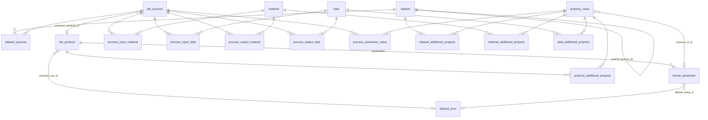

## Creation Order

FK dependencies require this order:

1. `defined_term`
2. `lab_protocol`
3. `formal_parameter`
4. `dataset`
5. `lab_process`
6. `material`
7. `data`
8. `property_value`
9. Junction tables (any order)

---

## Entity Tables

### `defined_term`

Ontology term annotation. Pure leaf — no outgoing FKs.

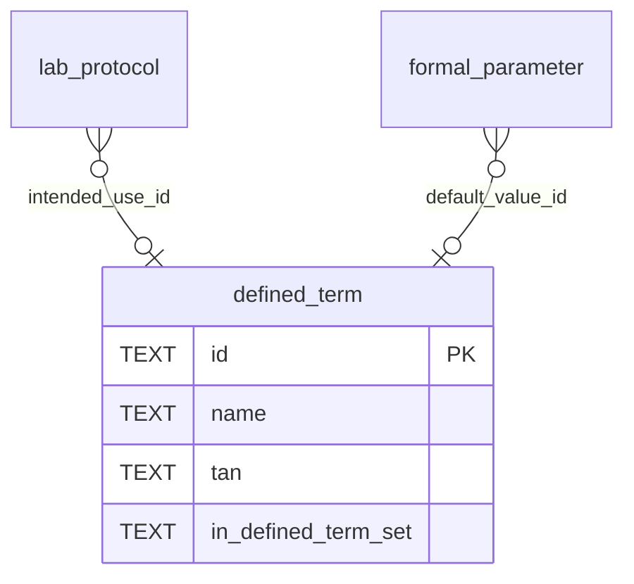

| Column | Type | Constraint | Source |
|---|---|---|---|
| `id` | TEXT | PK | spec `id` (MUST) |
| `name` | TEXT | NOT NULL | spec `name` |
| `tan` | TEXT | nullable | spec `TAN` |
| `in_defined_term_set` | TEXT | nullable | spec `inDefinedTermSet` (URL form) |

---

### `lab_protocol`

Planned procedure.

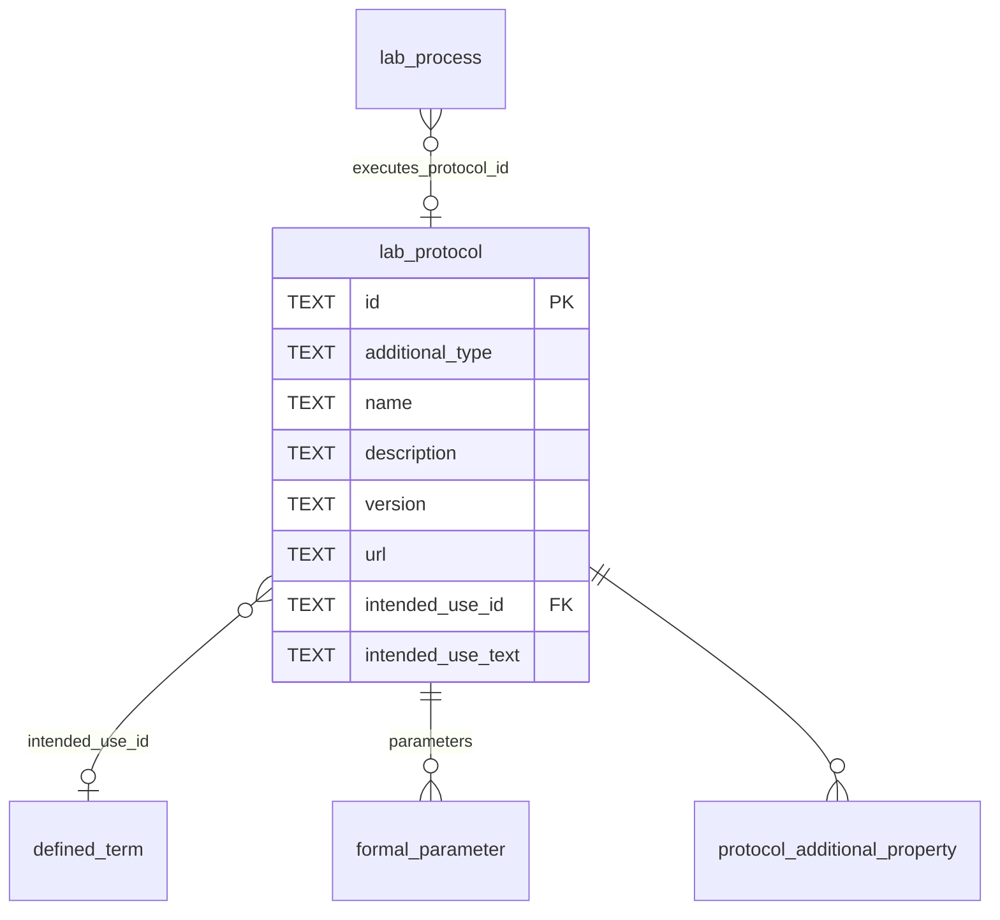

| Column | Type | Constraint | Source |
|---|---|---|---|
| `id` | TEXT | PK | spec `id` (COULD; app-generated if absent) |
| `additional_type` | TEXT | nullable | spec `additionalType` |
| `name` | TEXT | nullable | spec `name` |
| `description` | TEXT | nullable | spec `description` |
| `version` | TEXT | nullable | spec `version` |
| `url` | TEXT | nullable | spec `url` |
| `intended_use_id` | TEXT | FK → `defined_term.id` | spec `intendedUse` (DefinedTerm form) |
| `intended_use_text` | TEXT | nullable | spec `intendedUse` (Text form) |

`intended_use_id` and `intended_use_text` are mutually exclusive. The application enforces this; the schema does not.

---

### `formal_parameter`

Named parameter slot owned by exactly one protocol.

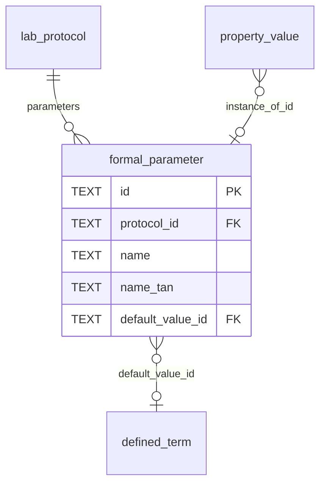

| Column | Type | Constraint | Source |
|---|---|---|---|
| `id` | TEXT | PK | spec `id` (MUST) |
| `protocol_id` | TEXT | FK → `lab_protocol.id` | inverse of `LabProtocol.parameters` |
| `name` | TEXT | nullable | spec `name` |
| `name_tan` | TEXT | nullable | spec `nameTAN` (URL) |
| `default_value_id` | TEXT | FK → `defined_term.id` | spec `defaultValue` |

A FK on the child suffices because each `FormalParameter` belongs to exactly one `LabProtocol`.

---

### `dataset`

Container for processes; nestable via self-referential `parent_id`.

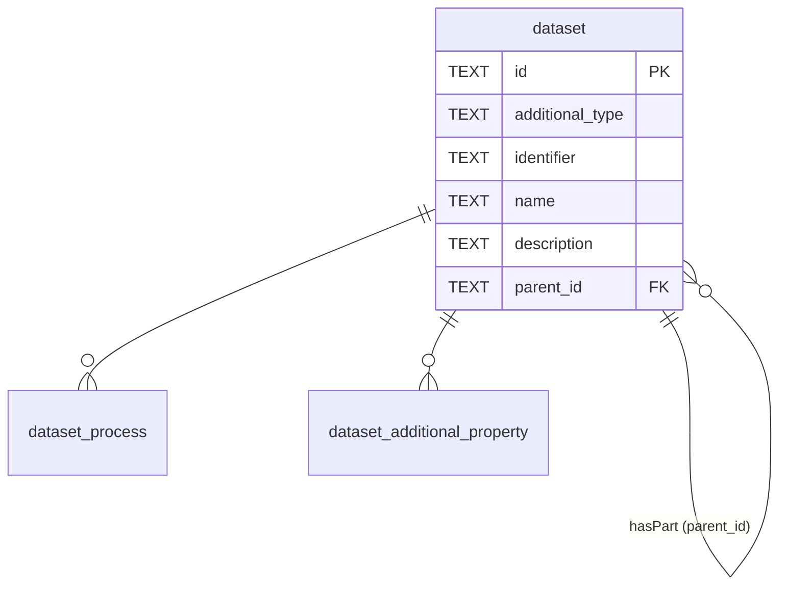

| Column | Type | Constraint | Source |
|---|---|---|---|
| `id` | TEXT | PK | spec `id` (MUST) |
| `additional_type` | TEXT | nullable | spec `additionalType` |
| `identifier` | TEXT | NOT NULL | spec `identifier` (MUST) |
| `name` | TEXT | nullable | spec `name` |
| `description` | TEXT | nullable | spec `description` |
| `parent_id` | TEXT | FK → `dataset.id`, nullable | inverse of `hasPart`; NULL = top-level |

`hasPart` is encoded as the inverse FK on the child. No junction table required.

---

### `lab_process`

Transformation node.

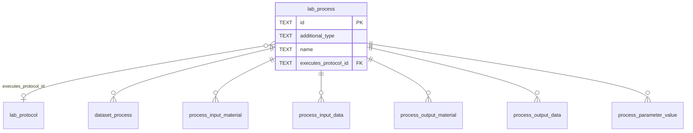

| Column | Type | Constraint | Source |
|---|---|---|---|
| `id` | TEXT | PK | spec `id` (COULD; app-generated if absent) |
| `additional_type` | TEXT | nullable | spec `additionalType` |
| `name` | TEXT | NOT NULL | spec `name` (MUST) |
| `executes_protocol_id` | TEXT | FK → `lab_protocol.id`, nullable | spec `executesProtocol` |

---

### `material`

Biological / chemical / digital material.

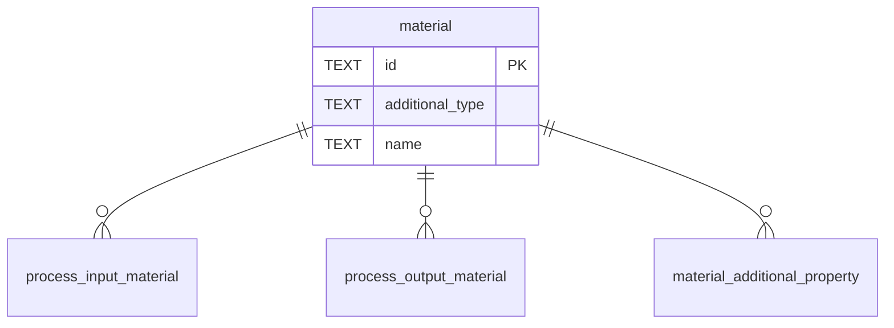

| Column | Type | Constraint | Source |
|---|---|---|---|
| `id` | TEXT | PK | spec `id` (MUST) |
| `additional_type` | TEXT | nullable | spec `additionalType` |
| `name` | TEXT | NOT NULL | spec `name` (MUST) |

---

### `data`

File or fragment.

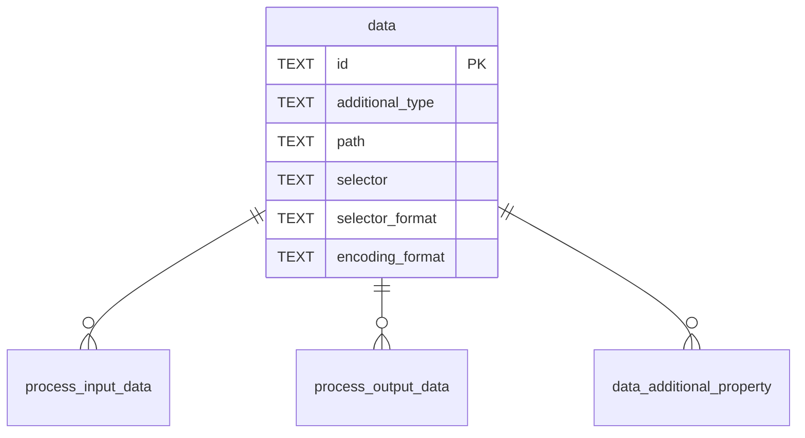

| Column | Type | Constraint | Source |
|---|---|---|---|
| `id` | TEXT | PK | spec `id` (COULD; app-generated if absent) |
| `additional_type` | TEXT | nullable | spec `additionalType` |
| `path` | TEXT | NOT NULL | spec `path` (MUST) |
| `selector` | TEXT | nullable | spec `selector` |
| `selector_format` | TEXT | nullable | spec `selectorFormat` (URL) |
| `encoding_format` | TEXT | nullable | spec `encodingFormat` |

---

### `property_value`

Key-value-unit triple. Owned via junction tables.

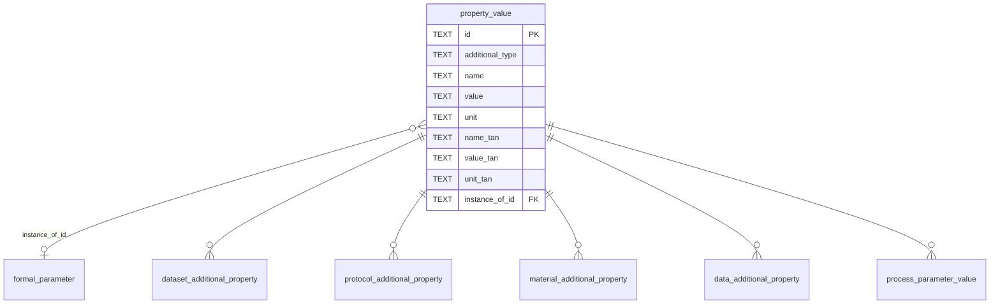

| Column | Type | Constraint | Source |
|---|---|---|---|
| `id` | TEXT | PK | spec `id` (MUST) |
| `additional_type` | TEXT | nullable | spec `additionalType` |
| `name` | TEXT | NOT NULL | spec `name` (MUST) |
| `value` | TEXT | nullable | spec `value` (numbers serialized as text) |
| `unit` | TEXT | nullable | spec `unit` |
| `name_tan` | TEXT | nullable | spec `nameTAN` (URL) |
| `value_tan` | TEXT | nullable | spec `valueTAN` (URL) |
| `unit_tan` | TEXT | nullable | spec `unitTAN` (URL) |
| `instance_of_id` | TEXT | FK → `formal_parameter.id`, nullable | spec `instanceOf` |

---

## Junction Tables

All junctions use a composite primary key `(owner_id, target_id)` and carry a `position INTEGER NOT NULL` column to preserve list order.

### `dataset_process` — `Dataset.processes` → `LabProcess`

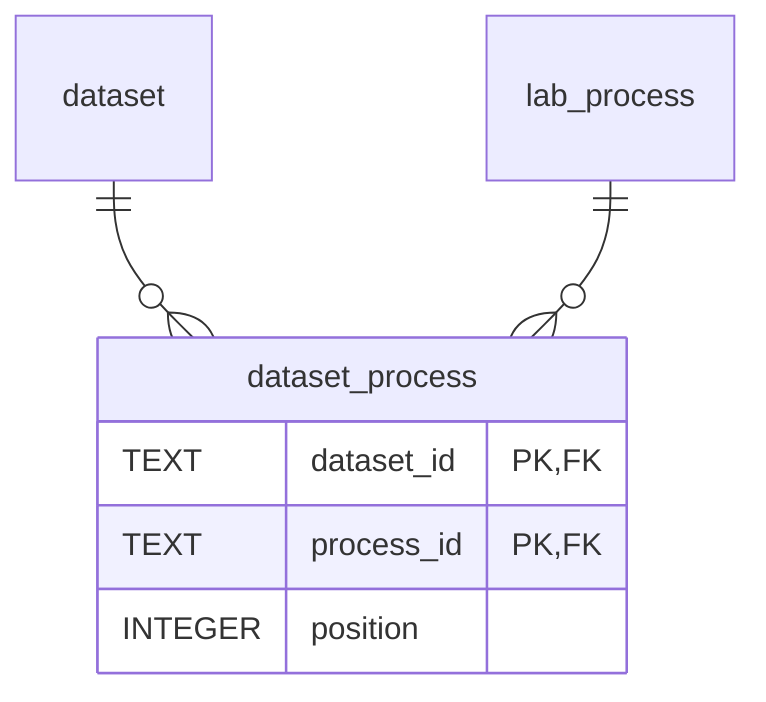

### `dataset_additional_property` — `Dataset.additionalProperty` → `PropertyValue`

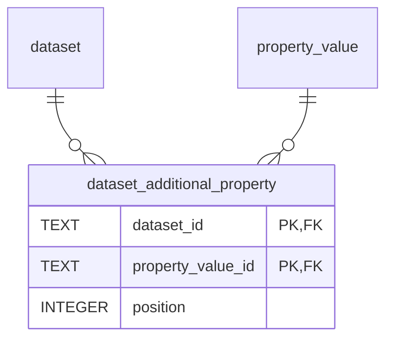

### `process_input_material` — `LabProcess.inputs` → `Material`

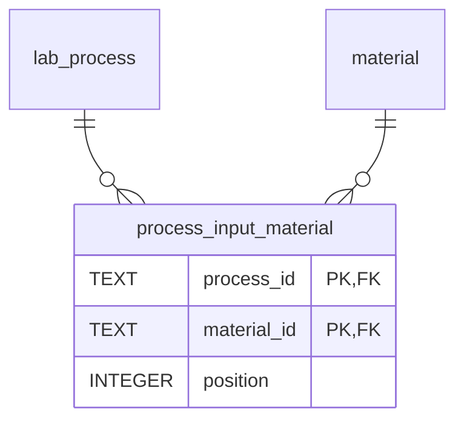

### `process_input_data` — `LabProcess.inputs` → `Data`

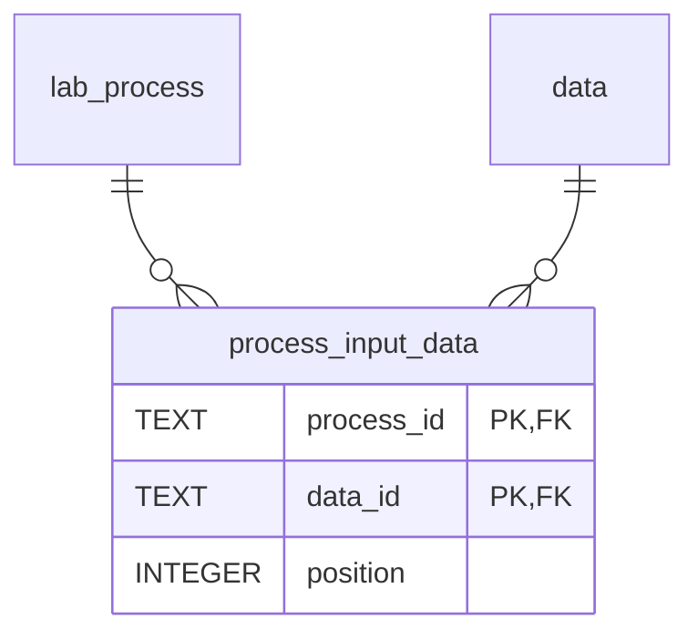

### `process_output_material` — `LabProcess.outputs` → `Material`

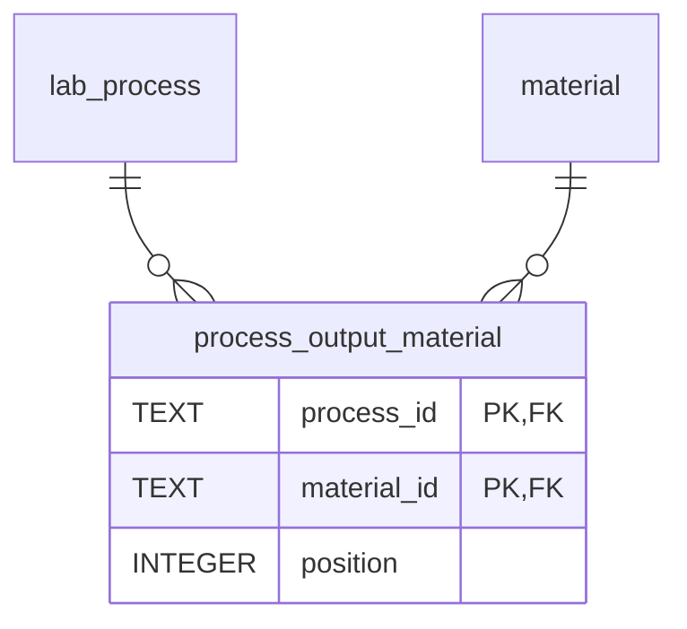

### `process_output_data` — `LabProcess.outputs` → `Data`

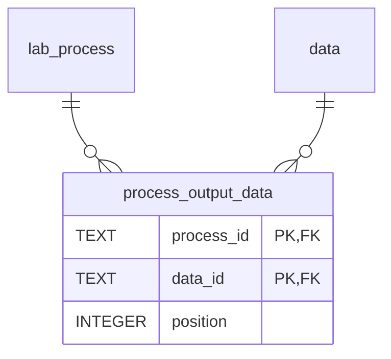

The `position` column on the four I/O junctions, taken together, is what preserves the input[N] ↔ output[N] correspondence guaranteed by the spec. Readers reconstruct the ordered sequences by sorting all rows for a given `process_id` across both the `material` and `data` variants, on `position`.

### `process_parameter_value` — `LabProcess.parameterValue` → `PropertyValue`

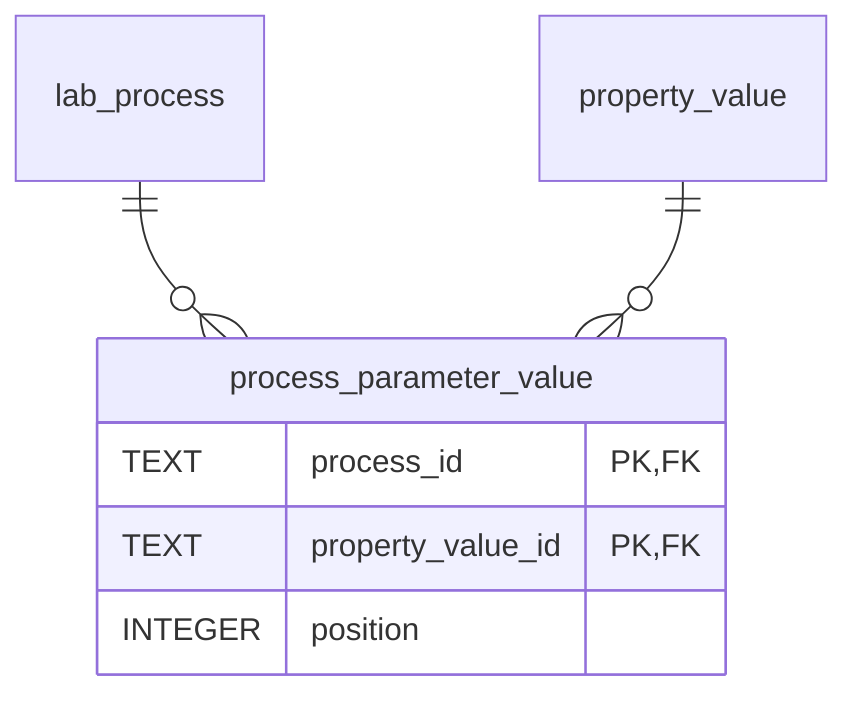

### `protocol_additional_property` — `LabProtocol.additionalProperty` → `PropertyValue`

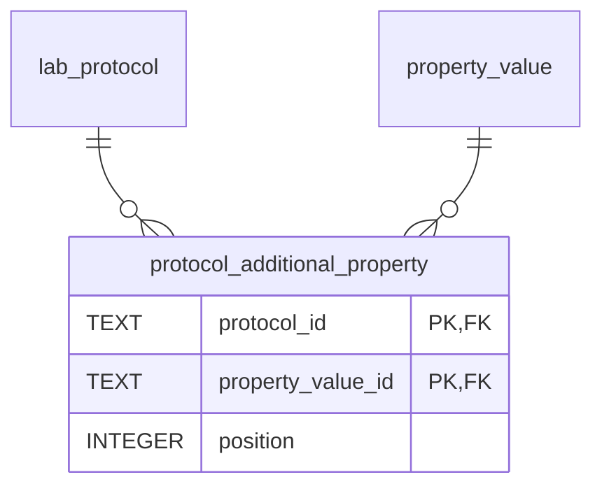

### `material_additional_property` — `Material.additionalProperty` → `PropertyValue`

### `data_additional_property` — `Data.additionalProperty` → `PropertyValue`

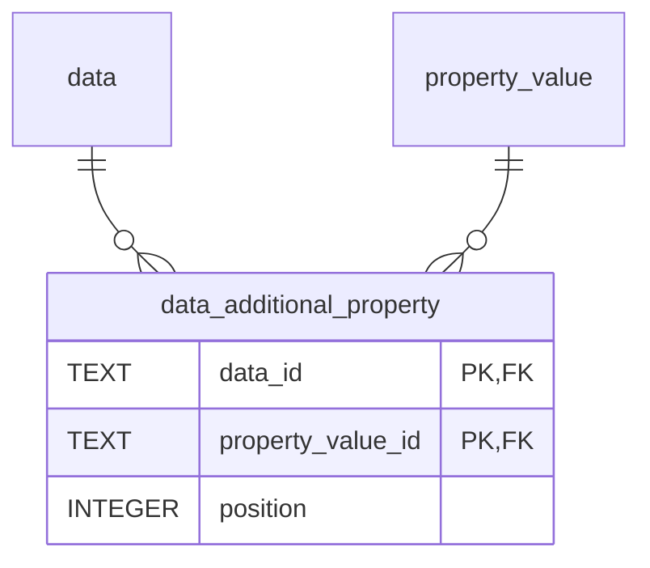

---

## Counts

8 entity tables + 10 junction tables = **18 tables**.

## Out of Scope

- ISA, Workflow Run, and Datamap decorations
- Process path views or closure tables (deferred; derivable from the I/O junctions)
- `Dataset.creator` → `Person` (appears in the spec diagram but not the property table)
- `FormalParameter.workExample` (appears in the spec diagram but not the property table)
- `value` numeric typing — `PropertyValue.value` is stored as `TEXT`. A future `value_numeric REAL` column with app-level dispatch could be added if numeric range queries become a requirement.
