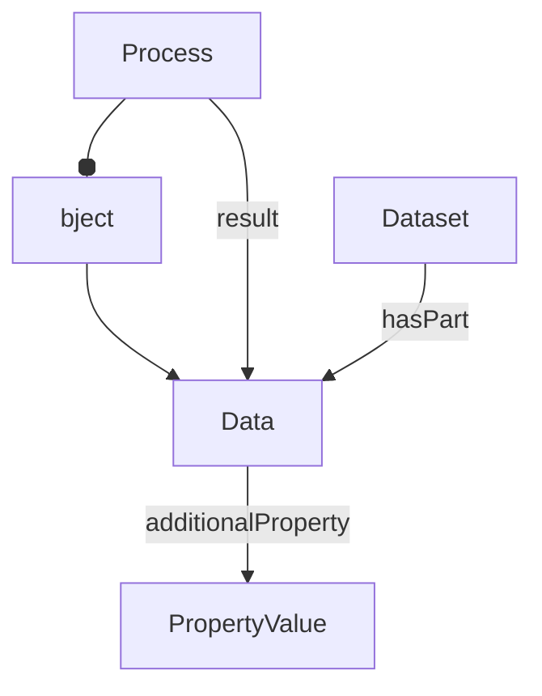

# Data

Data files produced or consumed by processes. A Data object may represent either a whole file or, when its identifier includes a selector, a specific fragment within a file.

**Schema.org type**: `schema.org/MediaObject` or `File`

## Properties

| Property | Type | Required | Description |
|----------|------|----------|-------------|
| `@id` | Text | MUST | Path pointing to the file |
| `@type` | Text | MUST | `File` or `MediaObject` |
| `name` | Text | MUST | File name |
| `encodingFormat` | Text | COULD | MIME type |
| `disambiguatingDescription` | Text | COULD | Data type (e.g., "Raw Data File", "Derived Data File") |
| `additionalProperty` | [PropertyValue](PropertyValue.md) | COULD | Extensible file-, fragment-, or content-level metadata |

## Relationships

