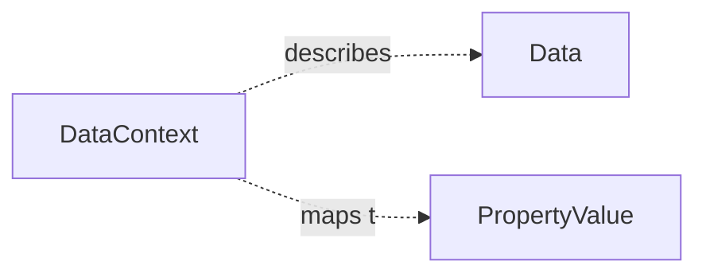

# DataContext

Authoring-oriented annotation object for datamaps. A DataContext carries additional information about the shape, content, and identity of a [Data](Data.md) object or a selected fragment within one.

Unlike the other ProcessCore types, DataContext is currently modeled in YAML examples as entries in a root `datacontexts` array. It is therefore a core authoring concept rather than a required graph node in every representation.

Reference: [ARC Datamap RO-Crate Profile](../../references/arc_datamap_ro_crate.md)

## Authoring Shapes

Current examples use two equivalent authoring patterns:

- Flat form: the Data target is identified directly through fields such as `path`, `selector`, and `encodingFormat`.
- Nested form: the Data target is carried in a nested `data` object, while the remaining fields describe the context of that target.

## Properties

| Property | Type | Required | Description |
|----------|------|----------|-------------|
| `type` | Text | MUST | `DataContext` in the current YAML authoring examples |
| `path` | Text | SHOULD | Path to the target data object when using the flat form |
| `data` | [Data](Data.md) | SHOULD | Target data object when using the nested form |
| `selector` | Text | COULD | Fragment selector that narrows the target to a subset of the data object |
| `selectorFormat` | URL | COULD | Formal description of the selector syntax, e.g. RFC 7111 |
| `encodingFormat` | Text | COULD | MIME type of the target data object or fragment |
| `explication` | Text | SHOULD | Human-readable description of the fragment contents |
| `explicationTAN` | URL | COULD | Ontology reference for `explication` |
| `label` | Text | COULD | Short label such as a column header |
| `objectType` | Text | COULD | Expected value shape or entry type of the described fragment |
| `objectTypeTAN` | URL | COULD | Ontology reference for `objectType` |
| `unit` | Text | COULD | Human-readable unit |
| `unitTAN` | URL | COULD | Ontology reference for the unit |
| `description` | Text | COULD | Additional free-text details |
| `generatedBy` | Text | COULD | Tool, assay, or method that produced the described data |

## Relationships

## RO-Crate Mapping Notes

The ARC Datamap RO-Crate profile models the same concept through a combination of data fragments and `PropertyValue` descriptors. A DataContext entry can be mapped as follows:

| DataContext field(s) | RO-Crate target | Notes |
|----------------------|-----------------|-------|
| `path` or `data` | Data / MediaObject | Identifies the file-level data object |
| `path` or `data`, plus `selector` | Data Fragment `@id` | Fragment identity is formed by combining the file identifier with the selector |
| `selectorFormat` | Data Fragment `usageInfo` | Formal description of how the selector is interpreted |
| `encodingFormat` | Data or Data Fragment `encodingFormat` | Preserved directly |
| `objectType`, `objectTypeTAN` | Data Fragment `pattern` | Describes the shape or value type of entries in the fragment |
| `explication` | Fragment Descriptor `value` | Textual explication of the fragment contents |
| `explicationTAN` | Fragment Descriptor `valueReference` | Ontology reference for the explication |
| `unit`, `unitTAN` | Fragment Descriptor `unitText`, `unitCode` | Unit mapping |
| `label` | Fragment Descriptor `alternateName` | Short human-facing label |
| `generatedBy` | Fragment Descriptor `measurementMethod` | Tool or method that produced the data |
| `description` | Fragment Descriptor `description` | Additional details |
| Target fragment | Fragment Descriptor `subjectOf` and fragment `about` | Bidirectional descriptor link in RO-Crate |

## Notes

- DataContext is a convenience authoring model for datamap annotations.
- A graph-native ProcessCore representation can instead attach a datamap-specific [PropertyValue](PropertyValue.md) subtype to [Data](Data.md) via `additionalProperty`.
- When a representation needs explicit fragment nodes, a selected fragment can be modeled as its own [Data](Data.md) object with a selector-bearing identifier.
