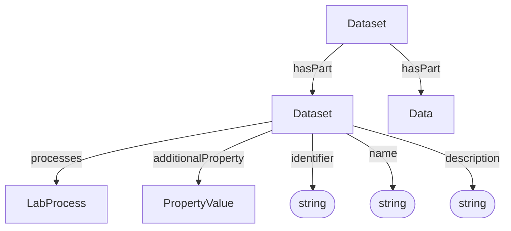

# Dataset

Container and context for data and processes. A Dataset groups a set of processes that belong together and provides administrative metadata (identifier, title, description).

**Schema.org type**: `schema.org/Dataset`

Decorations specialize Dataset via `additionalType`:
- ISA: Investigation, Study, Assay
- Workflow Run: ARC Workflow, ARC Run
- Datamap

## Properties

| Property | Type | Required | Description |
|----------|------|----------|-------------|
| `id` | Text | MUST | Unique identifier for the dataset |
| `type` | Text | MUST | `schema.org/Dataset` |
| `additionalType` | Text | COULD | Discriminator for decoration type |
| `identifier` | Text | MUST | Identifying descriptor |
| `name` | Text | SHOULD | Title |
| `description` | Text | SHOULD | Short description or abstract |
| `processes` | [LabProcess](LabProcess.md) | SHOULD | Processes contained in this dataset |
| `hasPart` | [Dataset](Dataset.md), [Data](Data.md) | SHOULD | Sub-datasets or data files |
| `additionalProperty` | [PropertyValue](PropertyValue.md) | COULD | Extensible metadata |

## Relationships

