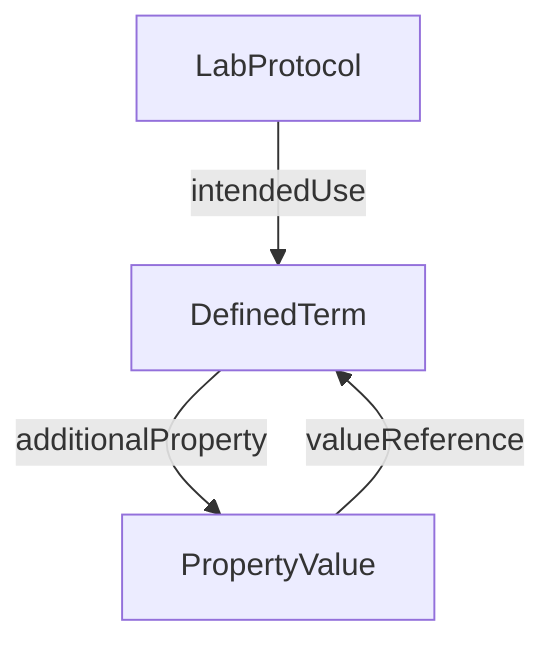

# DefinedTerm

Ontology annotation referencing a term in a controlled vocabulary or ontology.

**Schema.org type**: `schema.org/DefinedTerm`

## Properties

| Property | Type | Required | Description |
|----------|------|----------|-------------|
| `id` | Text | MUST | Term URI |
| `type` | Text | MUST | `schema.org/DefinedTerm` |
| `name` | Text | MUST | Term name |
| `termCode` | Text | SHOULD | Identifier within the ontology |
| `inDefinedTermSet` | URL, DefinedTermSet | SHOULD | Link to the ontology |
| `additionalProperty` | [PropertyValue](PropertyValue.md) | COULD | Extensible annotations on the term |

## Relationships

