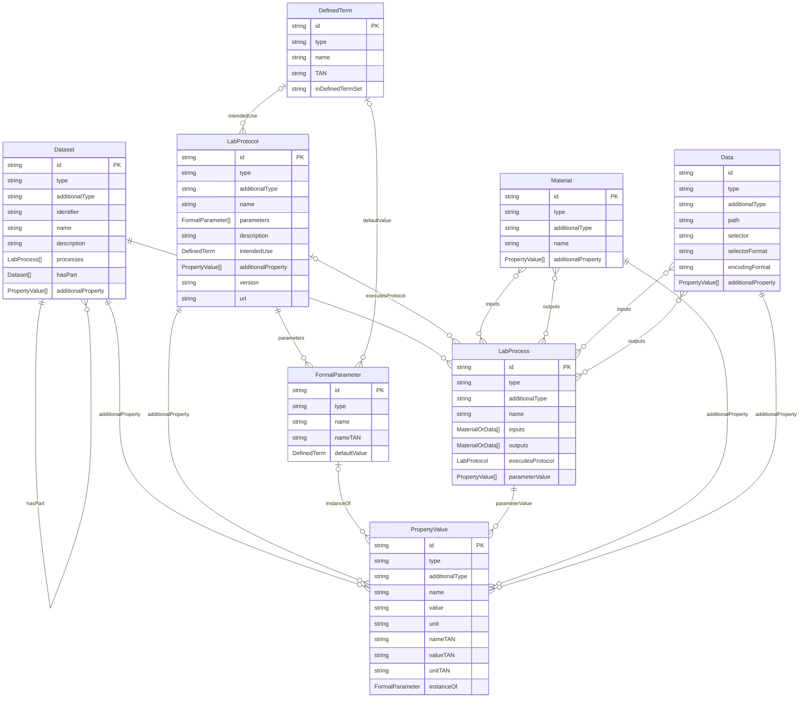

# Core ERD

This Mermaid ERD is a first relationally oriented draft of the currently specified core types. It is meant to bridge the conceptual process graph and a later SQLite schema without fixing implementation details too early.

For the SQLite-oriented follow-up that replaces multi-valued fields with explicit join tables, see [../../schemas/sql/core_logical_erd.md](../../schemas/sql/core_logical_erd.md).

This version is intentionally spec-faithful:

- Every currently specified property is listed inside its entity, including reference-valued properties such as `defaultValue`, `parameters`, `inputs`, and `instanceOf`.
- Relationship lines are used as type links for those reference-valued properties, not as replacements for the fields themselves.
- Where the spec allows more than one target type for a field, the entity uses a compact pseudo-type and the relation lines show the concrete targets.

Two caveats are intentional in this draft:

- `LabProcess.inputs` and `LabProcess.outputs` are shown as direct many-to-many relationships to `Material` and `Data`. A future SQLite schema will likely realize these through join tables so ordering and input/output pairing can be represented explicitly.
- `Dataset --creator--> Person` is omitted for now because `Person` is referenced from [Dataset.md](Dataset.md) but is not currently specified as a core type in `spec/core`.

