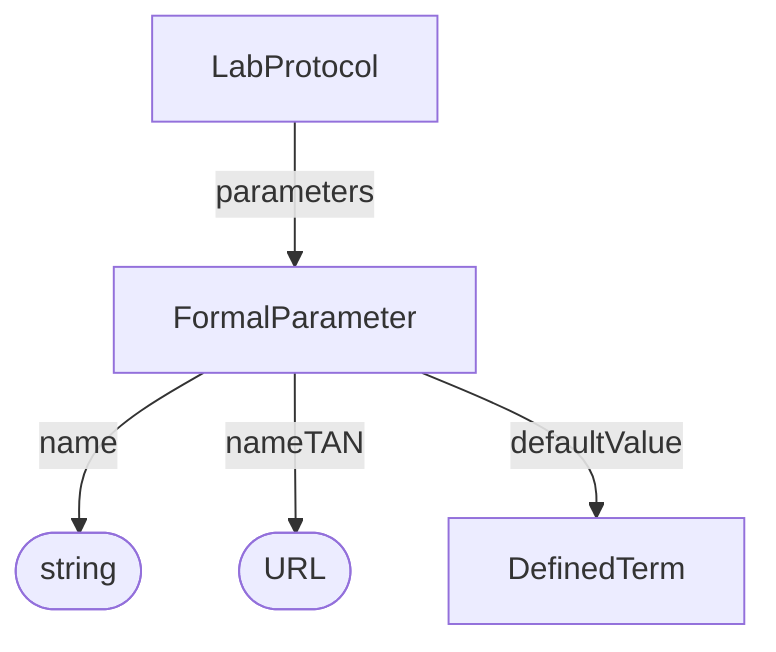

# FormalParameter

Describes the shape and type of protocol inputs/outputs, providing prospective provenance.

**Schema.org type**: `bioschemas.org/FormalParameter`

## Properties

| Property | Type | Required | Description |
|----------|------|----------|-------------|
| `id` | Text | MUST | Unique identifier |
| `type` | Text | MUST | `bioschemas.org/FormalParameter` |
| `name` | Text | SHOULD | Parameter slot name (should match workflow parameter) |
| `nameTAN` | URL | SHOULD | Key ontology reference |
| `defaultValue` | DefinedTerm | COULD | Default value for input |

## Relationships

