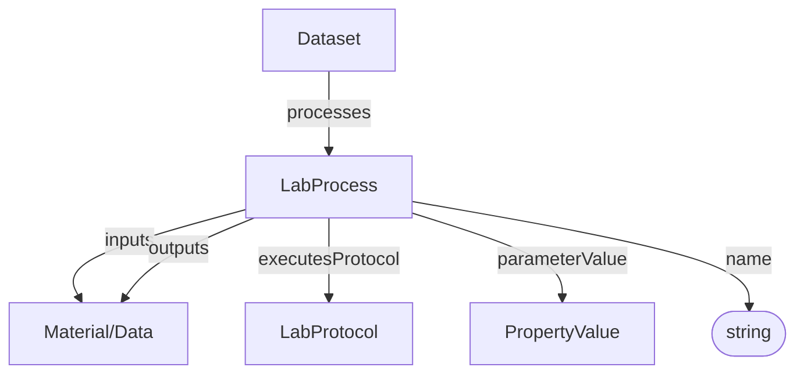
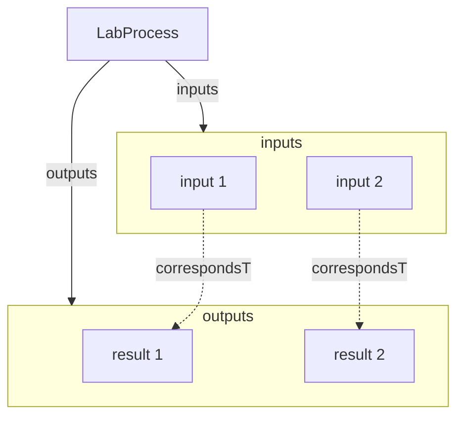

# LabProcess

Core transformation node in the process graph. A Process connects inputs to outputs and references the Protocol that was executed.

**Schema.org type**: `bioschemas.org/LabProcess`

Decorations specialize Process:
- ISA: LabProcess
- Workflow Run: Workflow Invocation (CreateAction + LabProcess)

## Properties

| Property | Type | Required | Description |
|----------|------|----------|-------------|
| `id` | Text | COULD | Unique process identifier |
| `type` | Text | MUST | Process type |
| `additionalType` | Text | COULD | Decoration discriminator, e.g. `LabProcess` |
| `name` | Text | MUST | Name of the process |
| `inputs` | [Material](Material.md), [Data](Data.md) | SHOULD | Input(s) of the process |
| `outputs` | [Material](Material.md), [Data](Data.md) | SHOULD | Output(s) of the process |
| `executesProtocol` | [LabProtocol](LabProtocol.md) | SHOULD | Protocol that was executed |
| `parameterValue` | [PropertyValue](PropertyValue.md) | SHOULD | Parameter key-value pairs |

## Relationships

## Inputs and Outputs

The core mechanism of processes is to connect inputs to outputs. To allow for grouping of multiple inputs and outputs, we allow `inputs` and `outputs` to be lists. In this case, both lists should be of the same length and the Nth input corresponds to the Nth output. This allows us to maintain a simple one-to-one mapping between inputs and outputs while still supporting multiple inputs and outputs per process. 

