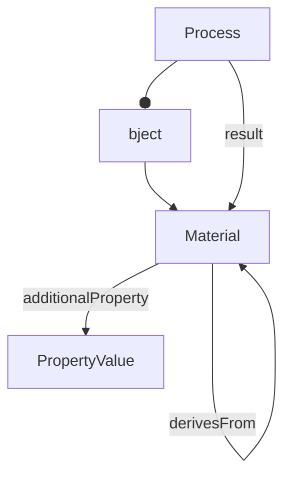

# Material

Input or output biological, chemical, or digital material in the process graph. Materials can derive from other materials, forming provenance chains.

**Schema.org type**: `bioschemas.org/Sample`

Decorations specialize Material:
- ISA: Sample, Source

## Properties

| Property | Type | Required | Description |
|----------|------|----------|-------------|
| `@id` | Text | MUST | Unique material name |
| `@type` | Text | MUST | Material type |
| `name` | Text | MUST | Name identifying the material |
| `additionalProperty` | [PropertyValue](PropertyValue.md) | SHOULD | Characteristics or factors |
| `derivesFrom` | Material | SHOULD | Source material(s) this derives from |

## Relationships

