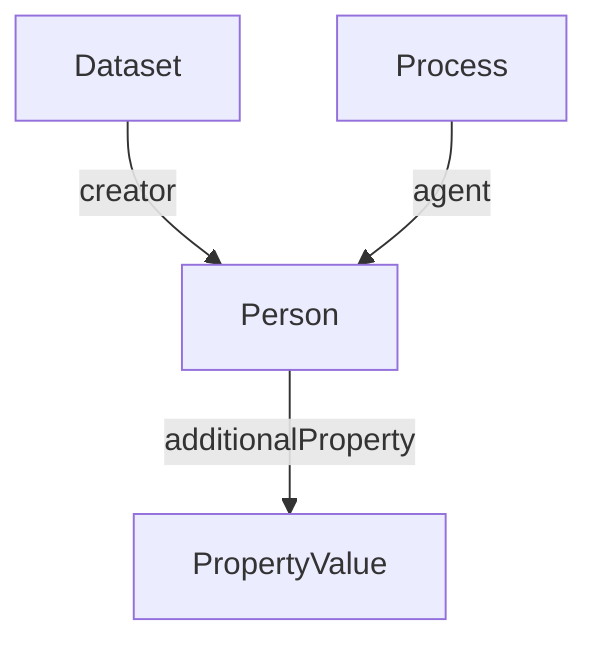

# Person

Individual contributor or performer in the experimental workflow.

**Schema.org type**: `schema.org/Person`

## Properties

| Property | Type | Required | Description |
|----------|------|----------|-------------|
| `id` | Text | COULD | Unique identifier |
| `type` | Text | MUST | `schema.org/Person` |
| `givenName` | Text | MUST | Given name |
| `familyName` | Text | SHOULD | Family name |
| `email` | Text | SHOULD | Email address |
| `affiliation` | Organization | SHOULD | Affiliated organization |
| `identifier` | Text, PropertyValue | SHOULD | ORCID or other identifier |
| `additionalProperty` | [PropertyValue](PropertyValue.md) | COULD | Extensible person metadata not covered by the base properties |
| `jobTitle` | [DefinedTerm](DefinedTerm.md) | COULD | Job title |

## Relationships

