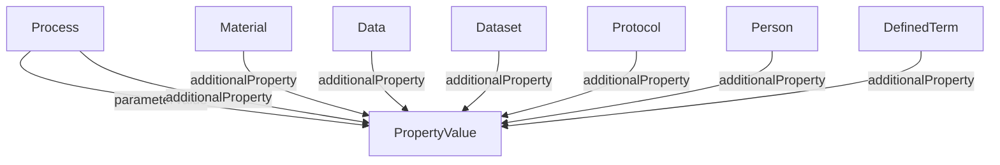

# PropertyValue

Extensible key-value-unit triple. PropertyValues are the primary extension mechanism of ProcessCore. They can be attached through `additionalProperty` for cross-cutting metadata, or through dedicated relationships such as `parameterValue` when the host type already defines a more specific role.

**Schema.org type**: `schema.org/PropertyValue`

Decoration subtypes:
- ISA: ParameterValue, CharacteristicValue, FactorValue, Component
- Datamap: FragmentDescriptor
- Workflow Run: Workflow Input, Prefix, Position

## Properties

| Property | Type | Required | Description |
|----------|------|----------|-------------|
| `@id` | Text | MUST | Unique identifier |
| `@type` | Text | MUST | `schema.org/PropertyValue` |
| `name` | Text | MUST | Key name |
| `additionalType` | Text | SHOULD | Subtype discriminator |
| `value` | Text, Number | SHOULD | The value |
| `propertyID` | URL | SHOULD | Key ontology reference |
| `unitCode` | URL | COULD | Unit ontology reference |
| `unitText` | Text | COULD | Unit name |
| `valueReference` | URL | COULD | Value ontology reference |

## Relationships

