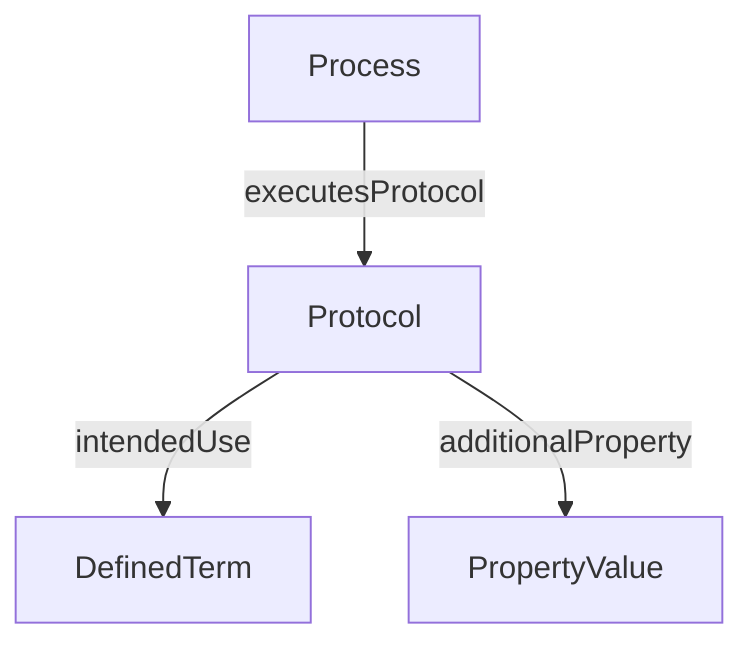

# Protocol

Description of a planned procedure. Protocols define what a Process executes, including intended use, equipment, reagents, and software.

**Schema.org type**: `bioschemas.org/LabProtocol`

Decorations specialize Protocol:
- ISA: LabProtocol
- Workflow Run: Workflow Protocol (SoftwareSourceCode + ComputationalWorkflow + LabProtocol)

## Properties

| Property | Type | Required | Description |
|----------|------|----------|-------------|
| `@id` | Text | MUST | URL or identifier for the protocol |
| `@type` | Text | MUST | Protocol type |
| `name` | Text | SHOULD | Main title |
| `description` | Text | SHOULD | Short description or abstract |
| `intendedUse` | [DefinedTerm](DefinedTerm.md), Text | SHOULD | Protocol type as ontology term |
| `additionalProperty` | [PropertyValue](PropertyValue.md) | COULD | Extensible protocol metadata |
| `version` | Text | COULD | Version identifier |
| `url` | URL | COULD | External protocol resource |

## Relationships

