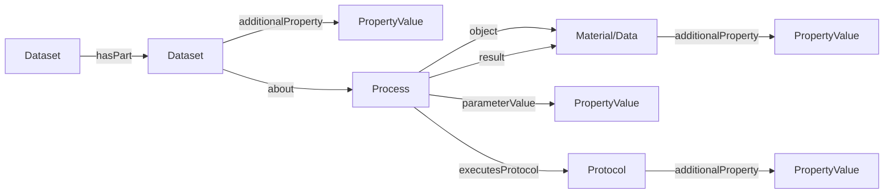

# ProcessCore

The ProcessCore model is the foundation of the ARC Data Model. It abstracts the ISA process model away from Investigation/Study/Assay specifics, providing a generic graph that connects sources to created data via processes.

## Design Principles

- **Process-centric**: All experimental workflows are modeled as graphs of processes that transform inputs into outputs.
- **Extensible**: PropertyValues provide a key-value-unit extension mechanism. Core entities can attach cross-cutting metadata through `additionalProperty`, while decorations specialize core types without modifying them.
- **Representation-agnostic**: The model can be depicted as a SQL schema, a document database, or RDF/JSON-LD.

## Process Graph

## Core Types

| Type | Description | Spec |
|------|-------------|------|
| [Dataset](Dataset.md) | Container/context for processes | Dataset.md |
| [Process](Process.md) | Transformation node connecting inputs to outputs | Process.md |
| [Protocol](Protocol.md) | Description of a planned procedure | Protocol.md |
| [Material](Material.md) | Input/output biological or digital material | Material.md |
| [Data](Data.md) | Data files | Data.md |
| [PropertyValue](PropertyValue.md) | Extensible key-value-unit triple | PropertyValue.md |
| [DefinedTerm](DefinedTerm.md) | Ontology annotation | DefinedTerm.md |
