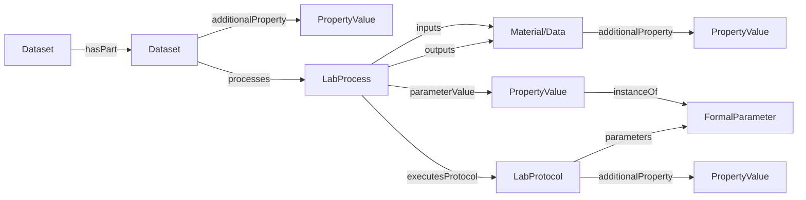
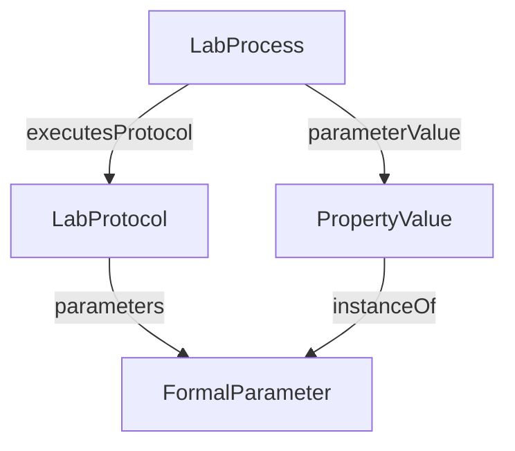

# ProcessCore

The ProcessCore model is the foundation of the ARC Data Model. It abstracts the ISA process model away from Investigation/Study/Assay specifics, providing a generic graph that connects sources to created data via processes.

## Design Principles

- **Process-centric**: All experimental workflows are modeled as graphs of processes that transform inputs into outputs.
- **Extensible**: PropertyValues provide a key-value-unit extension mechanism. Core entities can attach cross-cutting metadata through `additionalProperty`, while decorations specialize core types without modifying them.
- **Representation-agnostic**: The model can be depicted as a SQL schema, a document database, or RDF/JSON-LD.

## Process Graph

## Entity Relationship Diagram

For a relational view of the core types, see [schemas/sql/design.md](../../schemas/sql/design.md).

## Core Types

| Type | Description | Spec |
|------|-------------|------|
| [Dataset](Dataset.md) | Container/context for processes | Dataset.md |
| [LabProcess](LabProcess.md) | Transformation node connecting inputs to outputs | LabProcess.md |
| [LabProtocol](LabProtocol.md) | Description of a planned procedure | LabProtocol.md |
| [Material](Material.md) | Input/output biological or digital material | Material.md |
| [Data](Data.md) | Data files | Data.md |
| [PropertyValue](PropertyValue.md) | Extensible key-value-unit triple | PropertyValue.md |
| [FormalParameter](FormalParameter.md) | Named parameter slot for prospective provenance | FormalParameter.md |
| [DefinedTerm](DefinedTerm.md) | Ontology annotation | DefinedTerm.md |

## Usage Philosophy

At the core of the ProcessCore model is the idea that experimental procedures can be represented as graphs of processes that transform inputs into outputs. This process-centric view allows for a flexible and extensible representation of complex experimental designs, while the use of PropertyValues enables rich metadata annotation without bloating the core schema. The model is designed to be agnostic to specific representations, making it adaptable to various storage and serialization formats.

The Dataset serves as a container for related processes, providing administrative metadata and grouping functionality. LabProcesses represent the actual transformations that occur, connecting materials and data through defined protocols. Materials can represent both physical samples and digital entities, while Data is reserved for files. PropertyValues offer a powerful mechanism for extending the model with additional metadata, and DefinedTerms allow for ontology-based annotations to ensure semantic clarity.

### LabProcess and LabProtocol

LabProcess represents retrospective provenance: it captures what was actually executed and what inputs and outputs were involved. LabProtocol represents prospective provenance: it defines the intended procedure and its FormalParameters before execution. During execution, LabProcess records concrete parameter values and links them to the corresponding FormalParameters so the planned specification and realized run remain explicitly connected.

### Dataset nesting

Datasets can contain other Datasets, allowing for hierarchical organization of folders and processes. This supports complex experimental designs where multiple related processes are grouped together under a common context.

### PropertyValue and Domain-specificity

PropertyValues are the primary extension mechanism of ProcessCore. They can be attached to any core entity through `additionalProperty` metadata, or through dedicated relationships such as `parameterValue` when the host type already defines a more specific role. PropertyValues are expected to contain references to ontologies for their key and value semantics, enabling domain-specific annotations without modifying the core schema. 

