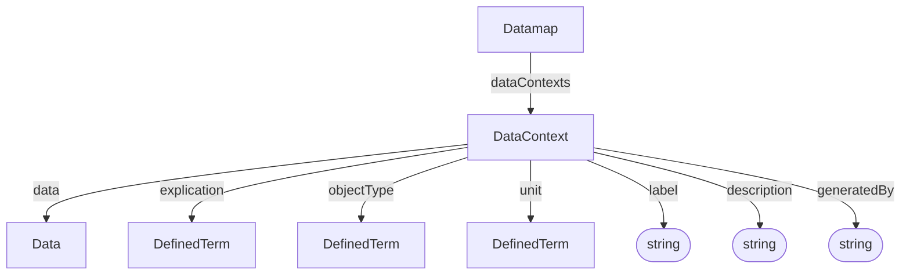

# DataContext

A DataContext carries additional information about the shape, content, and identity of a [Data](Data.md) object or a selected fragment within one.

Reference: [ARC Datamap RO-Crate Profile](../../references/arc_datamap_ro_crate.md)

## Properties

| Property | Type | Required | Description |
|----------|------|----------|-------------|
| `type` | Text | MUST | `DataContext` in the current YAML authoring examples |
| `data` | [Data](../../core/Data.md) | SHOULD | Target data object when using the nested form |
| `explication` | [DefinedTerm](../../core/DefinedTerm.md) | SHOULD | Ontological annotation of the fragment contents |
| `objectType` | [DefinedTerm](../../core/DefinedTerm.md) | COULD | Expected value shape or entry type of the described fragment, e.g. `String`, `Integer` |
| `unit` | [DefinedTerm](../../core/DefinedTerm.md) | COULD | Unit of measurement of the values stored in the fragment, preferably taken from `Unit Ontology`, e.g. `hour`, `gram per liter`|
| `label` | Text | COULD | Short label such as a column header |
| `description` | Text | COULD | Additional free-text details |
| `generatedBy` | Text | COULD | Tool, assay, or method that produced the described data |

## Relationships

