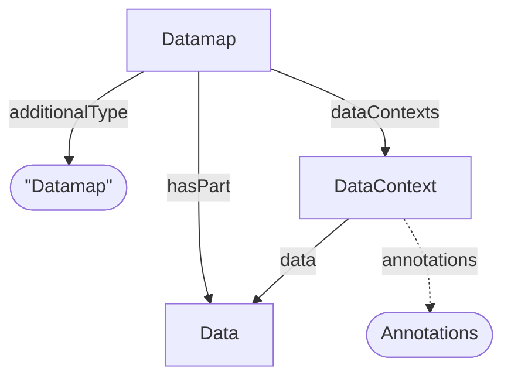

# Datamap

Datamap specialization of [Dataset](../../core/Dataset.md). Represents a specific analytical measurement or experimental assay.

**`additionalType`**: `Datamap`

Reference: [Datamap RO-Crate Profile](../../../references/arc_datamap_ro_crate.md)

## Additional Properties (beyond Dataset)

| Property | Type | Required | Description |
|----------|------|----------|-------------|
| `additionalType` | string | MUST | `Datamap` |
| `dataContexts` | [DataContext](DataContext.md) | SHOULD | List of DataContexts for annotation of Data Objects |
| `hasPart` | [Data](../../core/Data.md) | COULD | Measurement type (e.g., Proteomics) |

## Relationships

