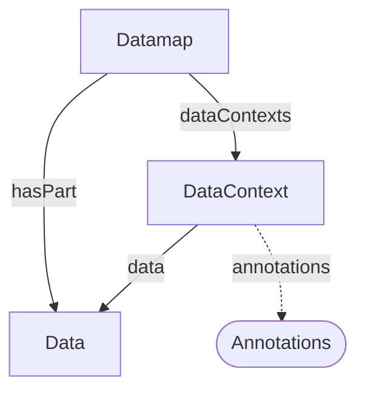

# Datamap Decoration

Maps datamap-style data context annotations onto ProcessCore. A [Datamap](Datamap.md) specializes [Dataset](../../core/Dataset.md) and holds a collection of [DataContext](DataContext.md) objects, each annotating a [Data](../../core/Data.md) object with semantic, typing, and unit metadata.

Reference: [ARC Datamap RO-Crate Profile](../../../references/arc_datamap_ro_crate.md)

## Core → Datamap Mapping

| Core Type | Datamap Specialization | `additionalType` |
|-----------|------------------------|------------------|
| [Dataset](../../core/Dataset.md) | [Datamap](Datamap.md) | `Datamap` |
| — | [DataContext](DataContext.md) | — |

`DataContext` is a decoration-specific entity with no direct ProcessCore counterpart. It is introduced by this decoration to carry per-fragment annotations (explication, objectType, unit, label, description, generatedBy) for a target `Data` object.

## Relationships

## Modeling Notes

- A `Datamap` groups [Data](../../core/Data.md) objects via `hasPart` and annotates them via `dataContexts`.
- Each `DataContext` references one `Data` object through its `data` property and carries ontological annotation (`explication`), expected value type (`objectType`), measurement unit (`unit`), a short column header (`label`), free-text `description`, and provenance (`generatedBy`).
- `DataContext` annotations are authored independently of the core process graph; they describe the content and semantics of data files rather than the transformation steps that produced them.
