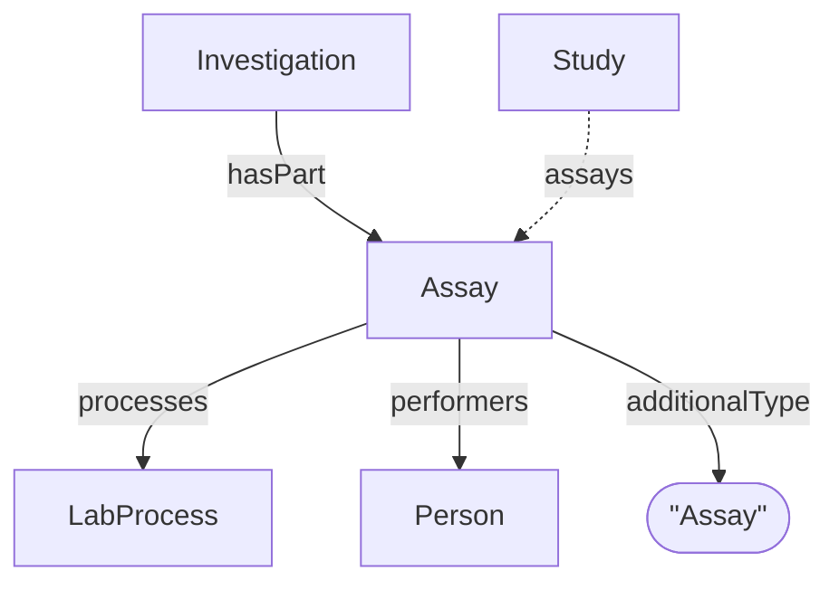

# Assay

ISA specialization of [Dataset](../../core/Dataset.md). Represents a specific analytical measurement or experimental assay.

**`additionalType`**: `Assay`

Reference: [ISA RO-Crate Profile — Assay](../../../references/isa_ro_crate.md)

## Additional Properties (beyond Dataset)

| Property | Type | Required | Description |
|----------|------|----------|-------------|
| `additionalType` | string | MUST | `Assay` |
| `processes` | [LabProcess](../../core/LabProcess.md) | SHOULD | Experimental processes in this assay |
| `performers` | [Person](Person.md) | COULD | Assay performers and contributors |

## Relationships

## AdditionalProperties

The `additionalProperty` property can be used to add some isa specific properties for the assay dataset.

TODO: Find ontology terms for these properties and add them as refinements of `PropertyValue`:

| Property | Type | Required | Description |
|----------|------|----------|-------------|
| `measurementMethod` | DefinedTerm | COULD | Measurement type (e.g., Proteomics) |
| `measurementTechnique` | DefinedTerm | COULD | Technology used (e.g., mass spectrometry) |
| `variableMeasured` | PropertyValue | COULD | Target variable being measured |
