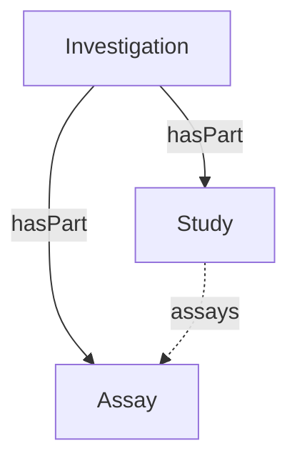

# ISA Decoration

Maps the ISA (Investigation/Study/Assay) model onto ProcessCore. This decoration enables the representation of experimental metadata following the ISA framework.

Reference: [ISA RO-Crate Profile](../../../references/isa_ro_crate.md)

## Core → ISA Mapping

| Core Type | ISA Specialization | `additionalType` |
|-----------|--------------------|-------------------|
| [Dataset](../../core/Dataset.md) | [Investigation](Investigation.md) | `Investigation` |
| [Dataset](../../core/Dataset.md) | [Study](Study.md) | `Study` |
| [Dataset](../../core/Dataset.md) | [Assay](Assay.md) | `Assay` |
| _ | [Person](Person.md) | — |
| _ | [ScholarlyArticle](ScholarlyArticle.md) | — |
| [Material](../../core/Material.md) | [Sample](Sample.md) | `Sample` |
| [Material](../../core/Material.md) | [Source](Source.md) | `Source` |
| [PropertyValue](../../core/PropertyValue.md) | [PropertyValues](PropertyValues.md) | `ParameterValue` / `CharacteristicValue` / `FactorValue` / `Component` |

## Investigation vs Study vs Assay

- **Investigation**: Top-level unit of research, containing one or more studies
- **Study**: Unit of research with associated experimental processes at the study level
- **Assay**: Specific analytical measurement or experimental assay within a study

## Source vs Sample

In ISA, the distinction between Source and Sample is contextual:
- **Source**: Starting material of a process (no `derivesFrom`)
- **Sample**: Material derived from a source or another sample via a process

Both use the same type (`bioschemas.org/Sample`); the graph position determines the role.

## Examples

- [investigation.yml](../../../examples/isa/investigation.yml)
- [assay_proteomics.yml](../../../examples/isa/assay_proteomics.yml)
- [datamap_proteomics.yml](../../../examples/isa/datamap_proteomics.yml)

